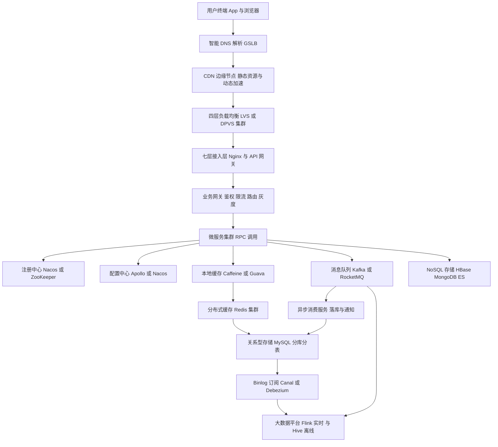
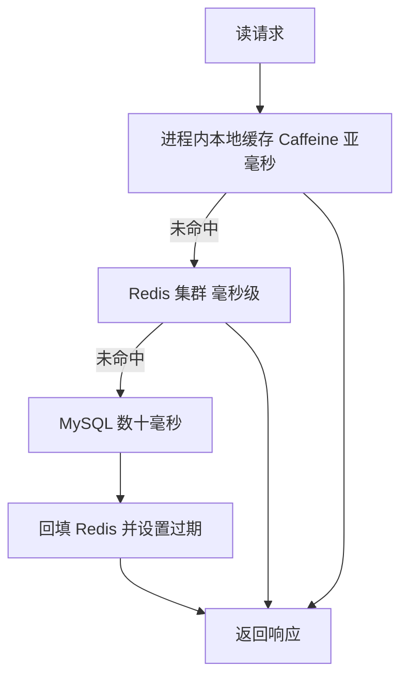
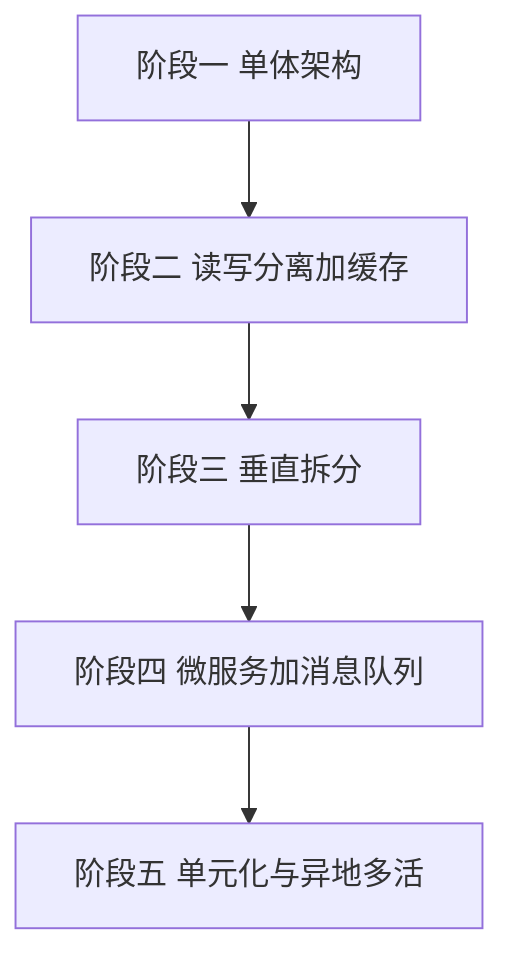

# 高并发架构总览:大厂视角的分层设计与演进

> 本文面向有 3-5 年经验的 SRE / 后端工程师,以淘宝、微信、字节跳动等大型互联网公司的公开架构实践为参照,梳理高并发系统的分层全景、容量估算方法论、演进路线与高可用设计。文中数字均为**经验值 / 量级参考**,实际以压测为准。

## 目录

- [1. 分层架构全景](#1-分层架构全景)
  - [1.1 全景架构图](#11-全景架构图)
  - [1.2 接入层:DNS 与 CDN](#12-接入层dns-与-cdn)
  - [1.3 四层负载均衡:LVS 与 DPVS](#13-四层负载均衡lvs-与-dpvs)
  - [1.4 七层接入:Nginx 与 API 网关](#14-七层接入nginx-与-api-网关)
  - [1.5 微服务层:注册中心、RPC、配置中心](#15-微服务层注册中心rpc配置中心)
  - [1.6 缓存层:多级缓存体系](#16-缓存层多级缓存体系)
  - [1.7 消息队列:削峰、解耦、异步](#17-消息队列削峰解耦异步)
  - [1.8 存储层:分库分表与 NoSQL](#18-存储层分库分表与-nosql)
  - [1.9 大数据平台](#19-大数据平台)
- [2. 容量估算方法论](#2-容量估算方法论)
  - [2.1 QPS 量级分级](#21-qps-量级分级)
  - [2.2 单机能力基线](#22-单机能力基线)
  - [2.3 由 DAU 推算 QPS](#23-由-dau-推算-qps)
  - [2.4 容量规划实操要点](#24-容量规划实操要点)
- [3. 架构演进路线](#3-架构演进路线)
- [4. 高可用设计](#4-高可用设计)
  - [4.1 多活模式对比](#41-多活模式对比)
  - [4.2 故障域隔离](#42-故障域隔离)
  - [4.3 SLA 与冗余设计](#43-sla-与冗余设计)
- [5. 大厂真实架构模式简述](#5-大厂真实架构模式简述)
- [6. 小结与面试要点](#6-小结与面试要点)

---

## 1. 分层架构全景

高并发架构的核心思想只有三条:**分层削流量、缓存挡读、异步削写**。请求从用户端到数据库,每经过一层都应被"消化"掉一部分,最终落到存储层的流量只占入口流量的极小比例(大促场景下数据库承接的 QPS 往往不足入口的 1%,量级参考)。

### 1.1 全景架构图



自上而下,每一层的职责、典型组件与大厂常用组合如下。

### 1.2 接入层:DNS 与 CDN

**职责**:就近调度、静态资源分发、隐藏源站、抵御流量攻击的第一道防线。

- **智能 DNS / GSLB**:按用户运营商与地理位置返回最近接入点的 IP,是异地多活的入口调度手段之一;DNS TTL 通常设为 60~600 秒,故障切换依赖 TTL 过期,秒级切换需配合 HTTPDNS 或 Anycast。
- **HTTPDNS**:大厂 App 端标配,绕过 LocalDNS 劫持与缓存不可控问题,支持秒级调度(阿里云 HTTPDNS、腾讯 HTTPDNS 均为公开产品形态)。
- **CDN**:静态资源(图片、JS/CSS、视频)命中率通常可达 90%~98%(经验值),大促期间 CDN 承接了绝大部分带宽。动态加速(DCDN)则优化回源链路。

**大厂组合**:自建 CDN + 商业 CDN 多家混跑(容灾 + 议价),App 端 HTTPDNS + 域名收敛。

### 1.3 四层负载均衡:LVS 与 DPVS

**职责**:基于 IP + 端口的转发,把海量 TCP/UDP 连接分发到七层接入集群,自身几乎不解析应用协议,追求极致转发性能。

| 组件 | 工作模式 | 单机性能量级参考 | 特点 |
|------|---------|----------------|------|
| LVS DR 模式 | 内核态,直接路由 | 数十万至百万级并发连接,数十 Gbps | 回包不经过 LVS,性能最优,要求同二层网络 |
| LVS NAT / FULLNAT | 内核态 | 低于 DR 模式 | 部署灵活,FULLNAT 为阿里开源补丁 |
| DPVS | 用户态 DPDK,绕过内核 | 单机千万级并发,百 Gbps 级 | 爱奇艺开源,大厂自建四层 LB 的主流选择 |
| 云 SLB / CLB 四层 | 云厂商托管 | 按规格弹性 | 免运维,内部同样基于 LVS/DPVS 类技术 |

表格结论:**自建机房用 LVS DR 或 DPVS + Keepalived/OSPF ECMP 做集群化;上云直接用四层 SLB**。四层 LB 通常以"一组 VIP + ECMP 等价路由"横向扩展,单点故障由路由收敛自动摘除。

### 1.4 七层接入:Nginx 与 API 网关

**职责**:HTTP/HTTPS 终结、路由分发、限流熔断、WAF、灰度发布、协议转换(HTTP → RPC)。

- **Nginx / OpenResty / Tengine**:Tengine 是淘宝开源的 Nginx 增强版;OpenResty 通过 Lua 实现动态逻辑(限流、AB 实验、动态 upstream)。
- **API 网关**:Kong、APISIX(Apache 顶级项目,国内使用广泛)、Spring Cloud Gateway、自研网关(如字节内部网关体系)。网关层是**统一鉴权、限流、协议收敛**的位置,也是泳道/灰度路由的执行点。
- **TLS 卸载**:HTTPS 握手 CPU 开销大,大厂常用会话复用(Session Ticket)、TLS 1.3、硬件加速卡或专用接入集群分摊。

**大厂组合**:LVS/DPVS → Tengine/OpenResty 接入集群 → 自研业务网关 → 内部 RPC。

### 1.5 微服务层:注册中心、RPC、配置中心

**职责**:业务逻辑承载,服务治理三件套——服务发现、远程调用、动态配置。

| 组件类型 | 主流选择 | 大厂代表实践 |
|---------|---------|------------|
| 注册中心 | Nacos、ZooKeeper、etcd、Consul、Eureka | 阿里 Nacos;早期 Dubbo 生态多用 ZooKeeper |
| RPC 框架 | Dubbo、gRPC、Thrift、bRPC、Kitex | 阿里 Dubbo/HSF;字节 Kitex 为 Go 生态开源;百度 bRPC |
| 配置中心 | Apollo、Nacos Config、Consul KV | 携程开源 Apollo;阿里 Nacos |
| 服务治理 | Sentinel、Hystrix 已停更、Resilience4j | 阿里 Sentinel 做限流熔断降级 |

表格结论:国内大厂技术栈以 **Nacos + Dubbo/自研 RPC + Sentinel** 或 **Kubernetes + gRPC/Kitex + Service Mesh** 两条主线为主,新建系统趋向云原生路线(K8s Service + Mesh 逐步接管注册与治理)。

微服务层的高并发关键设计:

- **无状态化**:实例可任意扩缩容,会话状态外置到 Redis。
- **线程/协程模型**:Java 系依赖线程池隔离(Dubbo 线程池、业务线程池分离);Go 系天然协程,字节大规模使用 Go。
- **超时与重试预算**:全链路超时逐级递减(入口 1s → 下游 500ms → 再下游 200ms,经验值),重试只在幂等接口上做且带退避,防止重试风暴。

### 1.6 缓存层:多级缓存体系

**职责**:挡读流量。读多写少是互联网业务常态(读写比 10:1 到 100:1,经验值),缓存是性价比最高的扩容手段。

典型多级缓存链路:



各级缓存定位与命中率(经验值):

| 层级 | 组件 | 延迟量级 | 典型命中率 | 适用数据 |
|------|------|---------|-----------|---------|
| L1 本地缓存 | Caffeine、Guava、堆外缓存 | 0.1ms 以内 | 热点数据 30%~60% | 配置、字典、极热点商品 |
| L2 分布式缓存 | Redis Cluster、Codis、Tair | 0.5~2ms | 整体 90%+ | 用户信息、商品详情、会话 |
| L3 持久层缓存 | MySQL Buffer Pool、TiKV Block Cache | 10ms 内 | — | 兜底 |

表格结论:**本地缓存解决"单 key 热点打爆 Redis 单分片"的问题,Redis 解决容量与共享问题**。热点探测(如京东 hotkey、阿里公开的热点散列方案)+ 本地缓存是大促秒杀标配。

三大经典问题必须在方案设计时给出答案:

- **缓存穿透**:查询不存在的 key。对策:空值缓存(短 TTL)、布隆过滤器。
- **缓存击穿**:热点 key 过期瞬间大量回源。对策:互斥锁单飞回源、逻辑过期不删除。
- **缓存雪崩**:大量 key 同时过期或 Redis 集群故障。对策:过期时间加随机抖动、多副本、限流降级兜底。

### 1.7 消息队列:削峰、解耦、异步

**职责**:削写流量。把"必须立刻做"和"可以稍后做"分开,峰值写入先进队列,下游按自身能力消费。

| MQ | 吞吐量级参考 | 延迟 | 典型场景 | 大厂使用 |
|----|------------|------|---------|---------|
| Kafka | 单集群百万级消息每秒 | 毫秒到十毫秒 | 日志、埋点、流计算源 | 全行业标配 |
| RocketMQ | 单集群数十万级消息每秒 | 毫秒级 | 交易、订单等业务消息 | 阿里开源,电商交易链路 |
| Pulsar | 与 Kafka 同量级 | 毫秒级 | 存算分离、多租户 | 部分大厂新建场景 |
| RabbitMQ | 万级消息每秒 | 微秒到毫秒 | 中小规模业务解耦 | 大厂核心链路少用 |

表格结论:**日志与流计算用 Kafka,交易类业务消息用 RocketMQ(事务消息、定时消息、消费重试等业务特性更全)**,新建平台可评估 Pulsar。

高并发关键实践:秒杀下单先写 MQ 再异步落库(前提是先经过库存预扣与限流)、消费端幂等(唯一键 + 状态机)、积压监控与消费者弹性扩容、死信队列兜底。

### 1.8 存储层:分库分表与 NoSQL

**职责**:数据最终落点,也是最难扩展的一层——所有上层设计本质上都在保护存储层。

**MySQL 分库分表**:

- 单表行数建议控制在千万级以内(经验值,取决于行宽与索引),单库 QPS 压到 5k 以内(量级参考)。
- 拆分维度:按用户 ID、订单 ID 等**高基数且查询高频**的字段做分片键;常见 32 库 × 32 表 = 1024 分片一步到位(阿里公开实践中常见的规格思路),避免二次扩容迁移。
- 中间件:ShardingSphere、MyCat、各厂自研 Proxy(如阿里 TDDL/DRDS 演进为 PolarDB-X)。
- 代价:跨分片 JOIN、分布式事务、全局二级索引都变难——**分库分表是最后手段,先缓存、先读写分离、先归档冷数据**。

**NoSQL 选型**:

| 存储 | 数据模型 | 量级定位 | 典型场景 |
|------|---------|---------|---------|
| Redis | KV 内存 | 单分片 10w QPS 量级 | 缓存、计数、排行榜、分布式锁 |
| HBase | 宽表 LSM | PB 级、百万级写 QPS 集群 | 订单历史、风控明细、Feed 存储 |
| MongoDB | 文档 | TB 级灵活 schema | 内容、评论、非核心业务 |
| Elasticsearch | 倒排索引 | 十亿级文档搜索 | 搜索、日志分析、复杂条件查询 |
| TiDB / OceanBase | 分布式关系型 | 水平扩展的 SQL | 替代分库分表的新一代选择,蚂蚁 OceanBase 支撑支付宝交易为公开事实 |

表格结论:**MySQL 承载强事务核心数据,ES 承接复杂查询(通过 binlog 同步),HBase 承接海量冷数据与明细**,"一份数据多种存储、各取所长"的异构冗余是大厂标准做法,同步链路统一走 Canal/Debezium + MQ。

### 1.9 大数据平台

**职责**:离线报表、实时大屏、特征计算、监控指标。与在线链路通过 MQ 和 binlog 订阅解耦,**绝不允许分析查询直接打在线库**。

- **实时链路**:埋点/binlog → Kafka → Flink → OLAP(ClickHouse、Doris、StarRocks)→ 实时大屏与风控。
- **离线链路**:Kafka/日志 → HDFS/数据湖(Iceberg、Hudi)→ Spark/Hive → 数仓分层(ODS/DWD/DWS/ADS)。
- 大厂普遍走"流批一体"方向(Flink 官方长期宣传的方向,阿里为主要推动者之一)。

---

## 2. 容量估算方法论

容量估算是 SRE 的基本功:**先算量级,再定架构**。差一个数量级,架构选型完全不同。

### 2.1 QPS 量级分级

下表给出不同 QPS 量级对应的典型架构形态(经验值,按核心接口峰值 QPS 计):

| 峰值 QPS 量级 | 业务体感 | 典型架构形态 |
|--------------|---------|------------|
| 1k 以内 | 中小型业务、企业应用 | 单体 + 主从 MySQL + 单实例 Redis,Nginx 双机即可 |
| 1w 级 | 垂直领域头部产品 | 微服务 + Redis 集群 + 读写分离,开始需要 MQ 削峰 |
| 10w 级 | 一线互联网产品日常峰值 | 多级缓存 + 分库分表 + 完整服务治理,同城双活 |
| 100w 级 | 头部大厂大促 / 春晚级 | 单元化多活 + 全链路压测 + 弹性混部,CDN 与边缘承接大头 |

表格结论:**10w QPS 是一道明显的分水岭**——在此之前靠"加机器 + 加缓存"能解决,在此之后必须体系化解决数据分片、热点、多活与全链路容量治理。

### 2.2 单机能力基线

以下为主流组件在常规硬件(16C/32G 量级,万兆网卡)上的单机能力**量级参考**,用于快速估算集群规模,实际必须以自己环境的压测为准:

| 组件 | 单机能力量级参考 | 备注 |
|------|----------------|------|
| Nginx 七层代理 | 5w~10w QPS | 短连接更低,长连接与 keepalive 影响大 |
| LVS DR 四层 | 数十万 QPS / 百万级并发连接 | 瓶颈常在网卡与 PPS |
| Redis 单实例 | 8w~12w QPS | 单线程模型,value 大小敏感,pipeline 可数倍提升 |
| Kafka 单 broker | 数十万消息每秒 | 批量与压缩下更高,瓶颈常在磁盘与网络 |
| MySQL 单实例 | 3k~8k QPS 混合读写 | 纯主键点查可上万,涉及事务与索引复杂度差异极大 |
| Java 业务服务 | 500~3000 QPS | 取决于下游调用数与业务复杂度,IO 密集型偏低 |
| Go 业务服务 | 1k~1w QPS | 同上,协程模型下高并发连接更省资源 |

表格结论:**链路上每一层的集群规模 = 该层峰值 QPS ÷ 单机基线 ÷ 目标水位**。目标水位大厂通常按 50% 左右规划(即预留一倍余量),核心链路更保守(30%~40%),以便承受单机房故障后的流量迁移。

### 2.3 由 DAU 推算 QPS

标准估算公式:

```text
日均 QPS = DAU × 人均日请求次数 ÷ 86400
峰值 QPS = 日均 QPS × 峰值系数
```

- **峰值系数**:普通业务日常取 2~5(晚高峰效应);电商大促取 10~100 倍于日常峰值;秒杀开抢瞬间可达数百倍(均为经验值,必须结合业务历史曲线)。
- **人均日请求次数**:注意区分"页面访问"和"接口调用"——一次页面打开通常触发 10~50 次后端接口调用(经验值)。

**示例:估算一个 5000 万 DAU 的资讯类 App 的 Feed 接口容量**

```text
假设:人均每天刷 20 次 Feed,每次刷新 1 次核心接口调用
日请求量 = 5000w × 20 = 10 亿次
日均 QPS = 10 亿 ÷ 86400 ≈ 1.16w
峰值系数取 3(晚高峰) → 峰值 QPS ≈ 3.5w
容灾余量:按 50% 水位规划 → 集群需承载 7w QPS 的能力
若单实例 Go 服务压测 2000 QPS → 需要约 35 台,再加多机房冗余 → 实际部署 2 机房 × 25 台
```

再往下推存储层:

```text
Feed 读接口缓存命中率按 95% 计 → 回源 DB 的峰值 QPS ≈ 3.5w × 5% = 1750
单 MySQL 实例按 5k QPS 基线 → 1 套主从即可承载,但按故障冗余部署双分片
写入侧:发布/点赞等写行为约为读的 1/20 → 写峰值约 1750 QPS → 经 MQ 削峰后异步落库
```

这个"从 DAU 一路推到 DB 分片数"的推演过程,就是方案评审和面试中最常被考察的能力。

### 2.4 容量规划实操要点

- **以压测数据为准**:基线数字只用于初估,上线前必须做单机压测(找出单实例拐点)和全链路压测(找出链路短板)。阿里双 11 的全链路压测(生产环境影子库表 + 压测标透传)是公开的标杆实践。
- **按故障容量规划**:N+1 不够,多机房场景按"挂掉一个机房后剩余机房能扛全量峰值"规划,即 2 机房各承载 100%、3 机房各承载 50%。
- **弹性优先**:可容器化的无状态层用 HPA/弹性伸缩应对突发,存储层弹性差,必须提前规划。
- **关注非 QPS 维度**:连接数、带宽、PPS、磁盘 IOPS、慢查询,任何一个都可能先于 CPU 成为瓶颈。

---

## 3. 架构演进路线

架构不是一步到位设计出来的,而是**被业务量逼出来的**。过早微服务化和过晚拆库都是常见事故源。下面按五个阶段梳理演进路线及触发信号。



| 阶段 | 架构形态 | 触发演进的信号(该往下一阶段走了) |
|------|---------|--------------------------------|
| 一 单体 | 应用 + 单库,Nginx 反代 | 数据库 CPU 持续高于 70%;慢查询增多;高峰期接口延迟明显抖动 |
| 二 读写分离 + 缓存 | 主从复制、Redis 挡读、CDN 挡静态 | 主库写入接近单机上限;缓存命中率提升空间见顶;发布一次全站抖动 |
| 三 垂直拆分 | 按业务域拆应用与库(用户库/订单库/商品库) | 单一代码库多团队冲突严重;不同业务模块资源争抢;单库表数量与容量失控 |
| 四 微服务 + MQ | 注册中心/RPC/配置中心/网关齐备,MQ 削峰解耦,分库分表 | 单表过千万且增长快;峰值写入压垮同步链路;跨业务调用关系复杂需治理 |
| 五 单元化 / 异地多活 | 按用户维度切分单元,单元内闭环,跨单元异步同步 | 单机房容量见顶(机柜/电力/网络);监管或业务要求城市级容灾;单地域故障损失不可接受 |

表格结论:每个阶段解决上一阶段的主要矛盾,同时引入新的复杂度(缓存引入一致性问题、微服务引入分布式事务与调用链复杂度、多活引入数据同步与路由正确性问题)。**演进的判断依据永远是可观测的指标,而不是技术潮流**。

各阶段补充要点:

- **阶段二**是投入产出比最高的一步:读写分离 + Redis 通常能把可承载 QPS 提升一个数量级,而改造成本远低于拆分。
- **阶段三**先拆应用再拆库,拆库前先做好数据归档与冷热分离,能拖后拆库时间点。
- **阶段四**微服务化的前提是配套设施(CI/CD、链路追踪、统一日志、服务治理)就绪,否则拆完就是分布式单体。
- **阶段五**成本极高(数据同步中间件、流量路由体系、全链路改造),国内公开实践中只有支付宝、淘宝、微信等超大规模业务全面落地,绝大多数业务停在同城双活即可满足要求。

---

## 4. 高可用设计

### 4.1 多活模式对比

机房级容灾是高可用设计的核心命题,主流模式对比如下:

| 模式 | 部署形态 | RPO / RTO 量级参考 | 成本 | 适用场景 |
|------|---------|------------------|------|---------|
| 同城双活 | 同城两机房同时承载流量,数据库主库单边、跨机房半同步 | RPO 接近 0,RTO 分钟级 | 中 | 绝大多数业务的性价比之选,机房间延迟 1~3ms |
| 两地三中心 | 同城双活 + 异地冷备/温备中心 | 异地 RPO 秒到分钟级,RTO 小时级 | 中高 | 金融监管合规常见形态,异地中心平时不承载流量 |
| 异地多活单元化 | 多地域多单元同时承载写流量,按用户分片路由 | 单元故障 RPO 秒级,RTO 分钟级切流 | 极高 | 超大体量、城市级容灾刚需 |

表格结论:**同城双活解决"机房挂"的问题,异地多活解决"城市挂"的问题**。两地三中心的异地备中心因平时不接流量,真实故障时敢不敢切、切了能不能起来是经典痛点——这也是大厂转向"多活"(所有单元平时都在服役)的根本原因:**没有被流量验证过的容灾就是假容灾**。

异地多活的核心难点不在应用层而在数据层:

- **路由正确性**:同一用户的请求必须稳定落在同一单元,否则写冲突。入口按 UserID 分片路由,SDK/网关/四层全链路都要认同一套路由规则。
- **数据同步**:单元间通过 DTS/DRC 类中间件异步双向同步(阿里 DRC、Otter 为公开项目/实践),延迟通常在秒级,冲突以路由保证"单写"来规避而非事后合并。
- **全局数据**:库存、余额这类不可按用户切分的数据,要么中心化写(牺牲部分多活)、要么按维度再拆(库存分桶到单元)。

### 4.2 故障域隔离

隔离的原则:**故障爆炸半径最小化**,任何单点故障只影响一个可预期的、尽量小的范围。

- **物理故障域**:服务器 → 机柜 → 机房 → 可用区 → 地域,部署时跨故障域打散(K8s 拓扑分布约束 / 反亲和)。
- **部署隔离**:核心与非核心业务集群分开;在线与离线任务分开(或混部但有严格 QoS 隔离,大厂混部为公开方向)。
- **线程池 / 连接池隔离**:舱壁模式,防止一个慢下游拖垮整个服务的线程池。
- **泳道 / 环境隔离**:测试流量、灰度流量、压测流量与生产流量通过染色标区分,专用泳道承接。
- **数据隔离**:大促热点库存单独分桶;大客户/大群等热点数据识别后单独调度。

配套的稳定性三板斧,任何高并发系统缺一不可:

| 手段 | 目的 | 典型实现 |
|------|------|---------|
| 限流 | 保护自己不被打垮 | 网关令牌桶/滑动窗口,Sentinel 集群限流,入口排队 |
| 熔断降级 | 不被下游拖垮 | 错误率/慢调用比例触发熔断,降级返回兜底数据 |
| 隔离 | 缩小爆炸半径 | 舱壁、泳道、单元 |

表格结论:限流保护自身、熔断隔离下游、隔离控制半径,三者组合才能形成"任何依赖都可能失败"前提下的韧性设计;此外**预案 + 演练(混沌工程、断网演练)是把设计变成能力的唯一途径**。

### 4.3 SLA 与冗余设计

常见 SLA 等级与允许的不可用时间:

| SLA | 年不可用时长 | 月不可用时长 | 大致对应要求 |
|-----|------------|------------|------------|
| 99.9% | 8.76 小时 | 43.8 分钟 | 单机房 + 良好运维即可达成 |
| 99.95% | 4.38 小时 | 21.9 分钟 | 需要机房内全冗余 + 快速故障自愈 |
| 99.99% | 52.6 分钟 | 4.38 分钟 | 需要同城双活 + 自动切流,人肉响应来不及 |
| 99.999% | 5.26 分钟 | 26 秒 | 需要多活 + 全自动故障隔离,核心金融/通信级 |

表格结论:**99.99% 是人工响应与自动化的分界线**——分钟级 RTO 意味着从发现到切流必须自动完成。串联链路的可用性是各环节乘积(0.999 × 0.999 × 0.999 ≈ 0.997),链路越长可用性越差,因此核心链路要"短",并对非关键依赖做弱依赖改造(失败可降级、可跳过)。

冗余设计经验法则:

- 无状态层至少 N+2(滚动发布时仍有冗余),跨故障域打散。
- 有状态层至少一主两从、跨机房部署,半同步复制保 RPO。
- 冗余必须常态演练:定期主动切主、摘机房,验证冗余真实有效。

---

## 5. 大厂真实架构模式简述

以下均基于各公司公开技术分享与开源资料,只描述广为人知的模式框架,不涉及未公开细节。

### 5.1 阿里:单元化与异地多活

阿里从 2013 年前后公开分享其"异地多活/单元化"架构:将交易链路按**买家 ID** 维度切分为多个单元(Unit),每个单元部署在不同地域、包含完整的应用与数据闭环,正常情况下用户请求在本单元内完成读写;单元间通过自研数据同步中间件(DRC 方向)做秒级异步复制;卖家/商品等无法按买家切分的数据走中心单元 + 单元只读副本。配套体系包括全链路压测、统一接入路由、切流预案平台。支付宝(蚂蚁)公开的 LDC 逻辑数据中心架构是同一思想的深化,并与 OceanBase 的多副本一致性能力结合。

### 5.2 微信:Set 化

微信公开分享中多次提到 **Set 化(设施套餐化)** 思路:把一组完整服务能力(接入、逻辑、存储)打包成一个标准 Set,按用户维度把流量划分到不同 Set,Set 之间彼此独立、故障互不影响,扩容以 Set 为单位整建制复制。这与单元化思想同源,侧重点在**标准化复制与故障隔离**。微信后台公开的其他标志性实践还包括自研 KV 存储、基于 Paxos 的存储组件(PaxosStore 已开源)以及过载保护(如公开论文中的 DAGOR 过载控制思想)。

### 5.3 字节跳动:泳道与流量调度

字节公开的技术分享中,**泳道(Lane)** 是其研发流程与流量治理的标志性模式:通过流量染色把特定请求(测试、灰度、压测)路由到独立部署的泳道环境,泳道内未部署的服务自动回落到基准环境,实现低成本的多环境并行研发与灰度验证。配套的公开体系包括自研 Go RPC 框架 Kitex 与 HTTP 框架 Hertz(均已开源)、大规模 Service Mesh 落地,以及多机房容灾的流量调度平台方向。

### 5.4 模式对比

| 公司 | 模式名称 | 切分维度 | 主要目标 |
|------|---------|---------|---------|
| 阿里 | 单元化 / 异地多活 | 买家用户 ID | 城市级容灾 + 突破单地域容量上限 |
| 蚂蚁 | LDC 逻辑数据中心 | 用户 ID | 金融级容灾与弹性,结合 OceanBase |
| 微信 | Set 化 | 用户维度 | 标准化扩容 + 故障隔离 |
| 字节 | 泳道 + 流量调度 | 流量染色标 | 研发效率 + 灰度安全 + 容灾切流 |

表格结论:名称各异,内核一致——**按某个稳定维度把系统切成彼此独立、可整体复制的"细胞",用路由把请求送进正确的细胞**。单元化/Set 化解决容量与容灾,泳道解决研发与灰度,两者常常同时存在于一家公司的体系中。

---

## 6. 小结与面试要点

- **一条主线**:分层削流量——CDN 挡静态、网关挡恶意、缓存挡读、MQ 削写,数据库只承接最终必须落地的那一小部分。
- **一套算法**:DAU → 日均 QPS → 峰值 QPS → 按单机基线和目标水位反推各层集群规模,再按故障容量加冗余。
- **一条路线**:单体 → 读写分离加缓存 → 垂直拆分 → 微服务加 MQ → 单元化多活,每一步都由指标触发,不为技术而技术。
- **一个原则**:没有被真实流量验证过的容灾等于没有容灾,全链路压测与故障演练是把架构图变成可用性的唯一途径。

方案设计或面试中被问到"设计一个支撑 X QPS 的系统"时,推荐的回答框架:**先估容量定量级 → 画分层架构图 → 逐层讲清挡流量的手段与组件选型 → 指出瓶颈层(通常是存储)的拆分方案 → 收尾于高可用与演进空间**。本文各章节即按此框架组织,可直接作为答题地图。

---

*本文档为 sre-handbook 架构篇第一篇,后续篇章将分别深入负载均衡、缓存、消息队列与分库分表的生产实践细节。数字均为经验值/量级参考,落地前请以自身环境压测数据为准。*
