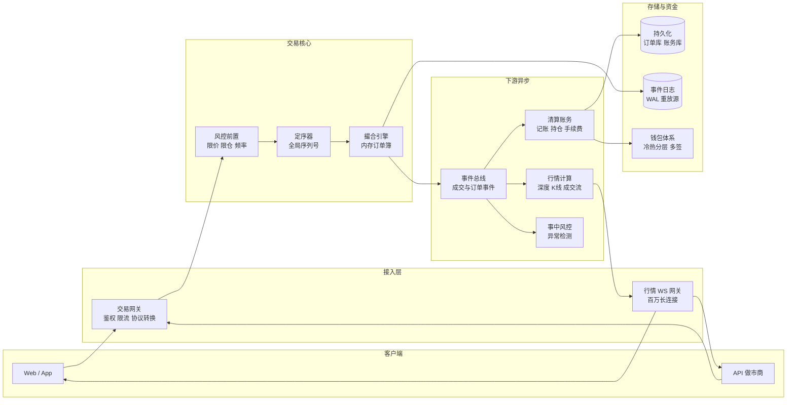
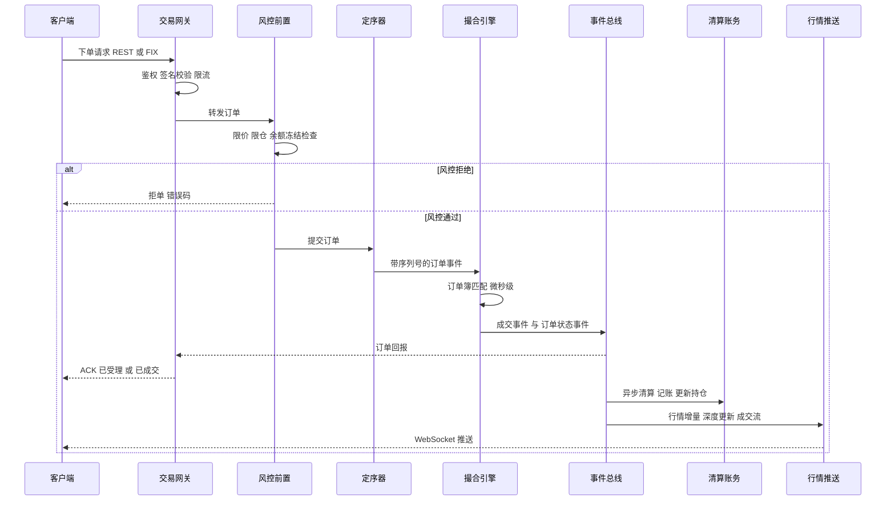
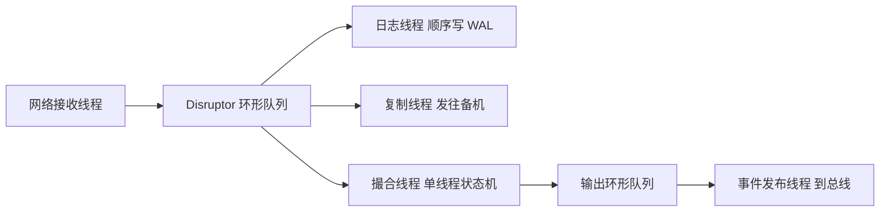
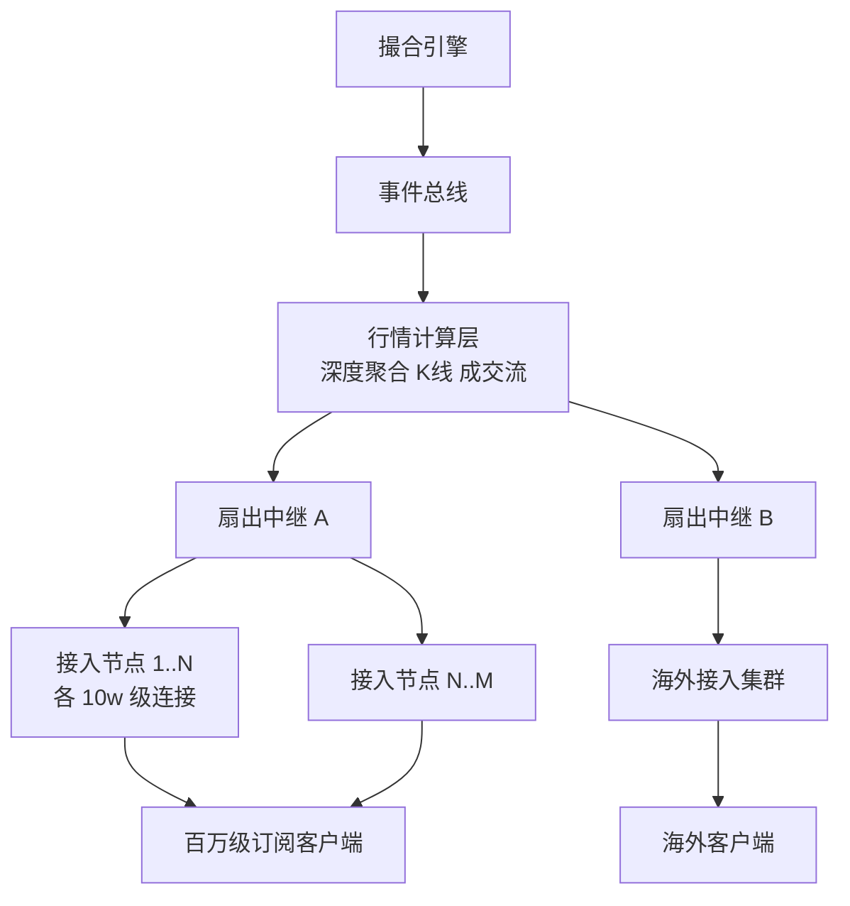
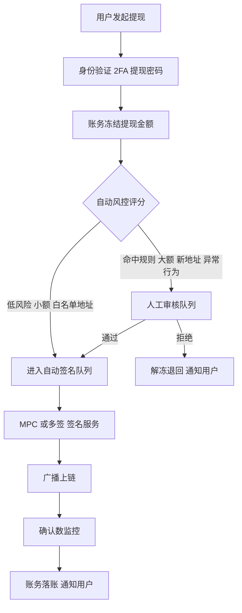

# 大型交易所系统架构

> 面向 SRE / 后端工程师的公开知识梳理。内容基于加密货币交易所(Binance、OKX、Coinbase 等)与证券交易所(NYSE、纳斯达克、LMAX 等)公开资料中的**通用架构模式**总结,不涉及、也不编造任何公司内部实现细节。文中所有性能数字均为**经验值/量级参考**。

## 目录

- [1. 业务全景与核心链路](#1-业务全景与核心链路)
  - [1.1 全景架构图](#11-全景架构图)
  - [1.2 下单核心时序](#12-下单核心时序)
  - [1.3 加密货币交易所与证券交易所的差异](#13-加密货币交易所与证券交易所的差异)
- [2. 撮合引擎](#2-撮合引擎)
  - [2.1 为什么是内存撮合](#21-为什么是内存撮合)
  - [2.2 订单簿数据结构](#22-订单簿数据结构)
  - [2.3 单线程事件循环与 LMAX Disruptor 模式](#23-单线程事件循环与-lmax-disruptor-模式)
  - [2.4 确定性与重放](#24-确定性与重放)
  - [2.5 高可用:状态机复制与主备热切](#25-高可用状态机复制与主备热切)
  - [2.6 性能量级参考](#26-性能量级参考)
- [3. 行情系统](#3-行情系统)
  - [3.1 行情与撮合解耦](#31-行情与撮合解耦)
  - [3.2 增量推送与快照](#32-增量推送与快照)
  - [3.3 百万级 WebSocket 长连接接入层](#33-百万级-websocket-长连接接入层)
  - [3.4 多级扇出架构](#34-多级扇出架构)
- [4. 账务与清算](#4-账务与清算)
  - [4.1 热点账户问题](#41-热点账户问题)
  - [4.2 异步记账与内存账本](#42-异步记账与内存账本)
  - [4.3 对账体系](#43-对账体系)
- [5. 风控体系](#5-风控体系)
- [6. 资金安全](#6-资金安全)
  - [6.1 冷热钱包分层](#61-冷热钱包分层)
  - [6.2 多签与 MPC](#62-多签与-mpc)
  - [6.3 提现风控流程](#63-提现风控流程)
- [7. 稳定性与 SRE 关注点](#7-稳定性与-sre-关注点)
  - [7.1 流量脉冲场景](#71-流量脉冲场景)
  - [7.2 行情风暴与流量放大](#72-行情风暴与流量放大)
  - [7.3 限流与降级预案](#73-限流与降级预案)
  - [7.4 灾备与演练](#74-灾备与演练)
  - [7.5 延迟监控指标体系](#75-延迟监控指标体系)
- [8. 小结](#8-小结)

---

## 1. 业务全景与核心链路

一笔订单从用户端发出到最终反映在账户余额和行情图上,会依次穿过接入网关、事前风控、撮合引擎、清算账务和行情推送五大子系统。理解这条链路是理解交易所架构的主线:**链路上游追求低延迟和高吞吐,下游追求准确性和最终一致性**,两者的技术选型截然不同。

### 1.1 全景架构图

链路要点:

- **定序器在撮合之前**:所有进入撮合的请求先获得全局单调递增序列号,这是确定性重放和主备复制的基石。
- **撮合之后全部异步化**:成交回报、清算、行情都通过事件总线消费撮合输出,撮合引擎不等待任何下游确认。
- **事件日志是事实源**:撮合引擎的输入事件流落盘后即为系统的权威事实源,数据库只是它的物化视图。

### 1.2 下单核心时序

注意两个常见误区:

1. 客户端收到的第一个 ACK 通常只代表"订单进入撮合",不代表成交;成交回报是异步的第二条消息。
2. 账务余额更新在成交之后异步完成,用户看到的"可用余额"是风控层冻结额度推算出来的,与账务库存在短暂窗口差,靠对账兜底。

### 1.3 加密货币交易所与证券交易所的差异

两类交易所的撮合核心高度相似,差异主要在运行时长、清算模式和资产托管上。下表对比其关键差异,结论是:**加密交易所因 7x24 运行且自托管资产,对在线变更能力和资金安全体系的要求远高于传统证券交易所**。

| 维度 | 证券交易所 | 加密货币交易所 |
| --- | --- | --- |
| 运行时间 | 交易时段制,有开闭市窗口 | 7x24x365,无停机窗口 |
| 清算交收 | T+1/T+2,依赖中央清算所 | 实时清算,交易所自身承担 |
| 资产托管 | 券商与登记结算机构 | 交易所自托管,链上钱包 |
| 维护窗口 | 收市后可停机维护 | 只能在线灰度或极短停服公告 |
| 用户接入 | 经纪商网关,FIX 协议为主 | 直连零售用户,REST/WS 为主 |
| 极端行情来源 | 熔断机制可暂停交易 | 通常无熔断,靠限价与风控 |

---

## 2. 撮合引擎

### 2.1 为什么是内存撮合

撮合是典型的"小数据、极高频"场景:单交易对的活跃订单簿通常在几十 MB 量级,但每秒要处理数万次读写且要求微秒级延迟。任何同步落库、跨网络调用、锁竞争都会击穿延迟预算,因此业界通行做法是:

- 订单簿完整驻留内存,撮合过程零磁盘 IO、零网络 IO;
- 持久化转化为"输入事件流顺序写日志",顺序写吞吐极高且不阻塞撮合;
- 崩溃恢复不靠数据库,靠"快照 + 日志重放"重建内存状态。

### 2.2 订单簿数据结构

订单簿的核心语义是**价格优先、时间优先**:更优价格先成交,同价格先到先得。典型实现是两层结构:

- **价格档位层**:买卖各一个有序结构,按价格排序。常见选型为红黑树/跳表(价格稀疏时),或以最小价格变动单位为下标的数组(价格密集、tick 固定时,数组寻址 O(1) 更快)。
- **档位内订单层**:同一价格档位内是一个 FIFO 双向链表,天然满足时间优先;配合一个 orderId 到链表节点的哈希索引,撤单可以 O(1) 定位。

关键操作复杂度(经验值/量级参考):

| 操作 | 典型复杂度 | 说明 |
| --- | --- | --- |
| 取对手方最优价 | O(1) | 缓存 best bid / best ask 指针 |
| 新增限价单 | O(log N) 或 O(1) | 树/跳表插入,数组档位为 O(1) |
| 撤单 | O(1) | 哈希索引直达链表节点 |
| 吃穿多个档位 | O(K) | K 为吃掉的订单数,与档位数无关 |

工程上还有两个常被忽略的点:一是**对象池化**,订单节点复用避免 GC(Java 系)或频繁 malloc(C++ 系)造成延迟毛刺;二是**缓存友好**,热点路径的数据结构尽量紧凑、顺序访问,减少 cache miss。

### 2.3 单线程事件循环与 LMAX Disruptor 模式

违反直觉但已被 LMAX 公开架构验证的结论是:**单线程撮合比多线程撮合更快**。原因在于撮合逻辑本身极轻(纳秒到微秒级),多线程引入的锁、CAS、缓存行失效的开销反而远大于计算本身。通行模式:

- 每个交易对(或一组交易对)绑定一个撮合线程,线程绑核(CPU affinity),独占核心不受调度干扰;
- 上游通过无锁环形队列(LMAX Disruptor 或等价实现)将事件投递给撮合线程,单写单读、预分配内存、批量消费;
- 撮合线程内部无锁、无系统调用、无内存分配,是一个纯粹的"事件进、事件出"状态机;
- 水平扩展靠**按交易对分片**而不是单簿多线程——BTC-USDT 与 ETH-USDT 天然无共享状态。

上图为典型的 Disruptor 流水线:日志、复制、撮合三个消费者并行消费同一输入队列,撮合可配置为等日志/复制先行(保证先持久化再撮合)或并行(更低延迟,依赖复制保证可靠)。

### 2.4 确定性与重放

撮合引擎必须是**确定性状态机**:同一初始状态 + 同一输入事件序列,任何时候重放都得到完全一致的结果。这带来三个直接收益:

1. **故障恢复**:崩溃后从最近快照 + 后续日志重放,秒级到分钟级重建内存状态;
2. **主备一致**:备机重放同一事件流即可与主机状态逐字节一致,无需同步内存;
3. **问题排查与审计**:线上任意历史时刻的订单簿状态可离线复现。

为保证确定性,工程约束包括:撮合逻辑中禁止读取本地时钟(时间戳由定序器注入事件)、禁止随机数、禁止依赖哈希遍历顺序、浮点运算改用定点数/整数(价格和数量以最小单位的整数表示)。

### 2.5 高可用:状态机复制与主备热切

撮合引擎的高可用不走"共享存储 + 冷备"路线,而是**状态机复制**:

- 定序后的输入事件流通过 Raft 或类似共识协议(Aeron Cluster 是公开的典型实现)复制到多个副本;
- 事件在多数派副本落盘后才视为已提交,再进入撮合;
- 所有副本并行执行同一事件流,备机状态实时热备;
- 主机故障时,选主完成后备机立即接管,**无需数据恢复过程**,切换时间取决于故障检测 + 选主,量级为亚秒到秒级(经验值/量级参考)。

需要重点设计的是**幂等与去重**:切换瞬间客户端可能重发订单,靠客户端订单号(clientOrderId)在网关/风控层去重;下游消费者靠事件序列号去重,保证清算不重复记账。

### 2.6 性能量级参考

以下为业界公开资料中常见的量级(经验值/量级参考,非任何具体公司的实测数据):

| 指标 | 量级 | 备注 |
| --- | --- | --- |
| 单撮合核吞吐 | 10 万+ TPS,优化实现可达百万级 | LMAX 公开数据为单线程 600 万 TPS 业务逻辑 |
| 撮合内部延迟 | 个位数微秒 | 纯内存匹配,不含网络 |
| 端到端下单延迟 | 亚毫秒到个位数毫秒 | 网关进到回报出,同机房 |
| 事件日志顺序写 | 数百 MB/s 单盘 | NVMe 顺序写,批量刷盘 |
| 主备切换 | 亚秒到秒级 | Raft 心跳超时 + 选主 |

---

## 3. 行情系统

### 3.1 行情与撮合解耦

行情是典型的**读扇出**系统:一笔成交要广播给数十万甚至百万订阅者。如果行情计算或推送反压传导回撮合,极端行情下会直接拖垮交易核心。因此第一原则是**单向解耦**:撮合把事件写入总线后即完成职责,行情系统的任何拥塞、宕机都不影响撮合;行情侧用"慢消费者踢除"策略保护自身——推不动的连接直接断开,让客户端重连拉快照。

### 3.2 增量推送与快照

全量订单簿深度可能有数千档,每次变更都推全量在带宽上不可行。业界通行"**快照 + 增量**"协议:

1. 客户端先通过 REST 或 WS 获取一份带序列号的深度快照;
2. 订阅增量流,每条增量携带连续序列号(如 firstUpdateId / lastUpdateId 语义);
3. 客户端从快照序列号之后开始应用增量,本地维护订单簿副本;
4. 一旦发现序列号不连续(丢包/断线),丢弃本地簿,重新拉快照。

服务端相应地要维护**多档快照缓存**(不同时刻的快照供新订阅者对齐)和**增量重放缓冲区**(短窗口内的增量可补发)。K 线、指数价、标记价等衍生行情由独立计算服务消费成交流生成,与深度推送互不影响。

### 3.3 百万级 WebSocket 长连接接入层

行情网关的核心挑战不是带宽而是**连接数**。单机长连接数受内存(每连接的读写缓冲)和文件描述符限制,单机 10 万到 50 万连接是常见工程水位(经验值/量级参考)。百万级连接的接入层设计要点:

- **接入与订阅管理分离**:接入节点只做连接维持、心跳、消息下发,订阅关系集中或分片管理,接入节点无状态可水平扩容;
- **四层负载均衡 + 一致性调度**:LB 只做 TCP 分发,避免七层代理成为吞吐瓶颈;新连接调度考虑节点连接数水位;
- **连接风暴防护**:大规模断线重连(机房抖动、发版)时,百万客户端同时重连会打爆接入层,需要重连退避随机化(客户端 SDK 内置 jitter)+ 接入层握手限流;
- **每连接消息队列有界**:下发队列满即判定为慢消费者,主动断开,防止单个慢客户端耗尽内存。

### 3.4 多级扇出架构

从一个撮合事件到百万订阅者,靠多级复制摊薄扇出压力,每级只做一对多复制,不做业务计算。

扇出层的两个关键优化:一是**按主题聚合**,中继到接入节点之间每个行情主题只传一份,由接入节点复制给本机订阅者;二是**合并推送**,极端行情下允许把 100ms 内的多次深度变更合并为一帧下发(牺牲粒度保吞吐),这也是常用的降级手段。

---

## 4. 账务与清算

### 4.1 热点账户问题

账务系统最经典的难题是**热点账户**:平台手续费账户、热门交易对的做市商账户,每秒承受数千至数万笔余额变更。如果按传统方式"每笔成交开事务、行锁更新余额",单行锁串行化会把吞吐压到数百 TPS。公开的通用缓解手段对比如下,实践中通常组合使用:**主账本走内存化 + 异步落库,数据库层保留缓冲记账兜底**。

| 方案 | 思路 | 代价 |
| --- | --- | --- |
| 缓冲记账 | 明细先插流水表,定时汇总更新余额 | 余额非实时,需推算可用额 |
| 账户拆分 | 热点账户拆成 N 个子账户轮转记账 | 查询余额需聚合,对账复杂 |
| 内存账本 | 余额驻留内存,变更走事件日志 | 需要完整的重放与对账体系 |
| 批量合并 | 同账户多笔变更在内存合并后一次落库 | 引入延迟,崩溃丢批次需重放 |

### 4.2 异步记账与内存账本

大型交易所普遍将账务核心做成与撮合类似的**内存状态机**:

- 账户余额、持仓、冻结额全部驻留内存,按用户分片(shard by userId),每分片单线程处理,天然无锁;
- 每笔账务变更(成交、充提、划转、资金费)作为事件顺序写 WAL,先落日志再改内存,崩溃后重放恢复;
- 数据库异步消费事件流,生成余额表、流水表等物化视图,供查询、报表、监管使用——**数据库不是事实源,日志才是**;
- 记账遵循复式记账原则:任何一笔变更借贷双方同时记录,全系统资产负债恒等,这是对账的数学基础。

风控冻结与账务的配合:下单时风控层预冻结额度(内存操作),成交后清算按实际成交解冻并扣减,撤单则全额解冻。冻结额是防止超卖的第一道闸,账务是最终事实。

### 4.3 对账体系

异步化的代价是链路上存在多份状态副本(风控冻结额、撮合订单簿、账务内存账本、数据库、链上钱包),对账是保证它们最终一致的兜底机制,通常分三层:

1. **实时对账**:流式核对,如"撮合成交事件量 = 清算记账事件量"、"每笔成交买卖双边金额相抵",发现差异分钟级告警;
2. **准实时快照对账**:定期(分钟到小时级)对内存账本快照与数据库物化视图做全量比对;
3. **日终对账**:每日全量核对总资产恒等式——所有用户余额之和 + 平台账户 = 链上钱包总资产 + 在途充提,任何不平都必须当日闭环归因。

SRE 视角:对账差异告警属于最高优先级告警之一,它往往是资损事故的第一信号;对账任务本身的运行成功率、时延也必须纳入监控。

---

## 5. 风控体系

风控贯穿交易全生命周期,按时点分为事前、事中、事后三层。设计原则:**事前风控在交易链路上,必须与撮合同级的低延迟;事中事后在链路外,可以用重计算换准确性**。

| 阶段 | 位置 | 典型手段 | 延迟要求 |
| --- | --- | --- | --- |
| 事前 | 下单同步链路 | 限价、限仓、余额冻结、频率限制 | 微秒到亚毫秒 |
| 事中 | 旁路实时消费 | 异常交易检测、自成交监控、风险度监控 | 秒级 |
| 事后 | 离线批处理 | 审计、监管报送、行为回溯 | 小时到天级 |

**事前风控**(下单必经):

- **价格笼子/限价**:委托价偏离最新成交价或指数价超过阈值(如 ±5%)直接拒单,防乌龙指和恶意画线;
- **限仓与杠杆检查**:单账户单合约最大持仓、名义价值分层限额;衍生品下单前校验保证金充足率;
- **频率限制**:按 API Key / 用户 / IP 多维度限流,区分下单、撤单权重,撤单比过高(如撤单成交比)触发惩罚性限速;
- **余额冻结**:内存原子操作完成冻结,失败即拒单,保证不超卖。

**事中风控**(旁路实时):消费成交与订单事件流,规则引擎 + 流式计算检测自成交、对倒刷量、异常价格拉抬等模式;衍生品场景持续计算账户风险度,触及维持保证金线自动触发强平流程。事中风控的动作通常是"限制账户 + 人工审核",而非直接干预撮合。

**事后风控**:全量事件归档(得益于事件溯源架构,天然具备完整审计日志),支持监管报送、可疑交易回溯、内部作业审计。合规子系统(KYC/AML、制裁名单筛查)在开户与出入金环节介入。

---

## 6. 资金安全

资金安全是加密交易所区别于传统交易所的最重的架构负担:交易所直接托管链上资产,私钥泄露等于资产归零,且链上转账不可逆。

### 6.1 冷热钱包分层

通行的分层托管模型,核心结论:**绝大部分资产放在无法被线上系统触达的冷钱包,热钱包只保留满足日常提现的最小水位**。

| 层级 | 资产占比 参考 | 私钥环境 | 用途 |
| --- | --- | --- | --- |
| 热钱包 | 低个位数百分比 | 在线服务器 HSM 或 MPC 节点 | 自动处理日常提现 |
| 温钱包 | 小比例缓冲 | 半离线 需人工参与签名 | 热钱包补水 大额提现 |
| 冷钱包 | 90 % 以上 | 完全离线 硬件设备 异地保管 | 长期储备 |

配套机制:热钱包水位自动监控,低于阈值告警并走人工审批的"冷转热"流程;充值地址归集(sweep)定时把用户充值地址余额归集到热钱包,归集本身也是需要监控的批量链上作业。

### 6.2 多签与 MPC

消除单点私钥是钱包体系的核心目标,两条公开的主流技术路线:

- **多重签名(Multisig)**:链上原生的 m-of-n 签名,如 2/3、3/5,任何单人无法动用资产。优点是链上可验证、逻辑透明;缺点是并非所有链都原生支持,且链上签名结构暴露了托管策略。
- **MPC 门限签名(TSS)**:私钥从不完整存在,以分片形式分布在多个节点,签名通过多方安全计算完成,链上看是普通单签地址。优点是链无关、策略不可见、分片可定期刷新(proactive refresh);缺点是密码学实现复杂,依赖厂商或自研库的正确性。

大型托管方通常 MPC 与 HSM、离线冷签结合使用,并叠加**审批策略引擎**:金额分级审批、白名单地址、时间锁,任何签名请求都要通过策略校验与多人审批。

### 6.3 提现风控流程

提现是资金流出的唯一通道,是风控密度最高的流程:

风控评分维度包括:提现地址是否首次使用、是否命中黑名单/制裁名单、账户近期行为(改密、换设备、异地登录后通常锁定提现 24 小时)、金额与历史习惯偏离度。SRE 需要关注:提现队列积压、签名服务可用性、链上确认延迟(链拥堵时 gas 策略调整)都是常态化监控项。

---

## 7. 稳定性与 SRE 关注点

### 7.1 流量脉冲场景

交易所的流量不是平滑曲线,而是由事件驱动的**脉冲**。SRE 必须按脉冲峰值而非日常均值做容量规划。典型脉冲场景:

| 场景 | 流量特征 | 应对要点 |
| --- | --- | --- |
| 证券开闭市 | 集合竞价瞬间订单洪峰 | 开市前预热、竞价专用处理逻辑 |
| 新币上线 | 开盘瞬间下单与行情订阅同时爆发 | 提前扩容、开盘保护机制如限价区间 |
| 极端行情 | 下单撤单与强平叠加 数倍到数十倍放大 | 全链路限流 强平引擎独立容量 |
| 热点事件 | 登录注册与查询流量涌入 | 非交易链路独立扩缩容 排队页 |

新币上线是加密交易所特有的可预期脉冲:上线时间公开,开盘瞬间的行情订阅、下单请求集中在单一交易对。通行做法是提前对该交易对独立扩容、设置开盘限价保护、行情推送预热订阅关系。

### 7.2 行情风暴与流量放大

极端行情下系统面临**乘法级流量放大**:价格剧烈波动 → 触发大量条件单/止损单/强平单(下单量放大)→ 成交与深度变更事件激增(行情事件放大)→ 每个事件扇出给百万订阅者(推送量再乘一个大系数)→ 用户恐慌性刷新加剧查询流量。撮合 10 倍的事件增量,到推送侧可能是百万倍的消息增量(经验值/量级参考)。

架构上的应对:

- 行情推送**降频合并**:深度更新从 10ms 一帧降到 100ms/500ms 一帧,牺牲粒度保全局;
- 强平引擎与用户下单**隔离容量**:强平单走独立通道,避免与用户订单互相挤兑;
- 查询类接口(资产、历史订单)与交易链路**物理隔离**,行情风暴时查询可以慢、可以降级,交易不能;
- 事件总线按主题隔离分区,行情积压不影响清算消费。

### 7.3 限流与降级预案

限流是分层的,每层保护自己的下游;降级是有预案编号、演练过、可一键执行的,而不是事故现场临时决策。

| 层级 | 限流手段 | 降级手段 |
| --- | --- | --- |
| 接入层 | IP QPS 连接握手限速 | 静态排队页 拒绝新连接保存量 |
| 网关层 | API Key 权重限流 下撤单分权重 | 关闭低优先级接口 只保交易 |
| 风控层 | 用户频率限制 撤单比惩罚 | 收紧价格笼子 限制新开仓 |
| 撮合层 | 队列水位背压 上游主动拒单 | 单交易对熔断 停牌 |
| 行情层 | 慢消费者断开 订阅数上限 | 推送降频 合并 关闭深档位 |
| 查询层 | 读接口限流 缓存兜底 | 返回缓存旧值 关闭报表类查询 |

预案管理的 SRE 实践:每个降级开关有唯一编号、明确的触发条件(指标阈值)、执行人权限、回滚步骤;定期在演练中真实拉闸验证;开关状态本身纳入监控大盘,防止"演练后忘记恢复"。

### 7.4 灾备与演练

- **机房级容灾**:撮合与账务核心通过 Raft 多副本跨可用区部署,单 AZ 故障自动切换;跨地域异地灾备通常是异步复制 + 有损切换预案(明确 RPO/RTO 目标,例如 RPO 秒级、RTO 分钟级,经验值/量级参考)。
- **混沌演练**:定期注入撮合主节点宕机、事件总线分区、数据库主从切换、单 AZ 断网等故障,验证自动切换与预案有效性;加密交易所无停机窗口,演练必须具备生产环境安全执行的能力(小流量交易对先行)。
- **重放演练**:定期验证"快照 + 日志"能真实恢复出与线上一致的状态——备份不可恢复等于没有备份。
- **发布策略**:7x24 运行意味着一切变更皆灰度:按交易对灰度撮合版本、按用户分片灰度账务、接入层滚动重启配合客户端重连退避。

### 7.5 延迟监控指标体系

交易所对延迟的敏感度要求监控从"平均值"进化到"分位数 + 全链路分段"。核心原则:**用 P99/P99.9 而非均值,按链路段拆解,并监控队列深度这一延迟的领先指标**。

| 指标 | 采集点 | 典型量级 经验值 | 告警关注 |
| --- | --- | --- | --- |
| 网关处理延迟 | 请求进出网关 | 百微秒级 | P99 突增 |
| 风控检查延迟 | 风控模块内 | 十至百微秒 | 规则变更后回归 |
| 撮合内部延迟 | 事件入队到结果出队 | 个位数微秒 | P99.9 毛刺 |
| 端到端下单延迟 | 客户端或网关打点 | 亚毫秒至毫秒 | 分位数漂移 |
| 成交回报延迟 | 撮合出到用户收到 | 毫秒级 | 总线积压 |
| 行情推送延迟 | 撮合出到 WS 发出 | 毫秒至十毫秒 | 风暴期降级触发 |
| 事件总线积压 | 各消费组 lag | 常态近零 | 清算 lag 最高优先 |
| 对账差异 | 对账任务 | 常态为零 | 非零即最高级告警 |

补充实践:

- **队列深度先于延迟告警**:Disruptor 队列水位、消费组 lag 是延迟恶化的领先指标,比 P99 告警提前发现问题;
- **时钟基础设施**:微秒级延迟测量依赖 PTP 级别的时钟同步,时钟偏移本身要监控,否则延迟数据不可信;
- **延迟直方图而非采样均值**:用 HDR Histogram 类工具记录全量延迟分布,毛刺(如 GC 停顿、缺页)只有在 P99.9/P99.99 才可见;
- **业务恒等式监控**:除了系统指标,持续校验"下单量 = 成交量 + 挂单量 + 拒单量 + 撤单量"之类的守恒关系,不平即链路丢事件。

---

## 8. 小结

大型交易所架构可以浓缩为几条主线原则:

1. **核心链路极简同步,其余一切异步**:网关、风控、撮合构成微秒级同步链路;清算、行情、审计全部事件驱动异步消费。
2. **事件日志是唯一事实源**:撮合与账务都是确定性状态机,快照 + 日志重放解决持久化、高可用、审计三个问题。
3. **单线程 + 分片胜过多线程共享**:撮合按交易对分片、账务按用户分片,分片内单线程无锁,是低延迟与正确性的共同最优解。
4. **读写彻底分离**:撮合是写路径,行情是读扇出,两者只通过单向事件流耦合,任何一侧的故障不传导到对方。
5. **不一致靠对账兜底,资损靠恒等式守护**:异步架构必然有窗口不一致,分层对账与资产守恒校验是最后防线。
6. **按脉冲峰值做容量,按预案做降级**:交易所流量由事件驱动,SRE 的核心工作是识别放大路径、预置分层限流降级开关并常态化演练。

对 SRE 而言,交易所系统最大的特点是**错误成本极高且不可逆**(资损、链上转账不可撤销),因此这套架构中大量"看似冗余"的设计——确定性重放、复式记账、三层对账、多签审批——本质上都是用工程复杂度换取错误的可发现性与可恢复性。

---

*参考的公开资料方向:LMAX 架构(Martin Fowler 撰文)、Aeron Cluster 文档、Binance/OKX/Coinbase 公开 API 文档与工程博客、NASDAQ INET 与各证券交易所公开技术白皮书。本文仅整理通用模式,具体实现以各家公开资料为准。*
