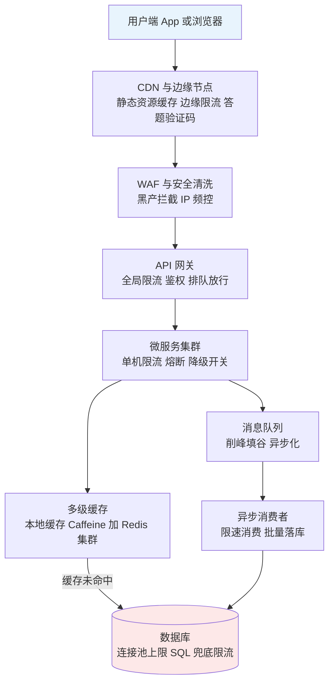
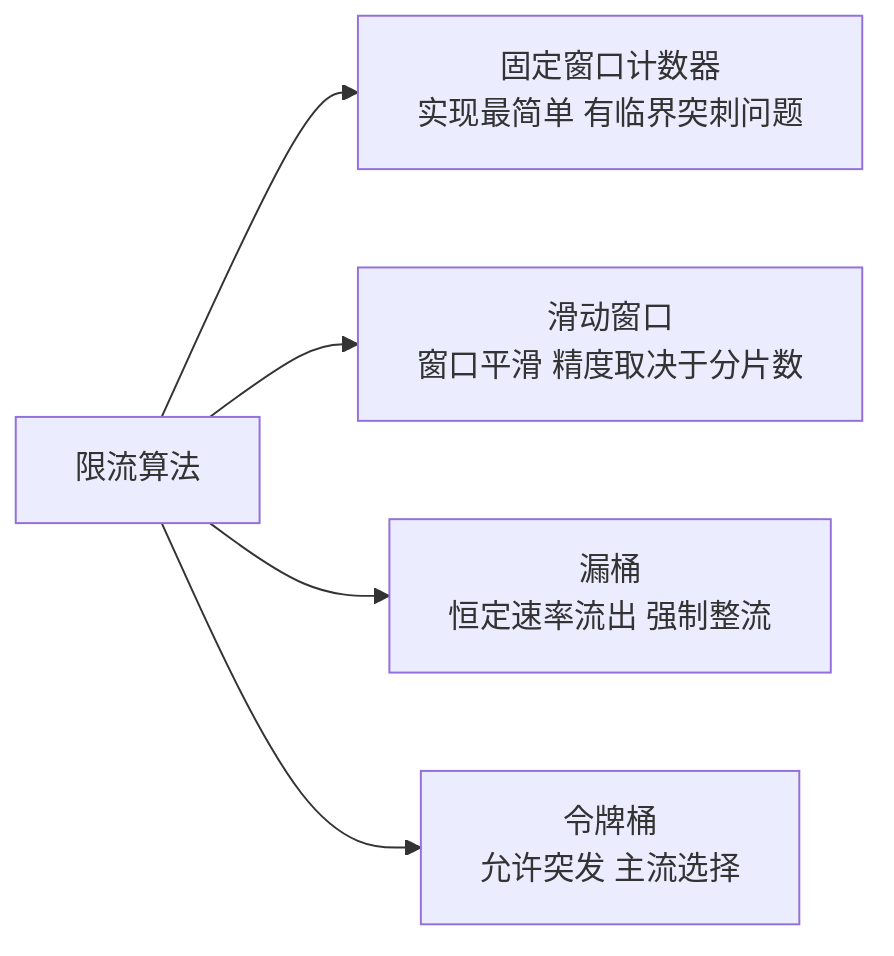
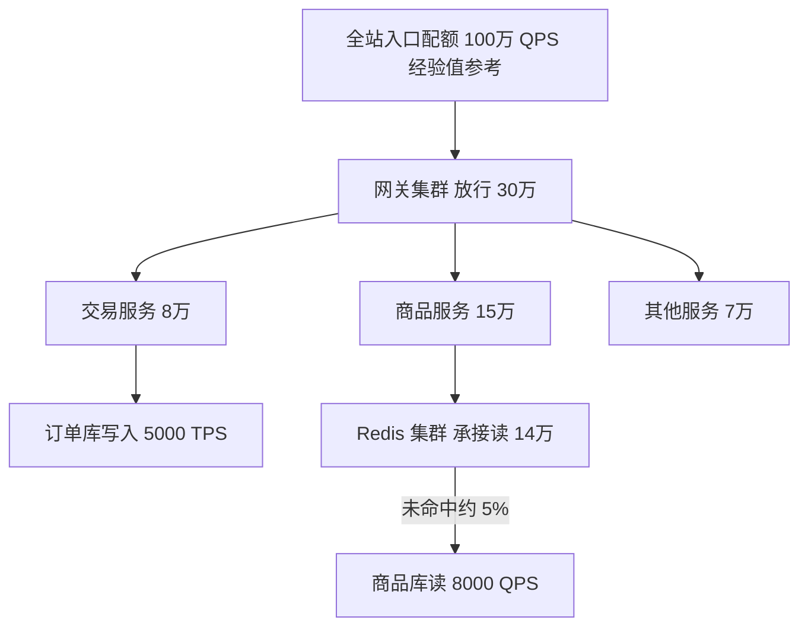
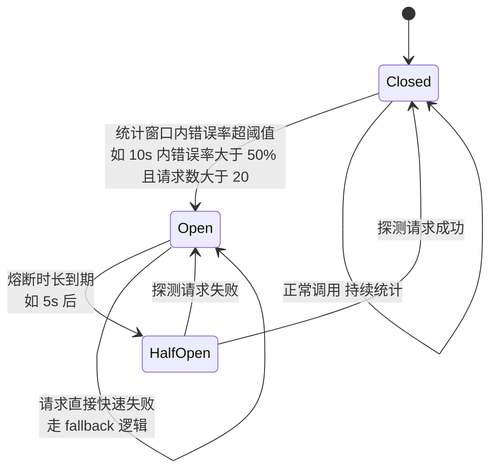
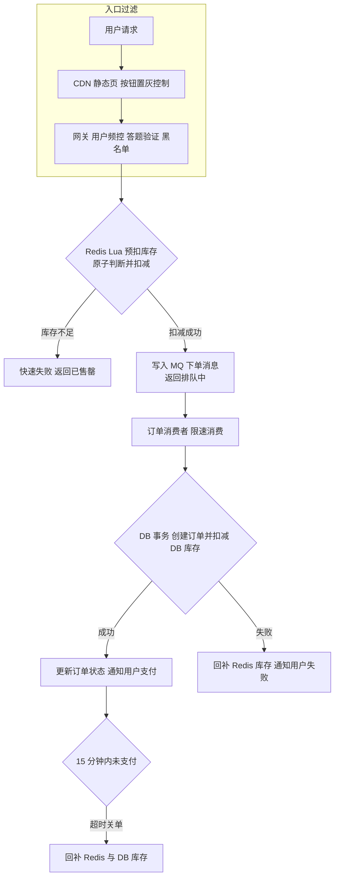
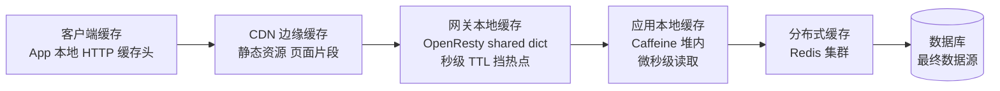
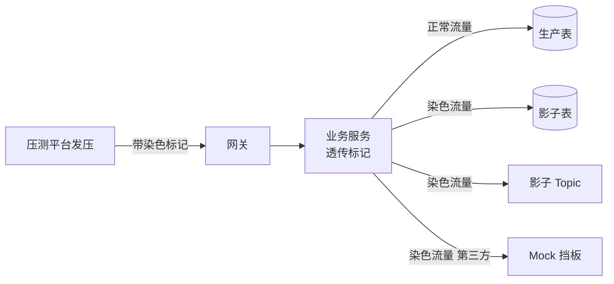

# 高并发流量治理体系

> 适用场景:大促、秒杀、热点事件等瞬时流量洪峰场景。本文总结大厂通用的流量治理模式,目标读者为有 3-5 年经验的 SRE / 后端工程师。文中所有量级数字均为经验值/量级参考,请结合自身业务压测数据校准。

## 目录

- [1. 流量治理全景](#1-流量治理全景)
- [2. 限流](#2-限流)
  - [2.1 四种限流算法对比](#21-四种限流算法对比)
  - [2.2 单机限流 vs 分布式限流](#22-单机限流-vs-分布式限流)
  - [2.3 分层限流配额设计](#23-分层限流配额设计)
  - [2.4 常用限流组件选型](#24-常用限流组件选型)
- [3. 熔断与降级](#3-熔断与降级)
  - [3.1 熔断器状态机](#31-熔断器状态机)
  - [3.2 降级分级体系](#32-降级分级体系)
  - [3.3 降级预案与开关系统](#33-降级预案与开关系统)
- [4. 削峰填谷](#4-削峰填谷)
  - [4.1 MQ 异步化](#41-mq-异步化)
  - [4.2 请求排队](#42-请求排队)
  - [4.3 秒杀典型架构](#43-秒杀典型架构)
- [5. 多级缓存](#5-多级缓存)
  - [5.1 缓存层次结构](#51-缓存层次结构)
  - [5.2 缓存三大问题与对策](#52-缓存三大问题与对策)
  - [5.3 热点 key 探测与本地缓存兜底](#53-热点-key-探测与本地缓存兜底)
  - [5.4 缓存一致性方案对比](#54-缓存一致性方案对比)
- [6. 全链路压测与预案](#6-全链路压测与预案)
  - [6.1 影子库表与流量染色](#61-影子库表与流量染色)
  - [6.2 容量规划](#62-容量规划)
  - [6.3 大促保障 Checklist](#63-大促保障-checklist)

---

## 1. 流量治理全景

流量治理的核心思想是**漏斗模型**:流量从入口到存储,每一层都要拦截掉一部分,让最终到达数据库的请求只占入口流量的极小比例。以秒杀场景为经验值参考:入口 100 万 QPS 的请求,经过层层过滤后落到 DB 的写入可能只有几百 TPS,漏斗收敛比达到千倍以上。



每道防线的职责与拦截比例(经验值/量级参考):

| 防线 | 核心手段 | 典型拦截/收敛比例 | 失效后果 |
|---|---|---|---|
| CDN / 边缘 | 静态化、边缘限流、验证码 | 拦截 60%-90% 请求(静态资源+无效刷量) | 回源流量打爆网关 |
| 网关层 | 全局限流、排队、鉴权 | 按容量放行,超量快速失败 | 服务层雪崩 |
| 服务层 | 单机限流、熔断、降级 | 保护自身与下游 | 级联故障 |
| MQ | 异步削峰 | 峰值写入摊平到 5-10 倍时长消费 | DB 写入过载 |
| 缓存层 | 多级缓存挡读 | 挡住 95%+ 读请求 | DB 读打爆 |
| DB | 连接池、慢 SQL 熔断 | 最后兜底 | 全站不可用 |

**设计原则**:上层能挡的绝不下沉;每一层都假设上一层会失效;所有防线的阈值必须可动态调整。

---

## 2. 限流

### 2.1 四种限流算法对比

限流算法的本质区别在于:**如何定义"时间窗口内的请求数"**,以及**是否允许突发流量**。



| 算法 | 原理 | 优点 | 缺点 | 典型实现 |
|---|---|---|---|---|
| 固定窗口计数器 | 每个时间窗口独立计数,超阈值拒绝 | 实现简单,内存占用小 | 窗口边界处可能放行 2 倍流量(临界突刺) | Redis INCR + EXPIRE |
| 滑动窗口 | 将窗口切分为多个小格,统计最近 N 格之和 | 消除临界突刺,统计平滑 | 分片越多越精确但内存开销越大 | Sentinel 滑动窗口、Redis ZSET |
| 漏桶 | 请求进桶,以恒定速率流出,桶满则拒绝 | 输出速率绝对平稳,保护脆弱下游 | 无法利用系统瞬时余量,突发全被削掉 | Nginx limit_req |
| 令牌桶 | 以恒定速率生成令牌,请求消耗令牌,桶容量决定突发上限 | 允许有限突发,平均速率可控 | 实现稍复杂,需维护令牌生成时间 | Guava RateLimiter、Envoy ratelimit |

**结论**:一般业务限流首选**令牌桶**(允许突发,贴近真实流量形态);保护无法承受任何突发的下游(如老旧核心系统、第三方接口)用**漏桶**做强制整流;固定窗口计数器仅适合精度要求低的粗粒度频控(如"每用户每天 100 次")。

### 2.2 单机限流 vs 分布式限流

| 维度 | 单机限流 | 分布式限流 |
|---|---|---|
| 判定位置 | 进程内存 | 集中存储(Redis)或 Token Server |
| 精度 | 集群总量 = 单机阈值 × 实例数,扩缩容后失真 | 集群总量精确可控 |
| 性能开销 | 纳秒级,无网络调用 | 每次判定一次 Redis 往返,亚毫秒级 |
| 可用性 | 无外部依赖 | Redis 故障需降级为单机模式 |
| 适用场景 | 保护单实例自身(CPU、线程池) | 保护共享下游(DB、第三方配额) |

**结论**:两者不是二选一,而是**叠加使用**——分布式限流控总量,单机限流做兜底(防止 Redis 故障或流量倾斜打垮单实例)。

**Redis + Lua 令牌桶示例**(Lua 保证原子性,避免"读-算-写"竞态):

```lua
-- KEYS[1]: 桶 key   ARGV[1]: 速率 tokens/s   ARGV[2]: 桶容量
-- ARGV[3]: 当前时间戳 ms   ARGV[4]: 本次申请令牌数
local rate     = tonumber(ARGV[1])
local capacity = tonumber(ARGV[2])
local now      = tonumber(ARGV[3])
local requested= tonumber(ARGV[4])

local bucket = redis.call('HMGET', KEYS[1], 'tokens', 'ts')
local tokens = tonumber(bucket[1]) or capacity
local ts     = tonumber(bucket[2]) or now

-- 按流逝时间补充令牌
local delta = math.max(0, now - ts) / 1000
tokens = math.min(capacity, tokens + delta * rate)

local allowed = 0
if tokens >= requested then
    tokens = tokens - requested
    allowed = 1
end

redis.call('HMSET', KEYS[1], 'tokens', tokens, 'ts', now)
redis.call('PEXPIRE', KEYS[1], math.ceil(capacity / rate * 1000) * 2)
return allowed
```

**Sentinel 集群限流**:Sentinel 提供 Token Server 模式——集群内选一个实例(或独立部署)作为 Token Server,其余实例作为 Client 每次请求前向其申请令牌。相比 Redis 方案的优势是与规则中心(Nacos/Apollo)集成、支持自动**退化为单机限流**(Token Server 不可用时按 `fallbackToLocalWhenFail` 降级),劣势是 Token Server 本身是新的单点,需要关注其容量与高可用。

### 2.3 分层限流配额设计

集群总容量确定后,配额要**逐层拆分、层层收紧**,并保证上游放行量不超过下游承接量之和:



配额拆分原则:

1. **自下而上定容量**:先压测出 DB / 核心下游的极限,乘以安全系数(经验值 0.7)得到该层配额,再反推上层。
2. **按业务优先级分配**:同一层内,核心链路(下单、支付)配额优先保证,营销、推荐类接口优先压缩。
3. **预留 buffer**:每层保留 10%-20% 配额不分配,用于大促中临时调配(经验值参考)。
4. **区分用户维度与接口维度**:接口级限流保系统,用户级频控(如单用户 10 QPS)防黑产,两者独立配置。

### 2.4 常用限流组件选型

| 组件 | 部署位置 | 限流粒度 | 算法 | 适用场景 |
|---|---|---|---|---|
| Nginx limit_req / limit_conn | 接入层 | IP、URI、自定义 key | 漏桶 | 入口整流、简单频控 |
| API 网关限流 如 Kong / APISIX / SCG | 网关层 | 应用、接口、用户、灰度标签 | 令牌桶为主,可插件化 | 全局配额、多租户配额 |
| Sentinel | 应用内 SDK | 资源(方法/接口)、热点参数 | 滑动窗口 + 令牌桶,支持集群模式 | Java 微服务限流熔断一体化 |
| Envoy ratelimit + RLS | Sidecar / 网格 | descriptor 任意组合维度 | 令牌桶(Redis 存储) | Service Mesh、多语言统一治理 |
| Redis + Lua 自研 | 任意 | 完全自定义 | 自选 | 特殊维度(如按商家、按活动)配额 |

**结论**:典型组合是 **Nginx/网关做入口粗限流 + Sentinel 或 Mesh 做服务级精细限流 + Redis+Lua 做业务维度配额**,三层互为补充而非替代。

---

## 3. 熔断与降级

限流解决"流量太多",熔断解决"下游太弱"。熔断是**调用方的自我保护**:下游持续失败时主动切断调用,避免线程池被慢调用耗尽引发级联雪崩。

### 3.1 熔断器状态机



关键参数(以 Sentinel / Resilience4j 通用语义,数值为经验值参考):

| 参数 | 含义 | 经验值参考 |
|---|---|---|
| 统计窗口 | 计算错误率/慢调用比例的滑动窗口 | 10s |
| 最小请求数 | 窗口内请求数低于此值不触发熔断,防止低流量误判 | 20 |
| 错误率阈值 | 触发熔断的失败比例 | 50% |
| 慢调用阈值 | RT 超过多少算慢调用 | 依接口 P99 设定,如 1s |
| 熔断时长 | Open 态持续时间 | 5-30s |
| 半开放行数 | HalfOpen 态允许的探测请求数 | 1-5 |

注意:**熔断必须配 fallback**,否则只是把超时错误变成快速失败错误。fallback 的常见形态:返回缓存旧值、返回默认值/空列表、返回静态托底页。

### 3.2 降级分级体系

降级的本质是**有损服务**:在容量不足时,牺牲非核心体验换取核心链路存活。建议按影响面预先划分三级:

| 级别 | 定义 | 典型动作 | 决策人 | 触发方式 |
|---|---|---|---|---|
| L1 轻度降级 | 用户几乎无感,牺牲实时性与个性化 | 关闭个性化推荐改为热榜、评论延迟可见、日志采样率下调、非核心异步任务延后 | 值班 SRE 直接执行 | 自动触发为主(CPU、RT 阈值) |
| L2 中度降级 | 用户有感,非核心功能不可用 | 关闭商品评价/收藏/足迹、搜索结果去掉聚合筛选、限制查单时间范围、图片降质 | 值班 SRE + 业务 owner 确认 | 半自动,预案一键执行 |
| L3 重度降级 | 核心链路有损,保命操作 | 只保下单支付、全站静态托底页、排队页、部分用户拒绝服务 | 大促指挥/技术负责人 | 人工决策,双人复核 |

**结论**:分级的意义在于**把决策成本前置**——大促现场没有时间讨论"这个功能能不能关",必须在预案里提前写清每个开关的级别、影响面和决策人。

### 3.3 降级预案与开关系统

降级动作必须收敛到统一的**开关系统**(基于配置中心 Nacos / Apollo / etcd 实现),要求:

1. **秒级生效**:配置推送到全部实例的延迟应在秒级(经验值 1-5s),并有生效实例数回显。
2. **开关元数据完整**:每个开关登记名称、级别、影响面描述、负责人、回滚方式、最近演练时间。
3. **支持灰度与分组**:可按机房、集群、用户尾号灰度打开,避免一把梭。
4. **操作审计**:谁在何时改了什么,自动同步到大促作战群。
5. **定期演练**:未在近一个季度演练过的开关视为不可用——**没演练过的预案等于没有预案**。

开关使用的伪代码模式:

```java
// 开关判断置于业务逻辑最前端,fallback 路径必须是纯内存或纯缓存操作
if (SwitchCenter.isOn("degrade.item.recommend")) {
    return hotRankCache.getTopN(20);   // L1 降级:热榜兜底
}
return recommendService.personalize(userId);  // 正常路径
```

---

## 4. 削峰填谷

### 4.1 MQ 异步化

同步链路的容量由**最慢的下游**决定;引入 MQ 后,前端接口容量与后端处理容量解耦——峰值流量先落队列,消费者按自身能力匀速消费,把"1 分钟的洪峰"摊平成"10 分钟的平稳消费"(量级参考)。

适合异步化的环节:订单创建后的积分/优惠券发放、消息通知、数据同步、日志上报。**不适合**异步化的:需要同步返回结果的强一致操作(如支付扣款结果)。

异步化的三个必答题:

| 问题 | 应对 |
|---|---|
| 消息堆积怎么办 | 监控堆积量与消费延迟;消费者可水平扩容;超过阈值触发上游限流联动 |
| 消息丢失怎么办 | 生产端确认 + Broker 多副本 + 消费端手动 ACK;关键链路加对账任务兜底 |
| 重复消费怎么办 | 消费逻辑幂等:唯一业务键 + 状态机判断,或幂等表去重 |

### 4.2 请求排队

对于**必须同步等待结果**但容量不足的场景(如秒杀下单),用"队列 + 令牌"模式把并发转为排队:

1. 用户请求先进入排队队列(Redis List / MQ),立即返回排队号。
2. 放行器按下游容量匀速发放"进场令牌"(如每秒 500 个,经验值参考)。
3. 前端轮询排队状态,拿到令牌后才真正提交业务请求。
4. 队列长度设上限,超出直接返回"活动火爆请稍后",避免无意义等待。

这本质上是把漏桶算法做到了产品层——用户看到的是进度条而不是报错,体验远好于直接限流拒绝。

### 4.3 秒杀典型架构

秒杀的核心矛盾:**瞬时百万级请求争抢千级库存**。解法是把库存判定前置到 Redis,DB 只做最终落库。



**Redis + Lua 库存预扣**(原子性是关键,绝不能"GET 判断后再 DECR"):

```lua
-- KEYS[1]: 库存 key   KEYS[2]: 用户已购集合   ARGV[1]: userId
if redis.call('SISMEMBER', KEYS[2], ARGV[1]) == 1 then
    return -2                          -- 重复购买
end
local stock = tonumber(redis.call('GET', KEYS[1]) or '0')
if stock <= 0 then
    return -1                          -- 已售罄
end
redis.call('DECR', KEYS[1])
redis.call('SADD', KEYS[2], ARGV[1])
return stock - 1                       -- 扣减成功,返回剩余
```

关键设计点:

1. **库存预热**:活动开始前把库存加载进 Redis,并对热点商品做**库存分片**(拆成 N 个 key 分散到多个分片,防单 key 热点)。
2. **Redis 扣减 + 异步落库**:Redis 判定成败(挡住 99%+ 无效请求,量级参考),MQ 消息驱动 DB 落库,DB 写压力从百万级降为与库存量同量级。
3. **最终一致性兜底**:Redis 与 DB 库存定时对账;落库失败、超时关单都要回补库存。
4. **防超卖双保险**:Redis Lua 原子扣减是第一道,DB 侧 `UPDATE stock SET num = num - 1 WHERE id = ? AND num > 0` 的条件更新是第二道。

---

## 5. 多级缓存

### 5.1 缓存层次结构

读多写少是高并发业务的普遍形态,多级缓存的目标是让读请求**在离用户最近、成本最低的层级被消化**:



| 层级 | 命中延迟 量级参考 | 容量 | 一致性 | 适合数据 |
|---|---|---|---|---|
| 客户端 / CDN | 0-10ms | 大 | 弱,靠 TTL 与主动刷新 | 静态资源、商详页框架 |
| 网关本地缓存 | 亚毫秒 | 小 | 弱,秒级 TTL | 极热点数据的读兜底 |
| 应用本地缓存 Caffeine | 微秒 | 小,受堆内存限制 | 弱,靠广播失效或短 TTL | 热点商品、配置、字典 |
| Redis 集群 | 1ms 内 | 中到大 | 较强,可主动失效 | 绝大多数业务缓存 |
| DB | 1-10ms 起 | 全量 | 强 | 最终数据源 |

**结论**:越靠前的层级延迟越低但一致性越弱,因此**放进前置层级的数据必须容忍短暂不一致**;强一致读(如支付余额)不走多级缓存。

### 5.2 缓存三大问题与对策

| 问题 | 定义 | 危害 | 对策 |
|---|---|---|---|
| 缓存穿透 | 查询**根本不存在**的数据,缓存永远不命中,请求全部打到 DB | 恶意构造不存在的 key 可直接打挂 DB | 1. 缓存空值(短 TTL 如 60s);2. 布隆过滤器前置拦截;3. 入口参数合法性校验(ID 格式/范围) |
| 缓存击穿 | 单个**热点 key 过期瞬间**,大量并发同时回源 DB | 单点热数据瞬间打出 DB 尖刺 | 1. 互斥锁/singleflight 只放一个请求回源,其余等待;2. 热点 key 逻辑过期不物理删除,异步刷新;3. 热点 key 永不过期 + 主动更新 |
| 缓存雪崩 | **大量 key 同时过期**或缓存集群整体故障 | DB 承接全量读流量,全站崩溃 | 1. TTL 加随机抖动(如基础值 ± 10%);2. 缓存集群高可用 + 熔断降级到本地缓存/默认值;3. DB 侧限流兜底 |

singleflight 防击穿伪代码:

```go
// 相同 key 的并发回源请求只执行一次,其余请求共享结果
val, err := sf.Do(key, func() (interface{}, error) {
    v, err := db.Query(key)
    if err == nil {
        redis.SetEx(key, v, ttlWithJitter(300))
    }
    return v, err
})
```

### 5.3 热点 key 探测与本地缓存兜底

Redis 集群的单分片容量有限(经验值:单分片 10 万 QPS 量级),突发热点 key(明星八卦、爆款商品)会把单分片打满,且无法靠扩容解决——同一个 key 永远落在同一分片。

治理闭环:

1. **探测**:客户端 SDK 上报 key 访问计数,汇聚端(如京东 hotkey、有赞 TMC 的模式)以秒级窗口聚合,超过阈值(如单 key 2 万 QPS,经验值参考)判定为热点;或用 `redis-cli --hotkeys`、Proxy 层统计做离线/准实时发现。
2. **推送**:探测系统将热点 key 名单实时推送到所有应用实例。
3. **兜底**:实例收到名单后,把该 key 自动加载进 Caffeine 本地缓存(短 TTL,如 5-30s),后续读请求在本地消化,Redis 压力下降数个量级。
4. **退出**:热度回落后自动移出名单,恢复正常读 Redis 路径。

```java
Cache<String, Object> hotCache = Caffeine.newBuilder()
        .maximumSize(10_000)
        .expireAfterWrite(Duration.ofSeconds(10))   // 短 TTL 控制不一致窗口
        .build();

Object get(String key) {
    if (HotKeyDetector.isHot(key)) {                // 命中热点名单
        return hotCache.get(key, k -> redis.get(k));
    }
    return redis.get(key);
}
```

### 5.4 缓存一致性方案对比

先给结论:**绝大多数业务用 Cache Aside 即可;对不一致窗口敏感的场景叠加延迟双删;中大型团队的终态方案是 binlog 订阅异步失效**。

| 方案 | 流程 | 不一致窗口 | 复杂度 | 适用 |
|---|---|---|---|---|
| Cache Aside 旁路缓存 | 读:先缓存后 DB 并回填;写:先更新 DB,再**删除**缓存 | 小概率窗口(读回填与写删除并发交错) | 低 | 默认方案,覆盖 90% 场景 |
| 延迟双删 | 写:删缓存 → 更新 DB → 延迟 N 百毫秒再删一次缓存 | 进一步压缩(清掉窗口期内的脏回填) | 中,延迟时间难精确设定,需异步化 | 读写并发高且对脏读敏感 |
| binlog 订阅 Canal | 业务只写 DB;Canal 伪装 MySQL 从库解析 binlog,经 MQ 驱动缓存删除/更新 | 秒级内最终一致,不依赖业务代码 | 高,需维护 Canal + MQ 链路 | 多语言/多入口写 DB、缓存更新逻辑收敛 |

补充说明:

- Cache Aside 选择**删缓存而非更新缓存**:删除是幂等且无序安全的,更新在并发下会写入旧值。
- 延迟双删的第二次删除建议投递到延迟队列执行,不要 sleep 阻塞业务线程;延迟时间取"主从同步延迟 + 一次读请求耗时"的上界(经验值 500ms-1s)。
- Canal 方案天然解决"DB 更新成功但删缓存失败"的问题(binlog 不会丢),且能覆盖 DBA 直接改库等旁路写入,代价是链路更长、需要监控订阅延迟。

---

## 6. 全链路压测与预案

### 6.1 影子库表与流量染色

大促容量必须用**生产环境全链路压测**验证——测试环境的拓扑、数据量、配置与生产差异太大,结论不可信。核心机制:

**流量染色**:压测流量在入口打上标记(如 HTTP Header `X-Stress-Test: true`),标记通过 RPC 上下文(如 gRPC metadata、Dubbo attachment)和 MQ 消息属性**全链路透传**,任何一环丢失标记都会造成脏数据污染生产。

**影子隔离**:各存储组件识别染色标记后路由到影子资源——

| 组件 | 隔离方式 |
|---|---|
| 数据库 | 影子表(同库 `_shadow` 后缀表)或影子库,压测写全部落影子表 |
| Redis | 影子 key 前缀(如 `shadow:`)或独立影子集群 |
| MQ | 影子 Topic,消费者按标记路由 |
| 日志/监控 | 打标区分,压测指标单独看板,避免污染业务报表 |
| 第三方调用 | 强制 mock 挡板,**绝不能把压测流量打给外部**(支付、短信、物流) |



压测实施要点:低峰期执行;从 20% 目标流量逐级加压;设置**自动熔断**(错误率或核心接口 RT 超阈值立即停止发压);压测后清理影子数据并复盘瓶颈。

### 6.2 容量规划

容量规划回答一个问题:**目标峰值下,每个环节需要多少资源**。方法论:

1. **预估峰值**:业务侧给出 GMV/UV 目标 → 换算为核心接口峰值 QPS。经验公式:峰值 QPS ≈ 日均 QPS × 峰值系数(大促场景峰值系数 10-50 倍,秒杀场景更高,量级参考)。
2. **摸底单机容量**:单机压测得出单实例极限 QPS,取 70% 作为安全水位(经验值)。
3. **推算实例数**:实例数 = 峰值 QPS ÷ 单机安全容量,再按 N+2 冗余和多机房容灾(如同城双活按单机房承担 100% 计算)上浮。
4. **核对非弹性资源**:DB 连接数、Redis 分片容量、MQ Topic 吞吐、带宽、SLB 规格——这些扩容周期长,必须提前 1-2 周确认(经验值)。
5. **全链路压测验证**:以目标峰值的 100%-120% 发压验证,发现短板环节回到第 3 步修正。

### 6.3 大促保障 Checklist

**T-2 周:准备期**

- [ ] 容量规划完成,扩容申请提交(计算、DB、缓存、MQ、带宽)
- [ ] 全链路压测通过 120% 目标流量(经验值参考)
- [ ] 限流阈值按压测结果全量校准并配置到位
- [ ] 降级预案清单评审:每个开关有级别、负责人、影响面、回滚步骤
- [ ] 变更封网时间确定,非必要发布冻结

**T-1 周:验证期**

- [ ] 所有 L1/L2 降级开关生产演练一遍
- [ ] 故障演练:注入 Redis 抖动、下游超时、单机房故障,验证熔断与切流
- [ ] 监控大盘与告警核对:核心链路黄金指标(流量、错误率、RT、饱和度)全覆盖
- [ ] 值班表排定,作战群建立,升级路径(oncall → 域负责人 → 总指挥)明确
- [ ] 秒杀库存预热脚本、缓存预热脚本演练通过

**T-1 天 至 当天:临战期**

- [ ] 缓存预热执行完成,命中率达标(经验值 95%+)
- [ ] 弹性资源扩容到位,健康检查全绿
- [ ] 封网生效,CMDB 冻结变更
- [ ] 战前 checklist 逐项唱票确认
- [ ] 活动开始后前 30 分钟盯盘:入口 QPS、限流触发量、MQ 堆积、DB 水位、错误率

**T+1 天:复盘期**

- [ ] 缩容回收资源,恢复常态限流阈值
- [ ] 影子数据、预热数据清理
- [ ] 复盘:预估 vs 实际流量偏差、预案触发情况、瓶颈与改进项落 owner 和 deadline

---

## 小结

高并发流量治理不是单点技术,而是一套**纵深防御体系**:限流控制入口总量,熔断降级阻断级联故障,MQ 削峰解耦峰值与处理能力,多级缓存把读压力消化在存储之前,全链路压测和预案演练则保证以上所有机制在真实洪峰到来时**真的有效**。落地时牢记三句话:每一层都假设上一层会失效;所有阈值来自压测而非拍脑袋;没演练过的预案等于没有预案。
