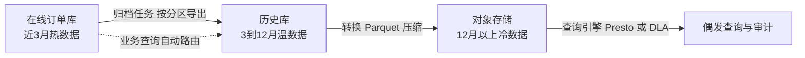
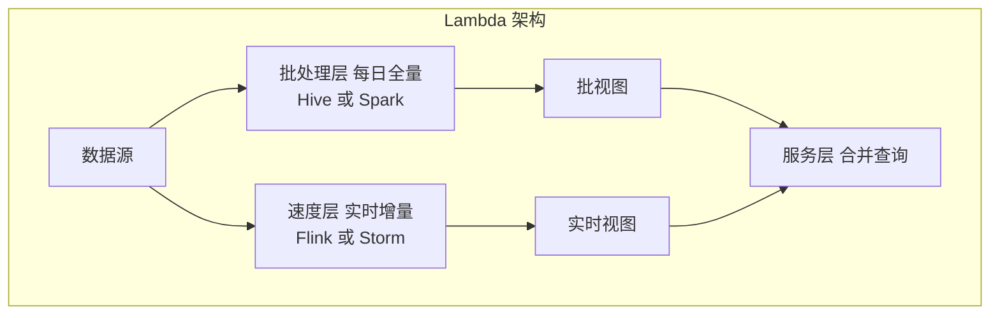
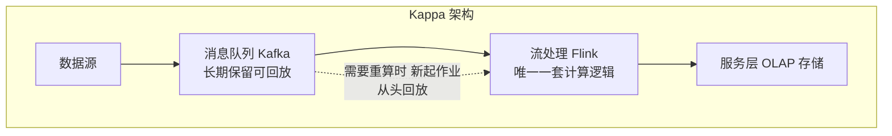
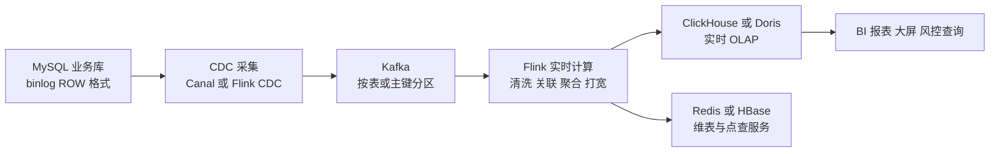
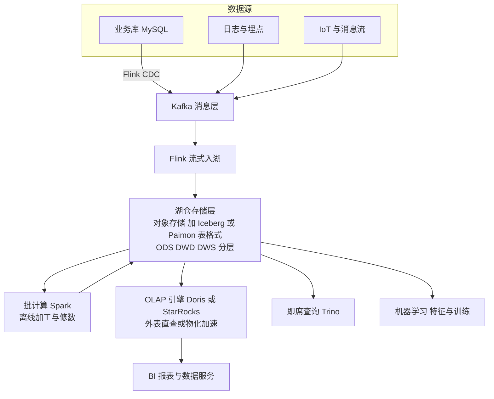
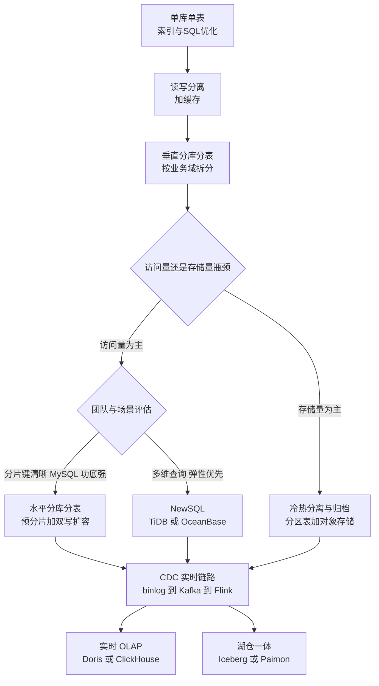

# 海量数据架构:TB~PB 级数据的存储与数据链路设计

> 本文面向有 3-5 年经验的 SRE / 后端工程师,系统梳理大厂在海量数据场景下的通用架构模式:从单库优化、分库分表,到 NewSQL、冷热分离、实时数仓与湖仓一体。文中所有量级数字均为**经验值/量级参考**,实际阈值取决于硬件规格、行宽、索引数量与访问模式,务必以压测数据为准。

## 目录

- [1. 数据规模分级与架构选择](#1-数据规模分级与架构选择)
- [2. 分库分表](#2-分库分表)
  - [2.1 垂直拆分与水平拆分](#21-垂直拆分与水平拆分)
  - [2.2 分片键选择原则](#22-分片键选择原则)
  - [2.3 常见分片算法](#23-常见分片算法)
  - [2.4 扩容方案](#24-扩容方案)
  - [2.5 中间件对比](#25-中间件对比)
  - [2.6 分库分表带来的问题及对策](#26-分库分表带来的问题及对策)
  - [2.7 全局 ID 方案对比](#27-全局-id-方案对比)
- [3. NewSQL 与分布式数据库](#3-newsql-与分布式数据库)
- [4. 冷热分离与归档](#4-冷热分离与归档)
- [5. 实时数仓与数据链路](#5-实时数仓与数据链路)
- [6. 数据湖与湖仓一体](#6-数据湖与湖仓一体)
- [7. 数据一致性保障](#7-数据一致性保障)
- [8. 总结:一张演进路线图](#8-总结一张演进路线图)

---

## 1. 数据规模分级与架构选择

海量数据架构的第一原则是:**不要过度设计**。绝大多数"性能问题"在千万级规模上可以靠索引、SQL 优化和读写分离解决,盲目上分库分表只会把复杂度提前引入。下表给出按单表规模分级的决策参考(经验值/量级参考,假设行宽 1KB 以内、B+ 树索引、常规 OLTP 负载):

| 单表规模 | 典型症状 | 首选手段 | 备选/进阶手段 | 不建议 |
| --- | --- | --- | --- | --- |
| < 500 万行 | 基本无压力 | 索引优化、慢 SQL 治理 | 无 | 任何拆分 |
| 500 万 ~ 2000 万行 | 个别慢查询、B+ 树 3~4 层 | 索引与 SQL 优化、覆盖索引、读写分离 | 按时间分区表 | 分库分表 |
| 2000 万 ~ 1 亿行 | 写入抖动、DDL 变更困难、备份变慢 | 分区表、冷热分离归档、读写分离 | 垂直拆分、大字段外移 | 直接水平分片 |
| 1 亿 ~ 10 亿行 | 单机 IOPS/磁盘瓶颈、主从延迟明显 | 水平分库分表、或迁移 NewSQL | 冷热分离 + 分片组合 | 继续硬扛单机 |
| > 10 亿行 / TB 级+ | 单机无法承载、扩容频繁 | NewSQL 分布式数据库、或成熟分片体系 | OLAP 场景转 ClickHouse/Doris、湖仓 | 用 OLTP 库做分析查询 |

几个常被误解的点:

1. **"单表不能超过 2000 万行"不是硬性规律**,它来源于 B+ 树层高从 3 层升到 4 层导致多一次磁盘 IO 的推算。NVMe SSD 时代该阈值可以显著放宽,几亿行的单表在良好索引下依然可用(经验值/量级参考)。
2. **先区分是"存储量问题"还是"访问量问题"**。存储量大但访问量低,冷热分离归档即可;访问量大(QPS 数万以上,经验值/量级参考)才需要分片或分布式数据库。
3. **OLTP 和 OLAP 必须分开**。分析型查询打在业务库上是海量数据场景最常见的事故来源,应尽早通过 CDC 链路把数据同步到 OLAP 引擎(见第 5 节)。

---

## 2. 分库分表

### 2.1 垂直拆分与水平拆分

**垂直分库**:按业务域把不同表拆到不同数据库实例,例如订单库、用户库、商品库分离。这是微服务拆分的自然结果,解决的是"业务耦合 + 单实例连接数/容量上限"问题。

**垂直分表**:把一张宽表按字段冷热拆开,例如把订单表中的大字段(收货地址快照、商品快照 JSON)拆到扩展表,主表只留高频访问的窄字段,提高单页能容纳的行数、降低 buffer pool 压力。

**水平分库分表**:同一张逻辑表按分片键把行分散到多个库/多张表。解决单表行数和单库写入吞吐上限,是本节的重点。

一般演进顺序:**垂直分库 → 垂直分表 → 读写分离 → 水平分库分表**。水平拆分复杂度最高,应放在最后。

### 2.2 分片键选择原则

分片键(Sharding Key)一旦选定,后续变更成本极高,选择时遵循以下原则:

1. **覆盖绝大多数查询**:80% 以上的查询条件必须携带分片键(经验值/量级参考),否则退化为全分片广播查询。
2. **数据分布均匀**:避免热点。用商家 ID 分片时,头部大商家会造成严重倾斜;用用户 ID 通常更均匀。
3. **基数足够大**:分片键取值空间要远大于分片数,状态、类型等低基数字段不可用。
4. **不可变**:分片键值变更意味着跨分片迁移行,应选天然不可变的字段(用户 ID、订单 ID)。
5. **兼顾多查询维度**:典型矛盾是订单表——C 端按 `user_id` 查、B 端按 `merchant_id` 查、客服按 `order_id` 查。常见对策:
   - **基因法**:把 `user_id` 的低位基因融入 `order_id`(见 2.3),使按订单号查询可直接路由;
   - **异构索引表**:按 `merchant_id` 再冗余一份数据(或只存映射关系),写入通过 binlog 异步同步;
   - **B 端/分析查询走 OLAP**:商家侧报表类需求同步到 ClickHouse/Doris 解决。

### 2.3 常见分片算法

| 算法 | 原理 | 优点 | 缺点 | 典型场景 |
| --- | --- | --- | --- | --- |
| Range 范围分片 | 按 ID 区间或时间区间划分 | 扩容简单只需追加新分片;范围查询友好 | 写热点集中在最新分片;数据冷热不均 | 日志、按时间归档的流水类数据 |
| Hash 取模 | `hash(key) % N` | 分布均匀、实现简单 | 扩容需大规模数据迁移;N 变化时映射全变 | 分片数长期稳定的业务表 |
| 一致性哈希 | 哈希环 + 虚拟节点,key 顺时针落到最近节点 | 扩缩容只迁移相邻节点部分数据 | 实现复杂;数据库分片场景收益有限,更常用于缓存 | Redis 集群客户端分片、无状态路由 |
| 基因法 | 把分片键 hash 后的低 N 位作为"基因"嵌入另一个 ID 的低位 | 两个维度共享同一路由结果,免二次查表 | 基因位数固定后分片数上限固定;设计前置性强 | 订单 ID 携带用户基因,按订单号免广播查询 |

**基因法示例**:分 16 库时取 `user_id` 的低 4 位作为基因;生成订单号时,把雪花 ID 的低 4 位替换为该基因。于是 `order_id % 16 == user_id % 16`,按订单号和按用户号查询路由到同一分片。代价是分片数被基因位数锁死(4 位基因最多 16 片),因此**基因位数要按终局容量规划**,常见做法是预留 6~7 位基因支持 64~128 分片(经验值/量级参考)。

实践中最常用的组合是 **"hash 分库 + range 分表"** 或 **"hash 取模 + 预分片"**:一次性建足逻辑分片(如 1024 个逻辑表),多个逻辑分片先落在少量物理库上,扩容时只做"逻辑分片 → 物理库"映射的搬迁,避免重新 hash。

### 2.4 扩容方案

水平分片的扩容是分库分表方案中最容易出事故的环节,两种主流方案:

**方案一:翻倍扩容(成倍扩容)**

前提是分片数为 2 的幂且用取模路由。从 N 库扩到 2N 库时,`hash % 2N` 的结果要么不变,要么等于原值加 N——即每个旧分片的数据最多只会迁往一个确定的新分片。

操作流程:为每个旧库挂载新从库 → 数据追平后从库升主 → 修改路由规则为 `% 2N` → 每个库中约一半数据成为冗余,低峰期后台删除。优点是**利用主从复制完成迁移,无需开发迁移程序,切换窗口短**;缺点是只能成倍扩、资源利用率阶梯式跳变。

**方案二:双写迁移**

通用方案,适用于任意分片数变更、更换分片算法、异构迁移(如 MySQL 迁 TiDB):

双写迁移的关键工程细节:

- **双写以旧库为准**:新库写失败只记日志报警,不影响主流程;
- **存量迁移与双写的时序冲突**用"新库数据更新时间不早于迁移数据"或按主键幂等覆盖解决;
- **校验必须自动化**:全量 checksum 比对 + 基于 binlog 的增量比对,不一致率降到 0 并稳定一段时间(如 24~72 小时,经验值/量级参考)才允许切读;
- **每一步都可回滚**:切读阶段保留旧库写入,发现问题秒级切回。

### 2.5 中间件对比

分库分表中间件分两类:**客户端 SDK 模式**(路由逻辑在应用进程内)和 **代理 Proxy 模式**(独立进程伪装成 MySQL)。选型结论:Java 技术栈新项目首选 ShardingSphere(JDBC 为主、Proxy 补充异构语言);多语言/超大规模且有专职团队可考虑 Vitess;MyCat 社区活跃度下降,新项目不建议引入。

| 维度 | ShardingSphere | MyCat | Vitess |
| --- | --- | --- | --- |
| 形态 | JDBC 客户端 + Proxy 双形态 | Proxy | Proxy + 完整管控平面 |
| 语言生态 | Java 为主,Proxy 支持任意语言 | 任意语言 | 任意语言,gRPC/MySQL 协议 |
| 性能损耗 | JDBC 模式无网络额外跳,损耗最低 | 多一跳网络 | 多一跳网络 |
| 分片能力 | 灵活,支持自定义算法、绑定表、广播表 | 基本分片能力 | VSchema 声明式分片,支持在线 Resharding |
| 在线扩容 | 需配合迁移工具或自研双写 | 需自行迁移 | 内建 Resharding 工作流,自动切分迁移 |
| 分布式事务 | XA / BASE 柔性事务 | 弱 | 两阶段提交支持有限,推荐单分片事务 |
| 运维复杂度 | 低到中 | 中 | 高,依赖 etcd/topo 服务,K8s 亲和 |
| 社区状态 | Apache 顶级项目,活跃 | 活跃度明显下降 | CNCF 毕业项目,YouTube/Slack 等生产验证 |
| 适合团队 | 大多数 Java 团队 | 存量系统维护 | 平台化团队、云原生 MySQL 底座 |

### 2.6 分库分表带来的问题及对策

分库分表不是免费的,以下问题必须在方案评审阶段给出答案:

| 问题 | 说明 | 常用对策 |
| --- | --- | --- |
| 分布式事务 | 跨分片写入无法用本地事务保证原子性 | 优先设计成单分片事务;跨分片用最终一致性方案,见第 7 节 |
| 跨分片查询 | 不带分片键的查询退化为广播,N 个分片 N 倍放大 | 基因法、异构索引表、ES/OLAP 承接复杂查询、限制业务查询入口 |
| 全局唯一 ID | 自增主键在分片间冲突 | 雪花算法 / 号段模式,见 2.7 |
| 跨分片分页排序 | `ORDER BY x LIMIT 100000, 10` 需各分片取前 100010 条归并 | 禁止深分页,改游标分页;报表走 OLAP |
| 跨分片 JOIN | 分片间无法直接 JOIN | 绑定表同分片、广播小表、应用层组装、宽表冗余 |
| 聚合统计 | count/sum 需全分片汇总 | 计数走 Redis/计数表异步维护,分析走数仓 |
| 运维复杂度 | 备份、DDL、监控对象翻 N 倍 | 自动化平台化,DDL 用 gh-ost/pt-osc 批量编排 |

### 2.7 全局 ID 方案对比

结论先行:**内部主键首选号段模式或雪花算法,对外暴露的 ID 建议雪花 + 加密或独立编码,UUID 不要做 InnoDB 主键**(随机写导致页分裂、写放大严重)。

| 维度 | 雪花算法 Snowflake | 号段模式 Segment | UUID |
| --- | --- | --- | --- |
| 结构 | 41 位时间戳 + 10 位机器 ID + 12 位序列 | 中心库批量发放区间,本地内存分配 | 128 位随机/时间混合 |
| 趋势递增 | 是,按时间趋势递增 | 是,严格或趋势递增 | 否,完全无序 |
| 依赖 | 时钟 + 机器 ID 分配 | 中心数据库 | 无 |
| 性能 | 本地生成,单机每毫秒 4096 个 | 内存分配,取号段时有一次 DB 交互 | 本地生成,极快 |
| 单点风险 | 无中心节点 | 发号库故障影响取新号段,双 buffer 缓解 | 无 |
| 主要风险 | **时钟回拨**导致重复 ID,需回拨检测/等待/备用位 | 号段浪费、重启丢段;严格递增时有单点写 | 索引碎片、存储 16 字节偏大 |
| 信息泄露 | 可推算生成时间与量级 | 可推算业务量 | 无 |
| 典型实现 | 百度 UidGenerator、自研 | 美团 Leaf-segment、滴滴 TinyID | 语言内建库 |

时钟回拨的工程处理:小幅回拨(几十毫秒内)自旋等待;大幅回拨拒绝服务并告警;或预留备用位在回拨时切换序列空间。机器 ID 分配用 ZooKeeper/etcd/DB 统一管理,严禁手工配置漏管。

---

## 3. NewSQL 与分布式数据库

NewSQL 的核心承诺:**保留 SQL 与 ACID 事务,同时获得 NoSQL 式的水平扩展能力**,让业务不再感知分片。

**TiDB**:计算存储分离架构。TiDB Server 无状态负责 SQL 解析与执行,TiKV 基于 RocksDB + Raft 多副本存储行数据(按 Region 自动分裂调度),PD 负责元数据与调度,TiFlash 列存副本承接分析查询,实现 HTAP。MySQL 协议高度兼容,生态工具(DM、TiCDC)完善。适合:MySQL 分库分表改造成本高、需要弹性扩展和实时分析一体的场景。

**OceanBase**:蚂蚁自研,单集群多租户,Paxos 多副本,LSM-Tree 存储引擎,以"三地五中心"金融级高可用著称,兼容 MySQL 与 Oracle 两种模式。TPC-C 打榜验证过极限性能。适合:金融级强一致与容灾要求、Oracle 迁移替代场景。

**CockroachDB**:Spanner 论文开源实现,PostgreSQL 协议,Range 自动分片 + Raft,多区域地理分区能力(数据按地域驻留)是其特色。适合:全球化部署、PG 生态、多云跨地域场景;国内生态与本地化支持相对弱。

### 分库分表 vs NewSQL 决策指南

两者不是互斥演进关系,而是不同约束下的取舍。决策参考:

| 决策因素 | 倾向分库分表 | 倾向 NewSQL |
| --- | --- | --- |
| 团队 MySQL 运维能力 | 强,有成熟 DBA 体系与自动化平台 | 一般,愿意换取"少操心分片" |
| 查询模式 | 单一维度为主,分片键覆盖率高 | 多维度查询、复杂事务、跨分片操作多 |
| 延迟要求 | P99 要求极致,单机 MySQL 路径最短 | 可接受 Raft 多副本共识带来的额外毫秒级延迟 |
| 数据规模增速 | 可预测,预分片一次到位 | 增长不可预测,需要随时加节点弹性扩容 |
| 二次扩容/变更分片键 | 能接受双写迁移的工程成本 | 希望完全免除,交给数据库自动 Region 调度 |
| 硬件成本 | 普通 SSD 单机即可 | 通常需要 NVMe + 万兆网络 + 至少 3 副本,基础成本更高 |
| 存量改造 | 存量 MySQL 体系,渐进改造 | 新业务、或分库分表技术债已难以维持 |

经验法则(经验值/量级参考):**单集群数据 10TB 以内、查询维度单一、团队 MySQL 功底扎实,分库分表的总拥有成本往往更低;跨分片事务频繁、查询维度多、DDL 与扩容成为常态痛点时,NewSQL 的架构简化收益开始超过其硬件与学习成本**。另注意 NewSQL 并不豁免设计责任:热点小表、超大事务、无索引扫描在分布式数据库上代价更高。

---

## 4. 冷热分离与归档

### 4.1 数据生命周期管理

海量数据的访问呈强烈的时间局部性:订单类数据 90% 以上的访问集中在最近 3 个月(经验值/量级参考)。数据生命周期管理(DLM)的核心是**按访问频率把数据放到成本匹配的存储层**:

| 层级 | 数据特征 | 存储介质 | 访问延迟目标 | 相对成本 |
| --- | --- | --- | --- | --- |
| 热数据 | 高频读写,近 N 个月 | 在线 OLTP 库,NVMe SSD | 毫秒级 | 最高 |
| 温数据 | 低频只读,偶发查询 | 历史库/归档库,大容量 SSD 或 HDD | 十到百毫秒 | 中 |
| 冷数据 | 极少访问,合规留存 | 对象存储 S3/OSS,Parquet/ORC 格式 | 秒级,按需查询 | 约为在线存储的十分之一,经验值/量级参考 |
| 冻结数据 | 仅审计取证 | 归档存储/低频存储类型 | 分钟到小时,需解冻 | 最低 |

### 4.2 按时间分区

在线库中优先用**分区表**为归档做准备:按月 RANGE 分区,归档时 `ALTER TABLE ... DROP PARTITION`(或先交换分区导出)是元数据级操作,秒级完成,避免 `DELETE` 大事务产生的主从延迟与 purge 压力。注意 MySQL 分区表要求分区键包含在所有唯一索引中,建表时就要规划好。

### 4.3 归档链路

归档工具选型:pt-archiver(通用、逐批删写)、DTS/DataX(异构同步)、自研基于分区交换的归档平台。归档作业必须具备**限速、断点续传、归档前后行数校验、可回灌**四项能力。

### 4.4 典型示例:订单数据 3-6-12 月分层

以电商订单为例的经典分层策略(经验值/量级参考,具体月份按业务退换货周期与合规要求调整):

| 数据年龄 | 存放位置 | 支持的查询 | 用户体验 |
| --- | --- | --- | --- |
| 0 ~ 3 个月 | 在线分片库 | 全功能:改址、退款、实时状态 | 无感知 |
| 3 ~ 6 个月 | 在线库只读态或历史库 | 查询、开票、售后受限 | 列表页正常展示 |
| 6 ~ 12 个月 | 历史库 | 查询、导出 | 入口标注"历史订单",可接受百毫秒级 |
| 12 个月以上 | 对象存储 Parquet | 按单号点查、批量审计 | 需跳转"订单归档查询",秒级返回 |

应用层通过**订单号内嵌时间基因或创建时间路由**决定查在线库还是历史库,对用户提供统一查询入口。切记:**归档不是删除**,合规留存期(如财务数据 5 年以上)内必须可查可审计。

---

## 5. 实时数仓与数据链路

### 5.1 Lambda vs Kappa 架构

**Lambda 架构**:批处理层保证准确性、速度层保证时效性,查询时合并两层结果。缺点是同一逻辑要用批和流两套代码实现,维护成本高、口径易漂移。

**Kappa 架构**:一切皆流,历史数据重算靠回放 Kafka(或湖仓中的流表)。逻辑只写一份,代价是消息系统需长期保留数据、大规模回溯重算耗时。

当前主流实践是 **Kappa 为主、湖仓补批**:实时链路走 Kappa,同时数据落一份到数据湖(Paimon/Iceberg),需要修数或回溯时用批引擎读湖表,兼得两者优点(即所谓流批一体/Kappa+)。

### 5.2 典型实时数据链路

业务库到实时 OLAP 的标准链路:

SRE 关注的链路要点:

- **binlog 必须 ROW 格式 + full 镜像**;Canal/Flink CDC 伪装成从库,注意其位点管理与主库切换后的位点续传;
- **Flink CDC 2.x+ 支持无锁全量+增量一体化读取**,新链路优先于 Canal;
- **Kafka 按主键 hash 分区**保证同一行变更有序;下游消费幂等(按主键 + 版本覆盖);
- **端到端延迟监控**:在源头注入时间戳,监控 binlog 产生到 OLAP 可查的延迟,常规目标秒级(经验值/量级参考);
- **DDL 变更协同**:上游加字段要有 schema 演进机制,否则整条链路中断,这是实时链路最高频的故障源之一。

### 5.3 OLAP 引擎对比

选型结论:**报表/多表关联/高并发点查场景选 Doris 或 StarRocks;单表极致分析、日志/行为明细分析选 ClickHouse;Druid 优势场景已基本被前三者覆盖,新项目较少选用**。

| 维度 | ClickHouse | Doris | StarRocks | Druid |
| --- | --- | --- | --- | --- |
| 定位 | 单表极致分析 | 全场景 MPP 数仓 | 全场景 MPP 数仓,极速版 Doris 分支 | 时序聚合与实时摄入 |
| 单表扫描性能 | 极强 | 强 | 极强,向量化 + CBO | 中 |
| 多表 JOIN | 弱,需大宽表化 | 强,分布式 JOIN | 强,CBO 优化器成熟 | 很弱 |
| 并发能力 | 低,建议 QPS 100 以内,经验值/量级参考 | 高,千级 QPS | 高,千级 QPS | 高 |
| 数据更新 | 弱,Mutation 异步且重 | 好,主键模型支持 Upsert | 好,主键模型支持 Upsert | 弱 |
| 实时摄入 | 好,配合 Kafka 引擎/物化视图 | 好,Routine Load / Flink 连接器 | 好,Flink 连接器 | 极好,原生流摄入 |
| 运维复杂度 | 中高,扩容需手动搬数据,依赖 ZK 或 ClickHouse Keeper | 低,FE/BE 两角色,自动均衡 | 低,同 Doris | 高,组件多 |
| SQL 兼容 | 方言较重 | MySQL 协议,兼容好 | MySQL 协议,兼容好 | 有限 |
| 典型场景 | 日志分析、用户行为明细、APM | 通用报表、用户面向分析、湖仓查询联邦 | 同 Doris,大宽表与多表混合负载 | 广告实时指标、监控时序聚合 |

---

## 6. 数据湖与湖仓一体

数据湖解决"先存后管"的原始数据沉淀问题,湖仓一体(Lakehouse)则在对象存储上补齐 ACID 事务、Schema 演进与增量读取能力,使湖具备部分数仓能力。三大表格式一句话定位:

- **Iceberg**:开放表格式的事实标准,元数据设计最通用,引擎中立(Spark/Flink/Trino/StarRocks 皆一等公民),批为主、流能力持续补强,适合作为长期中立底座。
- **Hudi**:为增量 Upsert 而生,近实时入湖(CDC 场景)起家,索引与压缩机制丰富但运维参数多,适合重更新负载。
- **Paimon**:源自 Flink 社区(前身 Flink Table Store),LSM 结构原生面向流式更新与流读,是"流批一体湖仓"与 Flink 生态结合最顺的选择,国内实时链路采用率快速上升。

### 湖仓典型架构

湖仓架构对 SRE 的核心价值:**一份数据、多引擎共享**,消除数仓与湖之间的反复同步;存储用对象存储,成本约为块存储数仓的几分之一(经验值/量级参考)。运维重点转向:小文件合并(compaction)作业的资源与调度、元数据服务(HMS/REST Catalog)的高可用、对象存储的请求速率限制。

---

## 7. 数据一致性保障

分库分表与异构多存储(DB + 缓存 + ES + 数仓)必然带来数据不一致的常态化,一致性保障体系包括**事前的最终一致性模式**和**事后的对账体系**两部分。

### 7.1 对账体系

对账是海量数据系统的"底线防御",原则:**任何跨系统的数据流转,都必须有独立于业务链路的对账覆盖**。

- **实时对账**:订阅双方 binlog/消息,对关键字段做准实时比对(延迟分钟级),发现不一致立即告警,适合资金、库存等高危链路;
- **T+1 批量对账**:每日全量或增量快照比对(总数、金额汇总、逐笔明细三级递进),覆盖全量数据兜底;
- **差异处理闭环**:差异必须进入工单/自动补偿流程,统计"差异发生率、自动修复率、修复时长"作为数据质量 SLO;
- **对账系统自身独立部署**,不复用业务库连接池与计算资源,避免对账拖垮业务。

### 7.2 最终一致性模式对比

跨分片、跨服务的写操作放弃强一致(2PC/XA 在互联网高并发场景下因同步阻塞与协调者单点问题很少使用),采用最终一致性模式。选型结论:**有 RocketMQ 基础设施优先事务消息;无事务消息中间件则本地消息表最稳妥;长流程多参与方编排用 Saga**。

| 维度 | 本地消息表 | 事务消息 RocketMQ | Saga |
| --- | --- | --- | --- |
| 原理 | 业务与消息记录同库同事务落盘,后台任务扫表投递 | 半消息 + 本地事务 + 回查确认机制 | 长事务拆为子事务序列,失败时逆序执行补偿 |
| 一致性保证 | 至少一次投递,最终一致 | 至少一次投递,最终一致 | 最终一致,依赖补偿正确性 |
| 对基础设施要求 | 仅需数据库 + 任意 MQ | 需支持事务消息的 MQ | 需编排引擎如 Seata Saga 或状态机自研 |
| 业务侵入 | 中,建消息表、写扫描任务 | 低,SDK 集成 + 实现回查接口 | 高,每个正向操作要写对应补偿操作 |
| 吞吐影响 | 消息表写入占用业务库容量,大流量下成瓶颈 | 对业务库无额外写放大 | 取决于编排实现 |
| 隔离性 | 无中间态可见问题,单向通知型 | 同左 | 无隔离,子事务结果中途可见,需业务容忍或加软锁 |
| 适用场景 | 中小流量、可靠通知、技术栈简单 | 高吞吐异步解耦、订单支付类主流程 | 跨多服务长流程,如出行下单、跨行转账 |
| 共同要求 | 下游消费幂等、失败重试、死信监控 | 同左 | 补偿也必须幂等且不可失败,需人工兜底通道 |

所有模式的公共工程要求:**消费端幂等**(唯一键/状态机防重)、**重试与死信队列监控**、**人工介入通道**。一致性模式解决的是"不丢",对账体系解决的是"不错",两者缺一不可。

---

## 8. 总结:一张演进路线图

核心原则回顾:

1. **按规模分级应对,不过度设计**:能靠索引和归档解决的,不上分片;
2. **分片键与全局 ID 是分库分表的两大前置设计**,基因法可一次解决双维度路由;
3. **扩容方案先于分片方案确定**:预分片 + 翻倍扩容或双写迁移,评审时必须给出;
4. **OLTP 与 OLAP 物理隔离**,CDC 链路是标配基础设施;
5. **一致性 = 事前模式 + 事后对账**,对账是不可省略的底线;
6. **所有量级阈值以自身压测为准**,本文数字仅为经验值/量级参考。

---

*相关文档:见本仓库 `architecture/` 目录下高可用架构、缓存架构等篇章(建设中)。*
