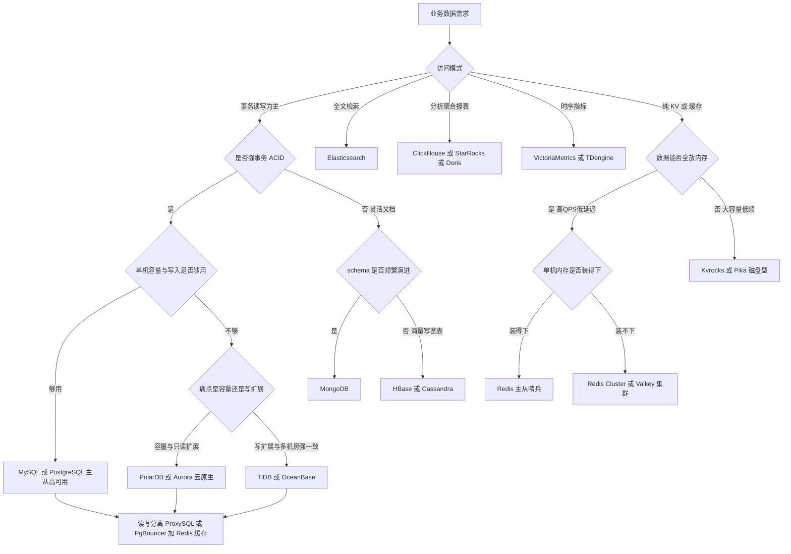

# 数据库与缓存选型

> 面向高并发大厂场景的 OLTP / NoSQL / NewSQL / OLAP / 缓存选型指南。
> 目标读者:3-5 年经验 SRE。所有量级数字均为经验值/量级参考,落地前请以压测为准。

## 目录

- [1. 结论先行:场景速查表](#1-结论先行场景速查表)
- [2. 关系型 OLTP:MySQL 与 PostgreSQL](#2-关系型-oltpmysql-与-postgresql)
  - [2.1 选型要点对比](#21-选型要点对比)
  - [2.2 高可用架构对比](#22-高可用架构对比)
  - [2.3 读写分离与连接池](#23-读写分离与连接池)
- [3. NewSQL 与分布式数据库](#3-newsql-与分布式数据库)
  - [3.1 定位对比](#31-定位对比)
  - [3.2 何时从 MySQL 迁到 NewSQL:决策清单](#32-何时从-mysql-迁到-newsql决策清单)
- [4. NoSQL:边界与反模式](#4-nosql边界与反模式)
- [5. 缓存深度:Redis 及其替代品](#5-缓存深度redis-及其替代品)
  - [5.1 Redis 部署形态对比](#51-redis-部署形态对比)
  - [5.2 Redis Cluster 的坑](#52-redis-cluster-的坑)
  - [5.3 多线程 IO 与 7.x 特性要点](#53-多线程-io-与-7x-特性要点)
  - [5.4 替代品对比:内存型与磁盘型](#54-替代品对比内存型与磁盘型)
  - [5.5 缓存容量规划与成本](#55-缓存容量规划与成本)
  - [5.6 缓存与数据库一致性](#56-缓存与数据库一致性)
  - [5.7 缓存三大经典故障与兜底](#57-缓存三大经典故障与兜底)
- [6. OLAP 简表](#6-olap-简表)
- [7. 综合决策流程图](#7-综合决策流程图)
- [8. 大厂典型组合拳](#8-大厂典型组合拳)
- [9. 选型原则总结](#9-选型原则总结)

---

## 1. 结论先行:场景速查表

没时间看全文,先看这张表。默认推荐即可覆盖 80% 场景,备选项用于特定约束。

| 业务场景 | 默认推荐 | 备选 | 一句话理由 |
|---|---|---|---|
| 强事务交易(订单/支付/账务) | MySQL InnoDB 或 PostgreSQL | OceanBase / TiDB | ACID 成熟、生态完善、人才好招 |
| 高并发读(商品详情/用户主页) | MySQL 读写分离 + Redis 缓存 | 多级缓存 + CDN | 缓存扛读,DB 只做兜底 |
| 海量 KV(设备状态/风控特征) | Redis Cluster | Kvrocks / Pika(冷数据) | 纯 KV 访问,内存扛热、磁盘扛冷 |
| 文档灵活 schema(内容/画像/配置) | MongoDB 副本集/分片 | PostgreSQL JSONB | schema 频繁演进时省去 DDL 之痛 |
| 时序数据(监控/IoT 指标) | Prometheus + VictoriaMetrics | InfluxDB / TDengine | 专用时序引擎,压缩比与降采样 |
| 分析报表(实时看板/Ad-hoc) | ClickHouse / StarRocks | Doris | 列存 + 向量化,详见《海量数据架构》 |
| 全文搜索(站内搜索/日志检索) | Elasticsearch | OpenSearch / Meilisearch | 倒排索引专用引擎,别拿 DB like 硬扛 |
| 缓存(通用) | Redis 主从哨兵或 Cluster | Valkey / Dragonfly | 生态最全;新集群可评估 Valkey |
| 宽表海量写(消息记录/轨迹/Feed 存储) | HBase / Cassandra | TiKV / Kvrocks | LSM 写优化,PB 级水平扩展 |

**核心原则**:先用最成熟的方案(MySQL + Redis)兜底,遇到明确瓶颈再引入专用引擎;每多一种存储,SRE 就多一套备份、监控、容量、故障预案。

---

## 2. 关系型 OLTP:MySQL 与 PostgreSQL

### 2.1 选型要点对比

国内互联网大厂 OLTP 主流仍是 MySQL(生态与 DBA 储备),PostgreSQL 在复杂查询、GIS、JSONB 场景更强。两者都能扛住绝大多数业务,选型更多取决于团队能力栈。

| 维度 | MySQL 8.x | PostgreSQL 15+ | 选型提示 |
|---|---|---|---|
| 生态与人才 | 国内生态最强,DBA/中间件/云服务全覆盖 | 增长快,国内储备相对少 | 团队没有 PG 经验时慎选 PG 做核心交易 |
| 复制 | 异步/半同步 binlog 复制,GTID 成熟;MGR 提供组复制 | 物理流复制 + 逻辑复制,物理复制延迟低 | MySQL 逻辑复制易受大事务拖累 |
| JSON 能力 | JSON 类型可用,函数较少,索引需生成列 | JSONB + GIN 索引,能力强得多 | 重 JSON 场景 PG 明显占优 |
| 并发模型 | 线程模型,一连接一线程,依赖连接池 | 进程模型,连接更重,必须配 PgBouncer | 两者高并发下都不要裸连 |
| MVCC 实现 | undo log 回滚段 | 元组多版本 + VACUUM | PG 需关注 VACUUM 与表膨胀告警 |
| DDL | 8.0 部分 Instant DDL,大表仍推荐 gh-ost/pt-osc | 多数 DDL 事务性,体验好 | MySQL 大表 DDL 是 SRE 高频事故点 |
| 复杂查询/分析 | 优化器较弱,复杂 join 吃力 | 优化器强,支持并行查询、窗口函数完善 | 报表别压在 OLTP 库上,见第 6 节 |

结论:**核心交易链路国内默认 MySQL;重 JSON、GIS、复杂查询或团队有 PG 基因则选 PostgreSQL。** 不建议同一团队双主力并行维护两套关系库。

### 2.2 高可用架构对比

单机 MySQL 不是生产架构。以下为主流高可用方案对比,自建规模小于 20 套实例时,优先考虑云 RDS。

| 方案 | 一致性保证 | 故障切换 | 运维复杂度 | 适用场景 |
|---|---|---|---|---|
| 主从 + MHA | 半同步下基本不丢,异步可能丢尾部事务 | 秒级~分钟级,依赖脚本与 VIP | 中,MHA 社区维护趋停 | 存量老架构,不推荐新建 |
| 主从 + Orchestrator | 同上,拓扑管理能力强 | 秒级,支持自动拓扑重排 | 中,需自建 raft 部署 | 自建 MySQL 集群的主流编排选择 |
| MGR 组复制 | 多数派提交,RPO 约等于 0 | 内置自动选主,秒级 | 中高,对网络抖动敏感 | 同城多机房强一致场景 |
| PXC Galera | 全同步认证复制 | 自动,节点即入即用 | 高,写放大、流控易全簇卡顿 | 逐渐被 MGR/NewSQL 替代,慎选 |
| 云 RDS 高可用版 | 依产品,通常主备半同步 | 托管自动切换,30s~2min 量级参考 | 低 | 中小规模与快速交付首选 |

**SRE 视角要点**:
- RPO 要求为 0 的账务库,自建只推荐 MGR 或直接上 NewSQL/云原生库;半同步在网络分区时会退化为异步,需监控 `Rpl_semi_sync_master_status`。
- 切换演练必须常态化:每季度至少一次真实 failover 演练,验证 VIP/DNS/连接池的收敛时间。
- 跨机房部署 MGR 时,RTT 建议小于 2ms(经验值),否则提交延迟不可接受。

### 2.3 读写分离与连接池

高并发下连接管理与流量路由是稳定性关键,常见组件对比如下。

| 组件 | 适用数据库 | 核心能力 | 注意事项 |
|---|---|---|---|
| ProxySQL | MySQL | 读写分离、查询路由/改写、连接复用、故障摘除 | 自身需做高可用;路由规则要纳入配置管理 |
| MySQL Router | MySQL | 官方轻量路由,配合 MGR/InnoDB Cluster | 功能弱于 ProxySQL,规则能力有限 |
| PgBouncer | PostgreSQL | 轻量连接池,transaction 池化模式 | transaction 模式下不支持会话级特性如 SET/PREPARE |
| Pgpool-II | PostgreSQL | 连接池 + 读写分离 + 负载均衡 | 功能重,故障面大,多数场景 PgBouncer 够用 |
| 应用侧中间件如 ShardingSphere | MySQL/PG | 分库分表 + 读写分离一体化 | 逻辑在应用层,升级需推动业务发版 |

**经验值/量级参考**:
- MySQL 单实例建议 `max_connections` 控制在 2000~5000,真正并发活跃连接(threads_running)超过 CPU 核数 2~4 倍即是危险信号。
- PostgreSQL 裸连超过几百就应强制走 PgBouncer;进程模型下 5000 直连基本等于事故。
- 读写分离必须处理**复制延迟读**:写后立即读的请求强制走主库(如基于 hint 或会话粘性),否则会出现"下单成功但订单查不到"的经典客诉。

---

## 3. NewSQL 与分布式数据库

### 3.1 定位对比

当单机 MySQL 分库分表的复杂度超过收益时,NewSQL 是主要出路。四个代表产品定位差异明显:

| 产品 | 架构定位 | 兼容性 | 强项 | 局限 |
|---|---|---|---|---|
| TiDB | 计算存储分离,Raft 多副本,开源 | MySQL 协议高度兼容 | 弹性扩展、HTAP(TiFlash)、社区活跃 | 小事务延迟高于单机 MySQL;资源开销大 |
| OceanBase | 原生分布式,Paxos,蚂蚁金融级验证 | MySQL/Oracle 双兼容 | 金融级 RPO=0、高压缩比、多租户 | 自建门槛高,调优体系独立 |
| PolarDB | 云原生共享存储,一写多读 | MySQL/PG 兼容 | 分钟级加只读节点、大容量单库、平滑迁移 | 绑定阿里云;写扩展仍受限(X-Engine/多主另论) |
| Aurora | 云原生共享存储,日志即数据库 | MySQL/PG 兼容 | AWS 生态、存储自动扩展、只读扩展 | 绑定 AWS;跨区能力与成本需评估 |

注意区分两条路线:**PolarDB/Aurora 是"更强的单机 MySQL"(共享存储、写仍集中)**;**TiDB/OceanBase 是"真正的分布式"(数据分片、写可水平扩展)**。写入量级没到分片必要性时,云原生共享存储路线迁移成本低得多。

### 3.2 何时从 MySQL 迁到 NewSQL:决策清单

满足以下条件越多,越应该启动迁移评估;一条都不满足则留在 MySQL:

- [ ] 单表超过 5 亿行或单实例超过 3~5TB(经验值),归档已无法缓解;
- [ ] 已经分库分表,且跨分片查询/分布式事务/扩容 rebalance 成为常态痛点;
- [ ] 写 QPS 单主已到瓶颈(单实例写 1~2 万 QPS 量级参考),垂直拆分空间耗尽;
- [ ] 有强一致多机房容灾要求(RPO=0 且自动切换),半同步方案无法满足审计;
- [ ] 业务需要在同一份数据上做实时分析(HTAP),不想再维护一条复制到 OLAP 的链路;
- [ ] 团队愿意承担新引擎的学习成本:备份恢复、慢查询体系、容量模型全部重建。

**反向清单(不要迁的信号)**:延迟敏感的小事务场景(NewSQL 单笔事务延迟通常高于本地 MySQL 2~5 倍量级参考);依赖大量 MySQL 边缘特性(存储过程/触发器/特殊 SQL);数据量靠归档就能压回单机水位。

---

## 4. NoSQL:边界与反模式

NoSQL 选型的关键不是"它能做什么",而是"它不该做什么"。越界使用是大多数 NoSQL 事故的根因。

| 引擎 | 该用的场景 | 反模式:不该用的场景 |
|---|---|---|
| Redis | 缓存、计数器、排行榜 ZSet、分布式锁、限流、会话 | 当唯一持久化存储放核心数据(持久化是尽力而为);存大 value 如整页 HTML;当消息队列扛关键业务(用 Kafka/RocketMQ) |
| MongoDB | 文档模型、schema 频繁演进、嵌套结构、内容/画像类读多写多 | 强多文档事务的账务核心(4.x 有事务但不是设计强项);高频跨文档 join;当分析引擎跑大聚合 |
| HBase / Cassandra | 海量写入宽表:消息流水、轨迹、Feed 物化、风控明细,PB 级 | 需要二级索引和灵活查询的业务(rowkey 之外的查询都是灾难);低延迟点查 SLA 苛刻场景;小数据量(运维成本远超收益) |
| Elasticsearch | 全文检索、日志/追踪检索、多维筛选聚合 | 当主存储(丢数据无法自愈对账);深分页大导出;高频更新的计数器;强一致读写 |

**通用反模式提醒**:
- 任何 NoSQL 都不应该是数据的唯一权威副本(Redis 尤其),权威数据留在有成熟备份/审计体系的关系库,NoSQL 作为派生视图,可通过 binlog/CDC 重建。
- ES 与 HBase 的数据应该"可再生":从上游 MySQL/Kafka 能全量重灌,这决定了故障时是"重建索引"还是"数据丢失事故"。

---

## 5. 缓存深度:Redis 及其替代品

缓存是高并发架构的第一道防线,也是 SRE 故障最集中的组件之一。本节为核心章节。

### 5.1 Redis 部署形态对比

三种主流形态各有明确的适用规模,不要为了"看起来先进"直接上 Cluster。

| 形态 | 架构要点 | 容量/吞吐上限 | 客户端要求 | 适用场景 |
|---|---|---|---|---|
| 主从 + 哨兵 | 1 主 N 从,Sentinel 三节点仲裁切换 | 受限单机内存,64~128GB 量级参考;读可扩从 | 普通客户端 + Sentinel 感知 | 数据量单机可容纳的绝大多数业务,首选 |
| Redis Cluster | 16384 slot 分片,gossip 协议,去中心化 | 水平扩展,官方建议不超过 1000 节点 | 必须 cluster 协议客户端,处理 MOVED/ASK | 单集群数据超单机内存、写 QPS 超单机上限 |
| Proxy 型 Codis/Twemproxy | 客户端连 Proxy,Proxy 做分片路由 | 水平扩展,Proxy 可独立扩容 | 普通客户端即可,接入成本最低 | 历史存量与多语言老客户端;新建项目一般不选 |

**选型建议**:
- 数据 < 单机内存的 60%、写 QPS < 8~10 万(量级参考):主从哨兵,架构最简单,故障面最小。
- 超过上述任一维度:Redis Cluster。Codis 已基本停止演进,Twemproxy 不支持自动 failover,新建集群不推荐 Proxy 型;但云厂商的"代理模式集群版"本质是托管 Proxy,免去客户端改造,可以用。
- 哨兵集群本身要跨机房 3 或 5 节点部署,防止仲裁与主库同 AZ 同挂。

### 5.2 Redis Cluster 的坑

上了 Cluster 之后,以下四类问题占据缓存事故的大头:

| 坑 | 现象 | 治理手段 |
|---|---|---|
| 大 key | 单 key 数 MB 以上;删除/过期/迁移时阻塞,slot 迁移卡死 | `redis-cli --bigkeys`/RDB 分析巡检;拆分为 hash 分桶;删除用 UNLINK;value 压缩 |
| 热 key | 单 key QPS 数十万打到单分片,单核打满而集群整体空闲 | 热 key 探测(客户端埋点/monitor 采样);本地缓存 + 多级缓存;key 加随机后缀打散多副本 |
| 数据倾斜 | 某分片内存/QPS 远高于均值,扩容也解决不了 | 检查 hash tag 滥用(大量 key 带同一个 {tag} 会集中到一个 slot);重新设计 key 分布 |
| multi-key 限制 | MGET/SINTERSTORE/事务/Lua 涉及跨 slot 直接报错 CROSSSLOT | 相关 key 用 hash tag 强制同 slot(注意别造成倾斜);或应用层拆分聚合;Pipeline 按 slot 分组 |

补充两个 Cluster 特有的运维点:
- **slot 迁移期间**的 ASK 重定向会造成尾延迟抖动,扩缩容要放在低峰并控制迁移速率;
- **gossip 风暴**:节点数多、`cluster-node-timeout` 过小时,网络抖动可引起误判与连锁 failover,该参数建议 15s 起步(经验值)。

### 5.3 多线程 IO 与 7.x 特性要点

- Redis 6.0 起支持**多线程 IO**(`io-threads`):仅网络读写解析多线程,命令执行仍是单线程,因此不改变"单个大命令阻塞一切"的事实。经验值:大流量实例 `io-threads` 设 4(默认读不开,`io-threads-do-reads yes` 打开读侧),吞吐可提升 1 倍左右量级参考。
- 单线程模型意味着 **CPU 单核是天花板**:监控要看单核利用率而非整机平均,整机 10% 但主线程核 95% 就是瓶颈。
- **7.x 关键特性**:Function 替代 Lua 脚本管理;ACL v2 细粒度到 key 模式;Sharded Pub/Sub 解决 Cluster 下 Pub/Sub 广播放大;AOF 多文件(base + incr)降低重写开销;`CLUSTER SHARDS` 替代 `CLUSTER SLOTS`。
- 7.2/7.4 后注意**许可证变更**:Redis 自 7.4 起转为 RSALv2/SSPLv1 双许可,云厂商与发行版陆续转向 Valkey(Linux 基金会分叉,兼容 7.2 协议),新建集群选型时需把许可合规纳入考量。

### 5.4 替代品对比:内存型与磁盘型

替代品分两条线:**内存型**追求更高吞吐/更好多核利用,**磁盘型**用 SSD 换内存成本,适合大容量低频访问。

| 产品 | 类型 | 架构特点 | 协议兼容 | 适用场景 | 风险/局限 |
|---|---|---|---|---|---|
| Valkey | 内存 | Redis 7.2 分叉,Linux 基金会,8.0 起增强多线程 | 完全兼容 | 替代 Redis 的默认开源选择,许可无忧 | 生态工具链仍在跟进中 |
| KeyDB | 内存 | 多线程执行,支持双主 | 兼容 | 想榨干多核的存量替换 | 社区活跃度下降,新项目慎选 |
| Dragonfly | 内存 | 多核 shared-nothing,单机可扛百万级 QPS 量级参考 | 高度兼容 | 用一台大机器替代小集群,降低运维面 | BSL 许可;与 Cluster 生态差异需验证 |
| Pika | 磁盘 | RocksDB 存储,360 开源 | 大部分兼容 | 大容量冷热混合 KV,替代超大 Redis | 延迟毫秒级,数据结构命令性能不均 |
| Kvrocks | 磁盘 | RocksDB,Apache 项目,支持集群 | 兼容良好 | 社区最活跃的磁盘型选择,新建首选 | 同为毫秒级延迟,不适合极热点 |
| Tendis | 磁盘 | RocksDB,腾讯开源 | 兼容 | 腾讯系存量生态 | 社区更新缓慢,新建不推荐 |

**选型建议**:热数据(高 QPS、微秒~亚毫秒延迟要求)留在内存型;访问频次低但量大的 KV(历史会话、风控特征、去重表)下沉磁盘型,Kvrocks 是当前默认推荐。

### 5.5 缓存容量规划与成本

容量规划三步法:

1. **估算工作集**:热数据条数 x 平均 value 大小 x 1.5(结构开销与碎片,经验值);Redis `used_memory` 与 RSS 比值(碎片率)超过 1.5 需关注,开启 activedefrag。
2. **预留水位**:内存使用建议不超过 `maxmemory` 的 70%(经验值),留给 fork 写时复制(RDB/AOF 重写期间 RSS 可瞬时上浮 30%~50% 量级参考)与流量突增。
3. **淘汰策略**:纯缓存用 `allkeys-lru` 或 `allkeys-lfu`;有不可淘汰数据的实例必须拆分,严禁与缓存混放同实例。

成本量级对比(经验值/量级参考,以 1TB 有效数据为例):

| 方案 | 硬件形态 | 相对成本 | 延迟量级 | 备注 |
|---|---|---|---|---|
| Redis Cluster 内存 | 约 20 台 64GB 内存节点含副本 | 基准 1x | 0.1~1ms | 内存是缓存成本的绝对大头 |
| Kvrocks/Pika 磁盘型 | 数台 NVMe SSD 节点 | 约 1/5~1/10 x | 1~5ms | 冷数据下沉的核心收益 |
| 云托管 Redis | 按 GB 计费 | 通常高于自建 1.5~3x | 0.1~1ms | 换来的是免运维与 SLA |

**成本治理抓手**:TTL 覆盖率(无 TTL 的 key 占比应趋近 0)、大 key 巡检、按业务前缀统计内存归属(`MEMORY USAGE` 采样)、冷热分层下沉。

### 5.6 缓存与数据库一致性

缓存与 DB 的双写一致性没有银弹,只有"不一致窗口大小"与"实现复杂度"之间的权衡。主流策略对比:

| 策略 | 做法 | 不一致窗口 | 复杂度 | 适用场景 |
|---|---|---|---|---|
| Cache Aside 旁路 | 读:miss 回源写缓存;写:先更 DB 再删缓存 | 秒级以内小概率窗口 | 低 | 默认推荐,覆盖绝大多数业务 |
| 延迟双删 | 更 DB 前后各删一次缓存,第二次延迟数百 ms | 进一步压缩窗口 | 中 | 读写并发极高且对旧值敏感 |
| binlog 订阅失效 | Canal/Flink CDC 消费 binlog 异步删/更缓存 | 复制延迟级,最终一致有保障 | 中高 | 多写入口、跨团队共享数据,大厂主流 |
| Write Through | 写缓存组件同步落 DB | 近似无窗口 | 高 | 需要缓存组件支持,场景少 |
| Write Behind 异步回写 | 先写缓存,异步批量落 DB | 缓存宕机会丢写 | 高 | 点赞/浏览计数等可容忍丢失的高频写 |

**SRE 关注点**:
- 一律用"删缓存"而非"更新缓存":更新缓存在并发下更容易写入旧值,且缓存了可能永远不被读的 value。
- 删除失败要有补偿:删缓存操作投递到 MQ 重试,或依赖 binlog 订阅链路兜底,同时给缓存设置 TTL 作为最终防线(即使一致性链路全挂,过期后也能自愈)。
- 不要在业务里追求缓存强一致——需要强一致就直接读主库,缓存的定位是"允许短暂陈旧的读加速"。

### 5.7 缓存三大经典故障与兜底

穿透、击穿、雪崩是缓存值班的必考题,预案要在上线前就位:

| 故障 | 成因 | 兜底手段 |
|---|---|---|
| 缓存穿透 | 查询根本不存在的 key,全部打到 DB,常见于恶意扫描 | 空值缓存短 TTL;布隆过滤器前置;参数合法性校验与限流 |
| 缓存击穿 | 单个热 key 过期瞬间,大量并发同时回源 | 互斥锁/singleflight 请求合并;热 key 逻辑过期不删除,异步刷新 |
| 缓存雪崩 | 大批 key 同时过期或缓存集群整体故障 | TTL 加随机抖动;多级缓存;集群多副本跨 AZ;DB 侧熔断限流保命 |

原则:**DB 必须假设缓存随时整体消失仍能限流存活**——缓存故障时靠熔断降级把流量压到 DB 可承受水位,宁可拒绝部分请求,不可击穿拖垮权威存储。

---

## 6. OLAP 简表

OLAP 详细选型见《海量数据架构》,此处只给一句话定位:

| 引擎 | 一句话定位 |
|---|---|
| ClickHouse | 单表极致性能之王,大宽表明细查询与日志分析首选,join 与并发是短板 |
| Doris | 易运维的全能型 MPP,兼容 MySQL 协议,实时报表与多表 join 均衡之选 |
| StarRocks | Doris 分支演进而来,向量化与 join 性能更激进,湖仓查询加速能力强 |

原则:**报表与分析流量绝不允许压在 OLTP 主库或其从库上**,通过 CDC(Canal/Flink CDC)同步到 OLAP 引擎。

---

## 7. 综合决策流程图

从业务特征出发的选型决策路径:

图读法:先定访问模式,再定一致性要求,最后才是容量与扩展性——顺序反了就会出现"为了扩展性牺牲了本不该牺牲的一致性"。

---

## 8. 大厂典型组合拳

三个典型业务的"数据库 + 缓存"组合示例,可作为架构评审的对照基线。

**电商(高并发读 + 大促脉冲 + 订单强事务)**:

| 模块 | 存储选型 | 缓存/加速 | 说明 |
|---|---|---|---|
| 商品/详情页 | MySQL 分库 + MongoDB 存描述文档 | 本地缓存 Caffeine + Redis Cluster + CDN | 多级缓存,读 QPS 缓存承接 99% 以上 |
| 订单/库存 | MySQL 分库分表或 OceanBase | Redis 扣减预热 + Lua 原子扣减 | 库存热点行是核心难点,DB 只做终态 |
| 购物车 | Redis Cluster 持久化 + 异步落 MySQL | 自身即热存储 | 允许极端情况少量丢失换性能 |
| 搜索/推荐 | Elasticsearch + 特征存 Kvrocks | Redis 缓存召回结果 | 数据由 binlog CDC 再生 |

**社交(海量写 Feed + 关系图 + 热点内容)**:

| 模块 | 存储选型 | 缓存/加速 | 说明 |
|---|---|---|---|
| Feed 流 | HBase 或 Cassandra 存物化时间线 | Redis ZSet 存热用户最近 N 条 | 推拉结合,大 V 走拉模式 |
| 关系链 | MySQL 分表 + Redis Set 全量镜像 | 关系判断全部走 Redis | 关注/粉丝计数用 Redis 计数器 + 定时校准 |
| 内容元数据 | MongoDB | Redis + 本地缓存,热 key 多副本打散 | 爆款内容是典型热 key 场景 |
| 私信 | HBase 宽表按会话 rowkey | Redis 存未读数与最近会话 | 写量大、按会话顺序读 |

**交易所(极致低延迟 + 零丢失 + 审计)**:

| 模块 | 存储选型 | 缓存/加速 | 说明 |
|---|---|---|---|
| 撮合引擎 | 内存撮合 + 事件溯源日志(Kafka/Raft 日志) | 不依赖外部缓存,状态全内存 | 数据库不在撮合关键路径上 |
| 账户/清结算 | OceanBase 或 MySQL MGR,RPO=0 | 只读余额快照进 Redis,资金操作绝不走缓存 | 强一致压倒一切,缓存只做展示 |
| 行情推送 | Redis Pub/Sub 或专用行情总线 + 时序库存 K 线 | Redis 存最新盘口快照 | 行情可再生,允许用尽力而为通道 |
| 审计/对账 | ClickHouse 存全量流水明细 | 无 | 由 Kafka 全量事件重放构建 |

三个案例的共同点:**权威数据永远在强一致关系库/日志中,缓存与搜索都是可重建的派生视图;越靠近钱的链路,缓存的角色越轻。**

---

## 9. 选型原则总结

1. **默认保守**:MySQL + Redis 能解决的,不引入第三种存储;每种新引擎都要回答"谁值班、怎么备份、容量模型是什么"。
2. **权威数据唯一**:确定每份数据的 single source of truth,NoSQL/缓存/搜索均为可再生副本,并演练过重建流程。
3. **先垂直后水平**:升配、归档、读写分离、缓存前置全部用尽,再考虑分库分表或 NewSQL。
4. **为失败设计**:选型时同步确定 RPO/RTO 目标、failover 演练计划、缓存击穿/穿透/雪崩的兜底(空值缓存、布隆过滤、请求合并、熔断降级)。
5. **成本入模**:内存型缓存与磁盘型差 5~10 倍成本量级(经验值),冷热分层与 TTL 治理是缓存降本的第一抓手。

---

*关联文档:《海量数据架构》(OLAP 详细选型)、《消息队列选型》、fail2ban 生产部署文档见 security/ 目录。*
