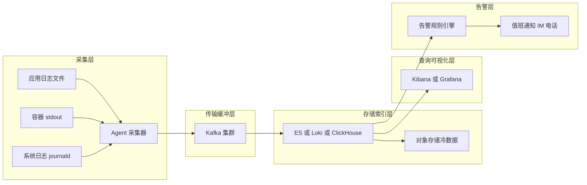
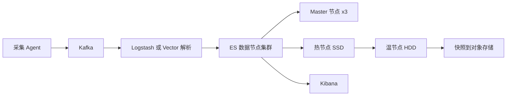
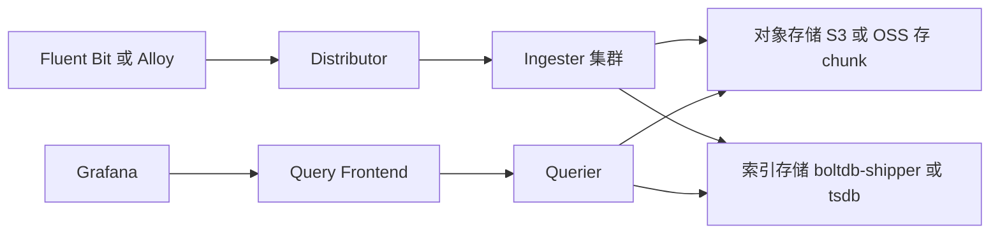
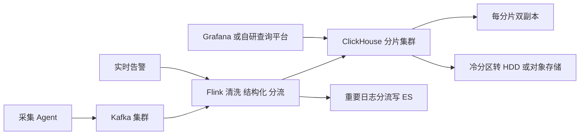
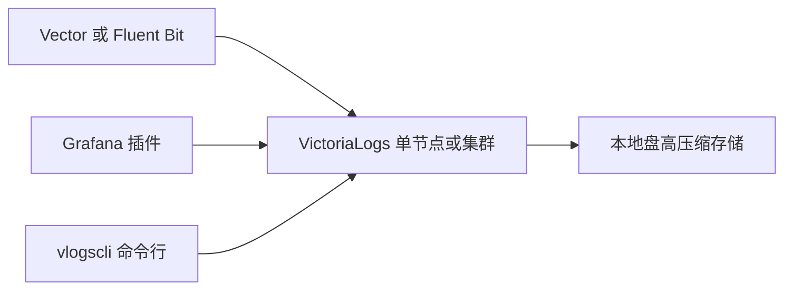
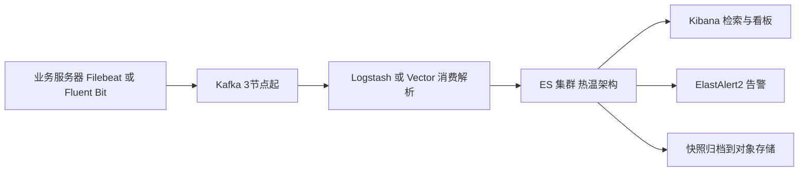
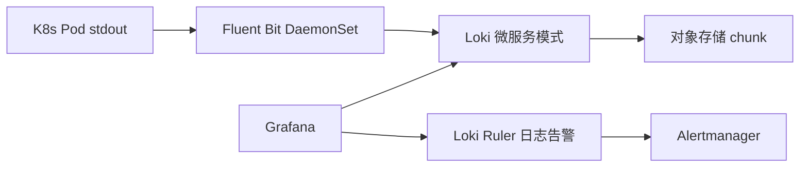
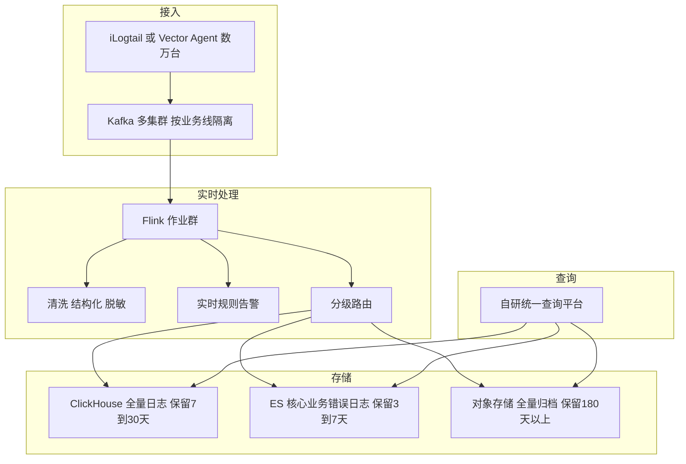

# 生产日志体系方案选型

> 适用范围:日志量从 GB/天 到 百TB/天 的生产环境。目标读者:3-5 年经验的 SRE / 平台工程师。
> 文中所有性能与成本数字均为**经验值/量级参考**,实际以压测和账单为准。

## 目录

- [1. 结论先行:场景速查表](#1-结论先行场景速查表)
- [2. 日志体系分层架构](#2-日志体系分层架构)
- [3. 采集端选型](#3-采集端选型)
- [4. 传输与缓冲层:Kafka 的取舍](#4-传输与缓冲层kafka-的取舍)
- [5. 存储引擎深度对比](#5-存储引擎深度对比)
  - [5.1 五维度对比总表](#51-五维度对比总表)
  - [5.2 Elasticsearch](#52-elasticsearch)
  - [5.3 Loki](#53-loki)
  - [5.4 ClickHouse 系](#54-clickhouse-系)
  - [5.5 VictoriaLogs](#55-victorialogs)
- [6. 典型组合方案](#6-典型组合方案)
  - [6.1 ELK / EFK 经典栈](#61-elk--efk-经典栈)
  - [6.2 PLG 栈](#62-plg-栈)
  - [6.3 Kafka + Flink + ClickHouse 大厂栈](#63-kafka--flink--clickhouse-大厂栈)
- [7. 成本估算示例](#7-成本估算示例)
- [8. 大厂实践模式](#8-大厂实践模式)
- [9. 选型决策清单](#9-选型决策清单)

---

## 1. 结论先行:场景速查表

先给结论,后面章节是论证过程。**选型的第一驱动因素是日志量级,第二是查询模式(全文检索 vs 标签过滤 vs 分析型 SQL),第三是团队运维能力。**

| 场景 | 日志量级 | 推荐方案 | 一句话理由 |
| --- | --- | --- | --- |
| 小团队 / 初创 | < 50 GB/天 | 单机 Loki + Grafana,或云厂商托管日志服务 | 运维成本最低,别自建 ES |
| 中型公司通用检索 | 50 GB ~ 2 TB/天 | EFK(Fluent Bit + Kafka + ES)或 Vector + ES | 全文检索体验好,规模尚可控 |
| K8s 原生 / 云原生团队 | < 5 TB/天 | PLG 栈:Fluent Bit 或 Promtail + Loki + Grafana | 与 Prometheus 生态同构,存储便宜 |
| 大厂海量日志 | 10 ~ 100+ TB/天 | Kafka + Flink + ClickHouse(或 Doris),重要日志分流 ES | 列存高压缩,成本比 ES 低一个量级 |
| 阿里云上业务 | 任意规模 | SLS(本质是 ClickHouse 类列存架构的托管服务) | 免运维,按量付费,量大后谈折扣 |
| 审计 / 合规留存 | 任意规模,留存 6 个月 ~ 数年 | 热数据任选 + 冷数据下沉对象存储(S3/OSS)+ 压缩归档 | 合规看重完整性与成本,不看重查询速度 |
| 观测一体化尝鲜 | < 2 TB/天 | VictoriaLogs + vmagent/Vector | 单二进制、资源占用极低,生态较新 |

**反模式提醒:**

- 日志量 < 100 GB/天 就上 ES 三节点集群 + Kafka 集群:运维投入远超收益。
- 日志量 > 10 TB/天 还全量写 ES:存储成本会成为账单里最刺眼的一行。
- 用 Loki 承接"任意关键字全文秒查"的需求:标签索引架构决定了它做不好这件事。

---

## 2. 日志体系分层架构

无论选什么组件,生产日志体系都可以拆成五层。选型本质上是**在每一层挑组件,并决定哪些层可以合并或省略**。

各层职责与常见组件:

| 层 | 职责 | 常见组件 |
| --- | --- | --- |
| 采集 | 从文件/stdout/syslog 读取,解析、打标签、脱敏 | Filebeat、Fluent Bit、Vector、iLogtail |
| 传输/缓冲 | 削峰填谷、解耦、多消费者分发 | Kafka、Pulsar、云消息队列 |
| 存储/索引 | 落盘、建索引、压缩、TTL | ES、Loki、ClickHouse、Doris、VictoriaLogs |
| 查询/可视化 | 检索、聚合、看板 | Kibana、Grafana、自研查询平台 |
| 告警 | 基于日志内容/量的规则告警 | ElastAlert2、Grafana Alerting、Flink 实时规则 |

---

## 3. 采集端选型

采集 Agent 部署在每台机器/每个节点上,**资源占用和稳定性比功能丰富度更重要**——它挂了会丢日志,它吃资源会影响业务。

| 维度 | Filebeat | Fluent Bit | Vector | iLogtail |
| --- | --- | --- | --- | --- |
| 开发语言 | Go | C | Rust | C++ |
| 内存占用(经验值) | 100~300 MB | 20~50 MB | 50~150 MB | 30~80 MB |
| 单实例吞吐(量级参考) | 2~5 万条/秒 | 5~15 万条/秒 | 10~30 万条/秒 | 10~20 万条/秒 |
| 解析/变换能力 | 弱,靠下游 Logstash | 中,内置 parser/filter | 强,VRL 语言可编程 | 强,插件化处理 |
| 输出生态 | ES 系最佳 | 广,输出插件多 | 极广,sink 覆盖全面 | 阿里系最佳,开源后逐步扩展 |
| K8s 支持 | DaemonSet 可用,元数据注入一般 | 一等公民,CNCF 毕业项目 | 一等公民,官方 Helm chart | 好,CRD 方式管理采集配置 |
| 背压/缓冲 | 内存+文件队列 | 内存+文件缓冲 | 磁盘缓冲完善,端到端确认 | 文件缓冲 |
| 典型搭配 | ELK 栈 | EFK / PLG / K8s | 任意后端,做采集+轻聚合 | SLS 或自建 CK |

**结论:**

- **新建 K8s 环境默认选 Fluent Bit**:资源占用最低、社区最活跃,DaemonSet 每节点几十 MB 内存即可。
- **需要复杂解析、脱敏、路由逻辑选 Vector**:VRL 可以在边缘完成结构化,减轻下游压力;也常用作 Kafka 后的聚合层(Aggregator 模式)。
- **已有 ELK 且无痛点,Filebeat 不必换**;但新项目不建议再选 Logstash 做重解析,资源开销大(JVM,单实例 GB 级内存)。
- **阿里云 SLS 用户直接用 iLogtail**,与 SLS 的采集配置下发、多租户隔离深度集成。
- Promtail 已进入维护模式(Grafana 官方转向 Alloy),新建 Loki 体系建议用 Fluent Bit/Alloy/Vector 写 Loki。

---

## 4. 传输与缓冲层:Kafka 的取舍

### 4.1 为什么要 Kafka 做缓冲

1. **削峰**:故障时日志量可能瞬间放大 10~100 倍(错误堆栈刷屏),Kafka 扛住洪峰,存储层按自己的节奏消费,避免"日志把日志系统打挂"。
2. **解耦**:存储层升级、重建索引、故障期间,日志堆在 Kafka(保留 6~24 小时),恢复后追赶,不丢数据。
3. **多消费者**:同一份日志同时供给 ES(检索)、Flink(实时告警/清洗)、对象存储(归档),一次采集多路分发。
4. **保护采集端**:Agent 只管写 Kafka,不感知后端拓扑变化,配置稳定。

### 4.2 什么规模可以省略

| 日志量级 | 建议 | 说明 |
| --- | --- | --- |
| < 100 GB/天 | 可省略 | Agent 直写存储,靠 Agent 本地磁盘缓冲兜底即可 |
| 100 GB ~ 1 TB/天 | 视情况 | 有 Flink/多消费者需求就上;单一 ES 后端可先不上 |
| > 1 TB/天 | 必须有 | 峰值削峰与故障缓冲不可或缺,3 节点 Kafka 起步 |

省略 Kafka 时的替代兜底:Vector/Fluent Bit 开启磁盘缓冲(disk buffer)+ 端到端 ACK,可容忍后端分钟级抖动;但扛不住小时级故障和全量重放需求。

Kafka 容量估算(量级参考):日志按 1 KB/条,10 TB/天 ≈ 峰值 30~50 万条/秒(按峰均比 3 估),3 副本 + 保留 12 小时 ≈ 需要 15~20 TB Kafka 磁盘,6~10 台中配机器。

---

## 5. 存储引擎深度对比

这是选型的核心决策点。四类引擎代表四种索引哲学:

- **Elasticsearch**:全字段倒排索引,"先付出索引成本,换任意字段秒查"。
- **Loki**:只索引标签(label),日志正文压缩存对象存储,"查询时暴力扫描"。
- **ClickHouse 系**(含阿里 SLS、自建 CK、Doris):列存 + 稀疏索引 + 高压缩,"用分析型引擎的方式处理日志"。
- **VictoriaLogs**:介于 Loki 与 ES 之间,词级索引 + 高压缩,单二进制。

### 5.1 五维度对比总表

| 维度 | Elasticsearch | Loki | ClickHouse 系 | VictoriaLogs |
| --- | --- | --- | --- | --- |
| 单核写入吞吐(量级参考) | 0.5~2 万条/秒/核,写放大明显 | 2~5 万条/秒/核 | 5~15 万条/秒/核 | 5~10 万条/秒/核 |
| 压缩比(原始:落盘,经验值) | 1:1 ~ 1:1.5,索引反而膨胀 | 5:1 ~ 10:1 | 8:1 ~ 15:1,ZSTD 列存 | 8:1 ~ 15:1 |
| 查询能力 | 全文检索最强,聚合好,DSL 成熟 | 标签过滤快,正文 grep 慢,LogQL 表达力有限 | SQL 分析最强,全文检索需 tokenbf 索引辅助 | LogsQL 较强,全文可用,聚合中等 |
| 每 TB 原始日志/天的存储成本 | 基准(最贵,约 1.5~2 TB 落盘) | 基准的 1/5 ~ 1/10 | 基准的 1/8 ~ 1/15 | 基准的 1/8 ~ 1/15 |
| 运维复杂度 | 高:分片/段合并/JVM/脑裂 | 中:微服务模式组件多,单体模式简单 | 中高:自建 CK 需管副本/ZK 或 Keeper;SLS 免运维 | 低:单二进制,集群模式也简单 |
| 适用规模上限 | < 5 TB/天较舒适,再往上成本陡增 | 10+ TB/天可行 | 100+ TB/天有大量案例 | 10+ TB/天,大规模案例尚少 |

**一句话结论:查询体验要 ES,省钱省事要 Loki,规模大且要分析能力上 ClickHouse,想轻量一体化试 VictoriaLogs。**

### 5.2 Elasticsearch

全文倒排索引意味着任意关键字、任意字段组合查询都是秒级返回,Kibana 生态成熟,这是它二十年不倒的原因。代价是:写入时 CPU 密集(分词+建索引),落盘体积常大于原始日志,JVM 调优、分片规划、段合并都是长期运维负担。

关键实践:热温冷架构(ILM)、按天/按量滚动索引、副本数 1、`index.codec: best_compression`。7.x 以上单集群建议控制在 100 节点/万级分片以内。

### 5.3 Loki

只对 label(如 namespace、app、level)建索引,正文切 chunk 压缩后丢对象存储。存储成本极低、天然适合 K8s,但**查询就是分布式 grep**:大时间范围的正文关键字查询慢,高基数 label(如 trace_id 当标签)会直接把它打挂。

关键实践:label 保持低基数(总 series 控制在十万级);trace_id 等高基数字段留在正文用行过滤查;单体模式(monolithic)可支撑到数百 GB/天,再往上换微服务模式。

### 5.4 ClickHouse 系

列存 + ZSTD 压缩 + 稀疏主键索引,日志表按时间分区、按服务排序,压缩比与扫描速度都远超 ES。全文检索靠 `tokenbf_v1` 布隆过滤器跳数索引近似实现,大多数"按服务+时间+关键字"的排障查询足够快。SQL 让日志直接变成可分析的数据资产(错误率统计、慢请求分布)。

同族方案:**阿里云 SLS**(托管、免运维、按量计费,架构同为列存)、**Apache Doris**(倒排索引支持比 CK 原生更好,SQL 兼容 MySQL 协议)、**自建 ClickHouse**(成本最低、灵活性最高、运维要求最高)。

关键实践:按天分区 + TTL 自动过期;`ORDER BY (service, timestamp)`;物化列提取高频查询字段;22.8+ 支持分区级冷数据挂 S3 磁盘。自建 CK 需要一个懂 MergeTree 的人长期负责。

### 5.5 VictoriaLogs

VictoriaMetrics 团队的日志引擎:单二进制、无外部依赖、自动对所有词建轻量索引(无需定义 schema 或 label 基数焦虑),LogsQL 支持管道式过滤与统计。资源占用与压缩比接近 CK,运维接近零。短板是生态年轻:告警、权限、超大规模多租户的案例积累还不如前三者。

关键实践:中小规模单节点即可(单机可扛数 TB/天,量级参考);适合替换"不想运维的小 Loki"或"杀鸡用牛刀的小 ES"。

---

## 6. 典型组合方案

### 6.1 ELK / EFK 经典栈

**适用规模:50 GB ~ 2 TB/天。** 全文检索体验最好,招人容易,资料最全;超过 5 TB/天后成本与运维压力显著上升。

组件建议:采集用 Fluent Bit 替代 Filebeat+Logstash 组合可省一半资源;ES 数据节点用 SSD 热节点 + HDD 温节点;保留 7~30 天,更久的走快照。

### 6.2 PLG 栈

**适用规模:K8s 环境,< 5 TB/天。** 与 Prometheus/Grafana 技术栈同构,SRE 一套 Grafana 看指标+日志;存储成本约为 ES 方案的 1/5~1/10(经验值)。

组件建议:小规模用 Loki 单体模式 + 本地盘/MinIO;标签只留 cluster/namespace/app/level 等固定低基数维度;把"查 trace_id"的需求引导到 Grafana 的行过滤而非 label。

### 6.3 Kafka + Flink + ClickHouse 大厂栈

**适用规模:10 ~ 100+ TB/天。** 字节、B站、快手、携程等公开分享均为此类架构(或以 Doris/自研列存替代 CK)。核心思想:**Kafka 统一接入,Flink 做实时 ETL 与分流,列存引擎做高压缩存储与 SQL 分析,ES 只留给最重要的日志。**

组件建议:Kafka 按业务线/优先级拆多集群防止互相影响;Flink 侧完成 trace_id 关联、敏感字段脱敏;查询平台统一入口,按时间范围自动路由热/冷存储。这套架构需要 3~5 人的平台团队长期维护,**不到 10 TB/天不建议照抄**。

---

## 7. 成本估算示例

以下按自建 IDC/包年云主机估算**机器数量级**,只算存储+计算主体,不含 Kafka 与采集端(两个规模下 Kafka 分别约 0 台和 8~12 台)。假设:日志平均 1 KB/条,峰均比 3,副本因子 2(ES 为 1 副本,CK 为双副本)。所有数字为**量级参考**,不同日志结构差异可达 2~3 倍。

### 7.1 规模一:1 TB/天,保留 30 天

| 方案 | 落盘总量估算 | 机器配置量级 | 台数量级 |
| --- | --- | --- | --- |
| ES 热温架构 | 1.5 倍膨胀 x2 副本 ≈ 90 TB | 16C64G,热 SSD 4TB + 温 HDD 12TB | 8~12 台 |
| Loki + 对象存储 | 压缩 8:1 ≈ 4 TB 对象存储 x 30 天 | 8C32G 计算节点 + 对象存储 | 3~4 台 + 120 TB 对象存储 |
| 自建 ClickHouse | 压缩 10:1 x2 副本 ≈ 6 TB | 16C64G + 8TB SSD/HDD 混合 | 2~4 台 |
| VictoriaLogs | 压缩 10:1 ≈ 3 TB | 8C32G + 4TB 盘 | 1~2 台 |

结论:1 TB/天 规模下,ES 与列存方案的机器成本差距约 **3~5 倍**;如果全文检索是刚需,这个溢价可以接受,否则选 Loki/CK/VL。

### 7.2 规模二:50 TB/天,保留 30 天(冷热分层)

假设热数据 7 天在集群、23 天冷数据下沉对象存储。

| 方案 | 热层机器量级 | 冷层 | 总体评价 |
| --- | --- | --- | --- |
| 全量 ES | 500~800 台数据节点 | 快照归档 | 机器+电力+运维成本失控,**实际没人这么干** |
| 分级:10% 入 ES + 90% 入 CK | ES 50~80 台 + CK 60~100 台 | 对象存储约 3.5 PB | 大厂主流形态,兼顾体验与成本 |
| 全量 CK 双副本 | 80~120 台 | 对象存储 | SQL 分析强,全文检索体验有折损 |
| 全量 Loki | 计算 20~40 台 | 对象存储约 4.5 PB | 最省钱,但海量下查询体验和稳定性挑战大 |

结论:50 TB/天 规模下,**"分级存储"比"选哪个引擎"更重要**——同样的钱,合理分级能把 90% 的成本花在 10% 最有价值的日志上。

---

## 8. 大厂实践模式

### 8.1 日志分级

把日志按价值分级,不同级别进不同引擎,是海量场景下最有效的降本手段:

| 级别 | 典型内容 | 存储 | 保留期(参考) |
| --- | --- | --- | --- |
| P0 核心 | 交易/支付错误日志、安全审计 | ES 全文索引 + 对象存储双写 | ES 7 天,归档 1 年以上 |
| P1 重要 | 核心服务 ERROR/WARN、访问日志 | ClickHouse | 30 天 |
| P2 普通 | 全量 INFO、调试日志 | ClickHouse 或 Loki 短保留 | 3~7 天 |
| P3 归档 | 全量原始日志 | 对象存储 ZSTD 压缩归档 | 180 天 ~ 数年,按合规要求 |

分级动作在 Flink/Vector 层完成(按 topic、level、服务标签路由),而不是让业务改打日志方式。

### 8.2 TTL 分层与冷数据下沉

- **热层(0~7 天)**:SSD,承接 95% 以上的查询(排障查询集中在最近几小时)。
- **温层(7~30 天)**:HDD 或 CK 冷分区,查询可接受十秒级。
- **冷层(30 天以上)**:对象存储,Parquet/原始压缩格式;查询走按需加载(ES 的 searchable snapshot、CK 的 S3 disk、Loki 天然如此),或离线用 Spark/Presto 扫。

所有主流引擎都支持自动分层:ES 用 ILM,CK 用 TTL ... TO DISK/VOLUME,Loki/VictoriaLogs 用 retention 配置。**上线第一天就配好 TTL,不要等磁盘告警才想起来。**

### 8.3 其他常见模式

- **采样与限流**:对 DEBUG/INFO 按比例采样入库、全量归档;单服务日志量突增触发限流并告警到服务 owner,防止一个坏循环打爆全平台。
- **Schema 化推动**:推动业务打 JSON 结构化日志,列存引擎压缩比和查询速度都受益;网关/Mesh 层日志统一格式。
- **成本回收**:按业务线统计日志量并出账单(showback/chargeback),是控制日志无序增长最有效的组织手段。
- **与 Trace 打通**:日志中强制注入 trace_id,查询平台支持从告警 → 日志 → 链路的一跳跳转。

---

## 9. 选型决策清单

最后给一个决策顺序,自上而下走一遍即可完成初选:

1. **量级**:< 100 GB/天 → 托管服务或单机 Loki/VictoriaLogs,到此结束。
2. **查询模式**:强全文检索刚需(客服查订单号、任意关键字)→ ES 必须在架构里,哪怕只放分级后的核心日志。
3. **技术栈亲和**:重度 K8s + Grafana 团队 → PLG;有数据平台团队、要 SQL 分析 → ClickHouse 系。
4. **规模再校验**:> 10 TB/天 → 必上 Kafka,必做日志分级与冷热分层,参考大厂栈。
5. **云依赖**:深度绑定阿里云且不想养平台团队 → SLS 直接买,拿账单跟自建对比后再决定是否迁出。

选型没有银弹:**ES 卖的是查询体验,Loki 卖的是便宜,ClickHouse 卖的是规模与分析能力,VictoriaLogs 卖的是省心。** 想清楚你在为哪个能力付钱。

---

*最后更新:2026-07 · 数据为经验值/量级参考,落地前请以自身日志样本压测验证。*
