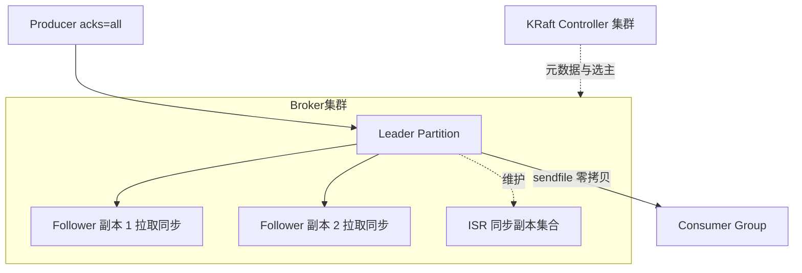
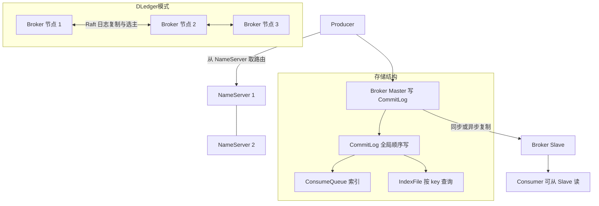
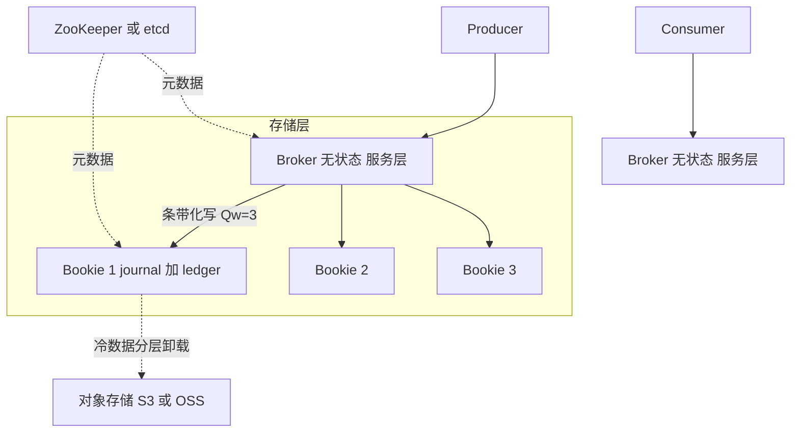
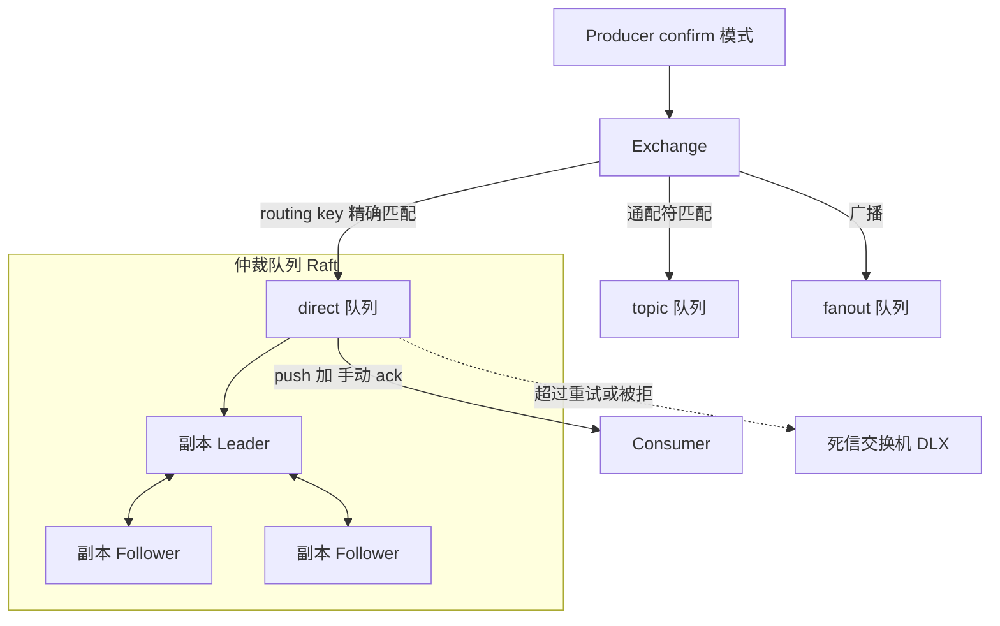
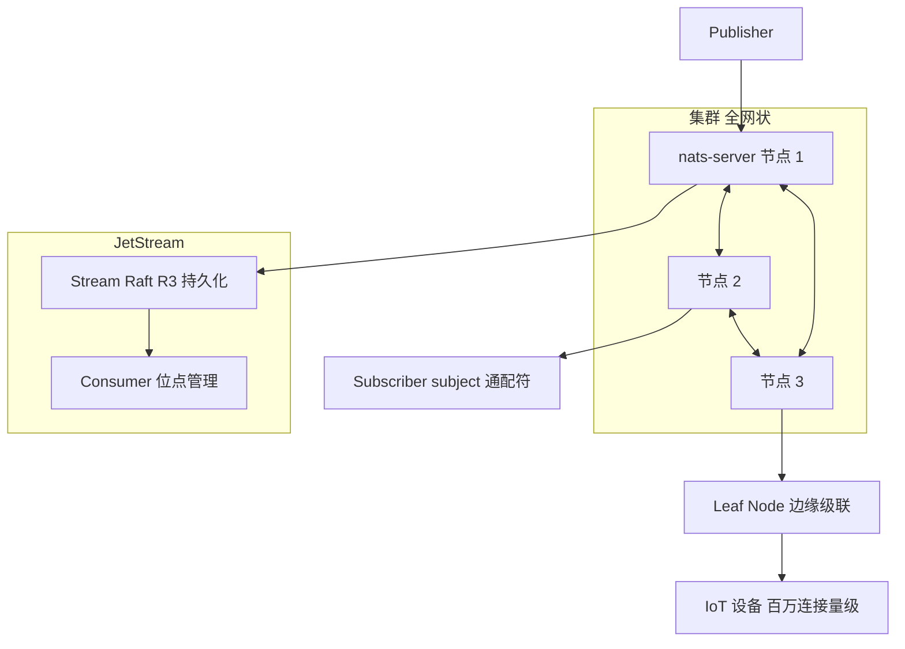
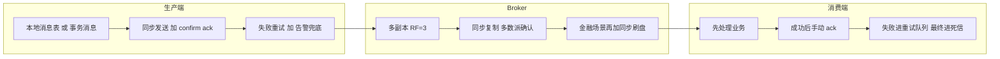
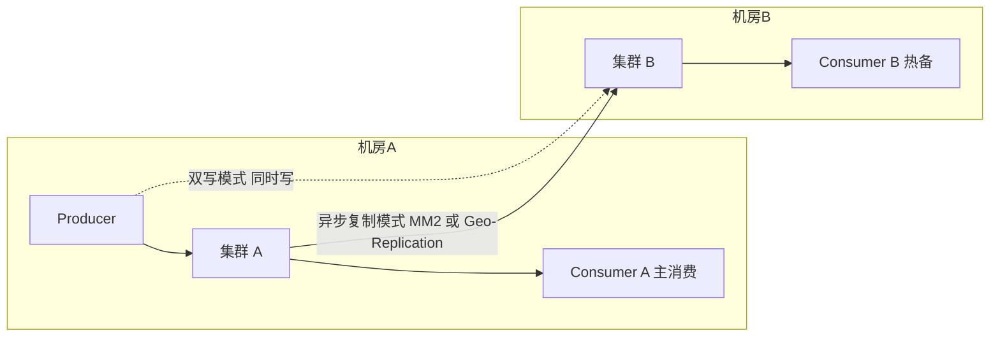

# 消息队列选型:Kafka / RocketMQ / Pulsar / RabbitMQ / NATS

> 面向高并发大厂场景的消息中间件选型指南。目标读者:3-5 年经验 SRE。
> 所有量级数字均为经验值/量级参考,实际以自有环境压测为准。

## 目录

- [一、结论先行:场景速查表](#一结论先行场景速查表)
- [二、核心概念对齐:模型差异](#二核心概念对齐模型差异)
- [三、深度对比](#三深度对比)
- [四、各 MQ 架构简析](#四各-mq-架构简析)
- [五、可靠性保障模式](#五可靠性保障模式)
- [六、容量规划](#六容量规划)
- [七、大厂实践](#七大厂实践)
- [八、选型决策清单](#八选型决策清单)

---

## 一、结论先行:场景速查表

先给结论,细节论证见后文。

| 场景 | 首选 | 备选 | 关键理由 |
| --- | --- | --- | --- |
| 日志流 / 大数据管道 | **Kafka** | Pulsar | 顺序写 + 零拷贝,吞吐天花板最高,生态与 Flink/Spark 深度绑定 |
| 电商交易消息 | **RocketMQ** | Kafka | 事务消息、顺序消息、延迟消息、消息轨迹开箱即用,阿里双十一验证 |
| 延迟消息 / 定时消息 | **RocketMQ** | Pulsar | RocketMQ 5.x 支持任意精度定时;Pulsar 原生 deliverAfter |
| 金融级事务消息 | **RocketMQ** | Pulsar | 半消息 + 回查机制成熟;Pulsar 有原生事务但生产案例较少 |
| IoT 海量连接 / 边缘 | **NATS** | Pulsar + MQTT 代理 | 单机百万级连接量级,轻量二进制,支持叶子节点级联 |
| 简单任务队列 / 业务解耦 | **RabbitMQ** | NATS JetStream | 路由灵活、管理界面完善、上手成本最低 |
| 十万级 topic 多租户平台 | **Pulsar** | RocketMQ | 存算分离,topic 数量对性能影响小,原生多租户隔离 |
| 跨地域容灾要求高 | **Pulsar** | Kafka + MirrorMaker2 | 原生 Geo-Replication,配置级开启 |

一句话版本:

- **大数据吞吐选 Kafka,业务消息选 RocketMQ,云原生多租户选 Pulsar,传统解耦选 RabbitMQ,极致轻量选 NATS。**

---

## 二、核心概念对齐:模型差异

五个 MQ 的存储与路由模型差异是一切能力差异的根源,先对齐概念再谈对比。

| 维度 | Kafka | RocketMQ | Pulsar | RabbitMQ | NATS |
| --- | --- | --- | --- | --- | --- |
| 存储模型 | 分区日志,partition 独立文件 | 所有 topic 共用一个 CommitLog,ConsumeQueue 做索引 | 分层:Broker 无状态 + BookKeeper 存储 ledger | 队列即存储,消息被消费后删除 | Core 不落盘;JetStream 基于 Raft 的流存储 |
| 路由模型 | producer 按 key 哈希到 partition | producer 轮询/哈希到 MessageQueue | 类似 Kafka 的 partitioned topic | Exchange 按 binding 规则路由到 Queue | Subject 通配符匹配 |
| 消费模型 | 消费组 + partition 独占,pull | 消费组 + queue 负载均衡,pull 为主 | 四种订阅模式:独占/故障切换/共享/键共享 | push 为主,竞争消费 | push,queue group 竞争消费 |
| 消息保留 | 按时间/大小保留,消费不删除 | 按时间保留,默认 48-72h | 按 TTL 与 backlog 配额保留 | ack 后即删除 | Core 即发即弃;JetStream 可保留 |
| 位点管理 | 消费者提交 offset | 消费者提交 offset | Broker 管理 cursor | Broker 管理未 ack 列表 | JetStream 管理 consumer 位点 |

```mermaid
flowchart TB
    subgraph Kafka模型
        KP[Producer] --> KT[Topic 分区日志]
        KT --> KP0[Partition-0 追加写]
        KT --> KP1[Partition-1 追加写]
        KP0 --> KC[Consumer Group 按分区独占消费]
        KP1 --> KC
    end
    subgraph RocketMQ模型
        RP[Producer] --> RQ[Topic 下多个 MessageQueue]
        RQ --> RCL[统一 CommitLog 顺序写]
        RCL --> RCQ[ConsumeQueue 逻辑索引]
        RCQ --> RC[Consumer Group 负载均衡]
    end
    subgraph Pulsar模型
        PP[Producer] --> PB[无状态 Broker]
        PB --> BK[BookKeeper 存储层 Ledger 分片]
        PB --> PC[四种订阅模式消费]
    end
    subgraph RabbitMQ模型
        BP[Producer] --> EX[Exchange 交换机]
        EX -->|binding 规则| Q1[Queue-A]
        EX -->|binding 规则| Q2[Queue-B]
        Q1 --> BC[Consumer 竞争消费后删除]
    end
```

关键理解:

- **Kafka**:一个 partition 一组物理日志文件。topic × partition 数量大时,顺序写退化为随机写,这是 Kafka 万级 topic 问题的根源。
- **RocketMQ**:所有消息顺序写入同一个 CommitLog,topic 再多也是一份顺序写,天然扛 topic 数量;代价是消费时多一层索引跳转。
- **Pulsar**:Broker 只做协议与缓存,数据切成 ledger 分片打散到 BookKeeper 节点(bookie),扩容不搬数据、topic 数量与单机文件数解耦。
- **RabbitMQ**:核心是路由灵活性(direct/topic/fanout/headers 四种交换机),不是为堆积和吞吐设计的。
- **NATS**:Core 模式是纯内存的 pub/sub 神经系统;JetStream 补齐持久化,但定位仍是轻量。

---

## 三、深度对比

### 3.1 总对比表

下表是核心章节,逐项展开见后。总体规律:**Kafka 赢在吞吐与生态,RocketMQ 赢在业务特性,Pulsar 赢在架构弹性,RabbitMQ 赢在易用,NATS 赢在轻量**。

| 能力项 | Kafka | RocketMQ | Pulsar | RabbitMQ | NATS |
| --- | --- | --- | --- | --- | --- |
| 单机吞吐量级(经验值) | 百万级 msg/s | 十万级 msg/s | 十万级 msg/s | 万级 msg/s | 百万级 msg/s(Core) |
| P99 延迟(常规负载) | 毫秒~十毫秒级 | 毫秒级 | 毫秒~十毫秒级 | 微秒~毫秒级 | 微秒级(Core) |
| 副本机制 | ISR 多副本 | 主从 / DLedger Raft | BookKeeper Quorum 写 | 镜像队列 / 仲裁队列 Raft | JetStream Raft |
| 同步刷盘 | 不支持(靠副本) | 支持,可配 | 支持,bookie fsync | 支持,lazy 或 fsync | JetStream 可配 |
| 顺序消息 | 分区内有序 | 分区有序 + 全局有序 | 分区内有序 / Key_Shared | 单队列单消费者有序 | 单 subject 有序 |
| 延迟消息 | 不支持,需外挂 | 18 级 / 5.x 任意精度 | 原生任意精度 | 需死信或插件模拟 | JetStream 不原生支持 |
| 事务消息 | 生产者事务(流场景) | 半消息 + 回查(业务场景) | 原生事务 | 仅本地 AMQP 事务,性能差 | 不支持 |
| 消息回溯 | 按 offset / 时间戳 | 按时间戳 | 按 message id / 时间戳 | 不支持(消费即删) | JetStream 支持按序号/时间 |
| 堆积能力 | TB 级,性能稳定 | TB 级,性能稳定 | TB 级,可分层卸载到对象存储 | 堆积即性能劣化 | JetStream 受限于配额 |
| 多租户 | 无原生概念,靠 ACL 模拟 | 5.x 有租户雏形 | 原生 tenant/namespace 两级 | vhost 隔离 | account 隔离 |
| 万级 topic 表现 | 明显劣化 | 良好 | 十万~百万级仍可用 | 队列数受内存限制 | subject 是逻辑概念,无压力 |
| 运维复杂度 | 中(KRaft 后免 ZK) | 中低 | 高(三组件) | 低 | 极低(单二进制) |
| 社区生态 | 最强,大数据事实标准 | 国内强,Apache 顶级 | 增长中,云原生方向 | 老牌稳定 | CNCF,云原生/边缘活跃 |

### 3.2 吞吐与延迟

- **Kafka** 高吞吐三板斧:partition 顺序写 + PageCache + sendfile 零拷贝,批量压缩后单集群可达千万级 msg/s(量级参考)。
- **RocketMQ** 单 Master 十万级 msg/s(经验值),同步刷盘 + 同步复制模式下会降到数万级,金融场景需按此容量规划。
- **Pulsar** 吞吐略低于 Kafka(多一跳网络:Broker→Bookie),但延迟分布更稳定,因为写入走 journal 盘、读走 ledger 盘,读写 IO 隔离,追赶读(catch-up read)不干扰写入延迟。
- **RabbitMQ** 采用 Erlang 每队列单进程模型,单队列吞吐有明显天花板(万级 msg/s 经验值),靠多队列水平扩展。
- **NATS Core** 不落盘,单机可达百万级 msg/s、亚毫秒延迟;JetStream 开启持久化后降一个量级。

### 3.3 消息可靠性:副本与刷盘

可靠性 = 副本机制 × 刷盘策略 × ack 语义,三者要一起看:

| MQ | 推荐生产配置 | 语义 |
| --- | --- | --- |
| Kafka | `acks=all` + `min.insync.replicas=2` + RF=3 + 关闭 unclean 选举 | 副本多数落 PageCache 即 ack,靠多副本而非 fsync 抗单机断电 |
| RocketMQ | 同步复制 SYNC_MASTER + 异步刷盘;金融场景同步刷盘 | 可做到单条消息级 fsync,可靠性上限更高 |
| Pulsar | `E=3, Qw=3, Qa=2` + journal fsync | 每条消息 Quorum 确认且落盘,默认即强持久化 |
| RabbitMQ | 仲裁队列(Quorum Queue)+ publisher confirm | Raft 多数派确认;镜像队列已被官方废弃,勿再新建 |
| NATS | JetStream R3 stream | Raft 三副本,注意 stream 配额 |

要点:Kafka 默认不 fsync 每条消息,机房整体断电存在丢失窗口,跨机架/跨 AZ 部署副本是前提;RocketMQ 和 Pulsar 可以做到真正的每条消息落盘确认。

### 3.4 顺序 / 延迟 / 事务消息

- **顺序**:五者都只承诺"单分区/单队列内有序"。业务上用 orderKey(如订单号)哈希到固定分区即可;全局有序意味着单分区,吞吐不可扩展,慎用。注意 Kafka 生产端 `max.in.flight>1` 且重试会乱序,需开幂等生产者。
- **延迟消息**:RocketMQ 4.x 固定 18 级(1s~2h),5.x 支持任意精度定时;Pulsar 原生 `deliverAfter/deliverAt`,但大量长延迟消息会驻留 broker 内存堆(delayed tracker),需评估;Kafka 无原生支持,常见做法是多级延迟 topic + 定时服务搬运,复杂度高;RabbitMQ 靠 TTL+ 死信路由或 delayed-message 插件,插件在集群模式下有单点隐患。
- **事务消息**:两种语义要分清。Kafka 的事务是"流处理内 exactly-once"(consume-transform-produce 原子性),不解决"DB 落库与发消息的一致性";RocketMQ 的半消息 + 回查才是解决"本地事务与消息发送最终一致"的方案,这是电商/金融选 RocketMQ 的核心理由之一。Pulsar 事务两者语义都覆盖,但生产成熟度仍在积累。

### 3.5 回溯与堆积

- Kafka/RocketMQ/Pulsar 消费与存储解耦,消费不删数据,可按时间戳重置位点回溯,这是流式 MQ 对 RabbitMQ 的代际优势。
- 堆积能力:Kafka/RocketMQ 堆积 TB 级不影响写入;Pulsar 更进一步,可将老 ledger 分层卸载(tiered storage)到 S3/OSS,近乎无限堆积;**RabbitMQ 堆积是事故信号**——内存高水位触发 flow control 会反压生产者,进而拖垮上游,这是 RabbitMQ 不适合大流量场景的本质原因。

### 3.6 多租户与运维复杂度

- **多租户**:Pulsar 原生 `tenant/namespace/topic` 三级模型,配额、限流、隔离策略挂在 namespace 上,是唯一为"公司级消息平台"设计的;Kafka 靠 quota+ACL 拼装;RabbitMQ vhost 可用但粒度粗。
- **运维复杂度**排序(低→高):NATS < RabbitMQ < RocketMQ < Kafka < Pulsar。Pulsar 需同时运维 Broker + BookKeeper + ZooKeeper 三个分布式系统,SRE 团队没有 BookKeeper 经验时,故障排查成本显著高于其他选项;Kafka 3.x 之后 KRaft 模式去掉了 ZooKeeper,复杂度已下降。
- **生态**:Kafka 协议已成事实标准,Pulsar(KoP)、Redpanda 等都在兼容它;大数据链路(Flink/Spark/Debezium/Connect)对 Kafka 的支持深度无可替代。

---

## 四、各 MQ 架构简析

### 4.1 Kafka:ISR 副本 + 零拷贝

关键设计:

- **ISR 机制**:Leader 维护"跟得上的副本集合",`acks=all` 只等 ISR 内副本确认;副本落后超时被踢出 ISR。`min.insync.replicas` 是可用性与可靠性的调节旋钮。
- **零拷贝**:消费路径 PageCache→网卡 直接 sendfile,不经用户态,冷读(消费很旧的数据)会击穿 PageCache 导致磁盘 IO 抖动,需监控 catch-up 消费者。
- **KRaft**:3.3+ 生产可用,用内置 Raft 取代 ZooKeeper,元数据变更传播更快,分区数上限提升。

### 4.2 RocketMQ:主从复制与 DLedger

关键设计:

- **NameServer**:无状态、彼此不通信的轻量注册中心,任意一台存活即可,比 ZK 简单得多。
- **传统主从**:Master 挂掉后 Slave 不会自动升主(4.x),只保证消息不丢、可读,写入需人工介入或依赖多 Master 分摊——这是老版本最大的运维痛点。
- **DLedger / 5.x Controller**:基于 Raft 的 CommitLog 复制,实现自动选主故障切换;5.x 的 Controller 模式进一步把选主与存储解耦,主从切换秒级完成。
- 单 CommitLog 设计使其在 topic 数量上限、混合读写稳定性上优于 Kafka。

### 4.3 Pulsar:存算分离 + BookKeeper

关键设计:

- **存算分离**:Broker 崩溃或扩容时 topic 所有权秒级迁移到其他 Broker,**不搬任何数据**;bookie 扩容后新 ledger 自动写入新节点,无 Kafka 式 rebalance 搬迁。
- **BookKeeper 写路径**:每条 entry 条带化写入 Qw 个 bookie,收到 Qa 个 ack 即成功;journal 盘 fsync 保证持久性,ledger 盘服务读取,读写 IO 物理隔离。
- **分层存储**:老数据卸载到对象存储后仍可透明读取,存储成本大幅下降,适合"消息即存储"的审计/回放场景。
- 代价:三组件运维、更长的故障排查链路、社区中文资料少于 Kafka/RocketMQ。

### 4.4 RabbitMQ:交换机路由 + 仲裁队列

关键设计:

- **交换机路由**是其不可替代性:一条消息按 header、通配符、绑定关系分发到任意队列拓扑,业务解耦场景表达力最强。
- **镜像队列已废弃**(3.13 后移除):其同步模型在网络分区下有丢消息风险且性能差。**新建集群一律用仲裁队列**,基于 Raft,多数派确认,语义清晰。
- 4.x 的 Khepri 元数据存储(替代 Mnesia)改善了网络分区下的元数据一致性。
- 适用边界:消息量万级 msg/s 以内、无堆积需求、需要复杂路由的业务解耦场景。

### 4.5 NATS:轻量级与 JetStream

关键设计:

- 单个约 20MB 的二进制,无外部依赖,配置极简,是运维成本最低的选项。
- **Core NATS** 即发即弃、不落盘,定位是服务间"神经系统"(请求响应、服务发现、控制面消息)。
- **JetStream** 补齐持久化流:Raft 副本、按序号/时间回放、K/V 与对象存储衍生能力。
- **Leaf Node** 级联是 IoT 杀手锏:边缘侧起一个叶子节点,断网自治、联网同步,天然适合车联网/工业网关拓扑。
- 边界:不适合 TB 级堆积、重量级流计算生态对接。

---

## 五、可靠性保障模式

消息不丢 = 生产端、Broker、消费端三段各自兜底,任何一段缺失都会丢。

### 5.1 端到端不丢消息

各段要点:

| 段 | 措施 | 反模式 |
| --- | --- | --- |
| 生产端 | 同步发送并检查结果;Kafka 开 `enable.idempotence=true`;RabbitMQ 开 publisher confirm;跨 DB 一致性用 RocketMQ 事务消息或本地消息表 + 定时补偿 | fire-and-forget 异步发送不管结果 |
| Broker | RF=3 跨机架;Kafka `acks=all` + `min.insync.replicas=2`;RocketMQ 同步复制;禁用 unclean leader 选举 | 单副本;`acks=1`;为性能开 unclean 选举 |
| 消费端 | 关闭自动 ack/自动提交 offset,业务处理成功后再 ack;Kafka 手动 `commitSync` | 先 ack 后处理;auto commit 间隔内进程崩溃导致丢消费 |

### 5.2 重复消费与幂等

所有主流 MQ 的默认语义都是 **at-least-once**,重复不可避免,幂等是消费端的义务:

1. **唯一键幂等**:业务主键(订单号+操作类型)做 DB 唯一索引,重复插入报错即跳过——最可靠,首选。
2. **去重表/Redis setnx**:消息 msgId 或业务 id 写入去重表,注意 msgId 在重投时可能变化,**必须用业务 id**。
3. **状态机幂等**:只允许 `待支付→已支付` 的单向迁移,重复消息因状态不匹配被拒绝。
4. **版本号/乐观锁**:update 带 `where version = ?`。

### 5.3 死信队列

- 消费重试超过上限(RocketMQ 默认 16 次)后消息进入死信 topic(`%DLQ%消费组`),RabbitMQ 通过 DLX 交换机路由。
- SRE 必做:**死信队列必须有监控告警**(死信数量 > 0 即告警),并提供人工/自动重投工具。死信无人管等于静默丢消息。
- Kafka 无原生死信,需在消费框架(如 Spring Kafka 的 DeadLetterPublishingRecoverer)层面实现。

### 5.4 消息积压应急处理 SOP

积压 = 生产速率 > 消费速率,按以下顺序处置:

1. **定位**(5 分钟内):看是消费端变慢(GC、下游 DB 慢、死锁)还是流量突增。查消费 TPS 曲线、消费耗时、下游依赖延迟。
2. **止血**:
   - 消费端有 bug → 先修 bug 发版,评估跳过/重置位点的业务代价;
   - 下游慢 → 消费端降级(跳过非核心逻辑、批量写);
   - 流量突增 → 对非核心生产方限流。
3. **扩容**:增加消费者实例,**上限是分区/队列数**;消费者数已达分区数时加机器无效。
4. **搬运扩散**(核弹方案):临时消费者把积压消息原样转发到一个 10 倍分区数的临时 topic,再用 10 倍消费者消费临时 topic,消化完回切。适用于分区数无法临时增加且积压达亿级的场景。
5. **复盘**:是否需要常态扩分区、消费端限流保护、上游削峰。

预防:消费 lag 必须配分级告警(如 lag > 10 万 warning,> 100 万 critical),并定期演练扩容路径。

---

## 六、容量规划

以下均为经验值/量级参考,规划时以 30%~50% 峰值余量 + 自有压测数据修正。

### 6.1 分区数规划

- 基本公式:`分区数 = max(目标吞吐 ÷ 单分区生产吞吐, 目标吞吐 ÷ 单分区消费吞吐)`,再取 ≥ 峰值消费者实例数。
- 单分区生产吞吐经验值:10~50 MB/s(取决于消息大小与压缩);单分区消费吞吐通常受业务处理耗时限制,按 `1000ms ÷ 单条处理耗时 × 批量数` 估算。
- 分区数**宁可一步到位略多,不要频繁扩**:Kafka 扩分区会破坏 key 的哈希有序性;但也不要无脑 128 起步——分区过多推高 broker 文件句柄、副本同步开销与故障恢复时间。
- 常规业务 topic:8~32 分区起步(经验值);大数据管道按吞吐公式算。

### 6.2 单 Broker 承载量级(经验值)

| 项 | Kafka | RocketMQ | Pulsar | RabbitMQ |
| --- | --- | --- | --- | --- |
| 单 broker 分区/队列数上限 | 2000~4000 分区(含副本)较稳 | 万级 queue 无压力 | 单 broker 数万 topic | 数千队列(受内存限制) |
| 单 broker 写入吞吐 | 100~300 MB/s(SSD/高效 PageCache) | 50~150 MB/s | 受 bookie 数量扩展 | 数十 MB/s |
| 典型机型 | 16C64G + NVMe/高吞吐云盘 | 16C64G + SSD | Broker 16C32G,Bookie 16C64G 双盘 | 8C16G 起 |
| 磁盘规划 | 峰值写入 × 保留时长 × RF ÷ 0.7 | 同左 | journal 与 ledger 分盘 | 不以堆积为目标 |

### 6.3 集群规模经验值

- **起步生产集群**:Kafka/RocketMQ 3~5 台 broker(RF=3 的最小合理规模);Pulsar 3 broker + 3 bookie + 3 zk;RabbitMQ 3 节点仲裁队列。
- **单集群不要无限膨胀**:Kafka 单集群分区总数(含副本)建议控制在 10 万以内(KRaft 可更高但运维风险同步上升);超过后按业务域拆多集群,用统一的 SDK/网关屏蔽集群路由。
- 预留:磁盘水位告警 70%,85% 强制扩容;网卡按峰值流量 × RF(副本复制流量)+ 消费流量 估算,万兆是底线。
- 变更红线:分区重分配 / bookie 下线等搬数据操作必须限速(如 Kafka `reassignment throttle`),避免复制流量打满网卡引发雪崩。

---

## 七、大厂实践

### 7.1 多机房容灾模式

两种主流模式,按 RPO/RTO 与成本权衡:

| 模式 | 做法 | RPO | 代价 | 适用 |
| --- | --- | --- | --- | --- |
| 异步复制 | MirrorMaker2 / RocketMQ Replicator / Pulsar Geo-Replication 单向同步到灾备集群 | 秒~分钟级,故障时丢尾部 | 成本低,**offset 不对齐是最大坑**,切换后消费位点需按时间戳重置 | 一般业务容灾 |
| 双集群双写 | 生产端 SDK 同时写两个机房集群,消费端就近消费 + 幂等去重 | 接近 0 | 生产端复杂度高、双倍存储、依赖消费幂等 | 交易/支付等核心链路 |

实践要点:

- 异步复制模式切换时,**用时间戳而非 offset 重置位点**(两集群 offset 无对应关系),并接受一小段重复消费——再次强调消费幂等是容灾的前置条件。
- Pulsar 的优势在此凸显:Geo-Replication 是 namespace 级配置,复制状态由集群自管理,不需要额外维护 MM2 这类外挂组件。
- 双写模式建议在公司统一消息 SDK 中实现,禁止业务方自行拼装,否则故障切换时行为不一致。
- 同城双 AZ 可用"单集群跨 AZ 部署副本"(rack awareness)替代双集群,RTO 接近 0,但要压测跨 AZ 复制延迟对 P99 的影响。

### 7.2 Kafka 万级 topic 问题与应对

问题本质(见第二节存储模型):

- Kafka 每个 partition 对应独立日志文件,topic × partition 到万级后,**顺序写退化为大量文件间的随机写**,PageCache 命中率下降,吞吐与延迟同时劣化;
- 分区多导致 controller 元数据膨胀、故障恢复(leader 重选举 + 日志恢复)时间从秒级恶化到分钟级;ZK 时代尤甚,KRaft 有改善但未根治文件模型问题。

各方案应对:

| 方案 | 思路 | 代价 |
| --- | --- | --- |
| Kafka 拆集群 | 按业务域拆成多个万级分区以内的集群 + 路由网关 | 平台组件复杂度转移到网关/SDK |
| Kafka 合并 topic | 小流量业务共用 topic,消息体加业务 tag,消费端过滤 | 隔离性差,大流量业务会挤压小业务 |
| RocketMQ | 单 CommitLog 顺序写,topic 数量只影响 ConsumeQueue 轻量索引,万级 topic 原生无压力 | 需迁移,生态弱于 Kafka |
| Pulsar | topic 是逻辑概念,数据按 ledger 分片打散,官方支持百万级 topic 量级 | 引入三组件运维成本 |

选型启示:如果你的场景是"公司统一消息平台、租户和 topic 数量会持续增长",Kafka 的文件模型是长期负债,应在早期就评估 RocketMQ / Pulsar;如果是"少量 topic 的超大吞吐管道",Kafka 仍是最优解。

---

## 八、选型决策清单

落地前用以下问题过一遍:

1. 峰值吞吐、消息大小、保留时长是多少?→ 决定 Kafka/Pulsar 还是 RabbitMQ/NATS 量级。
2. 需要事务消息、延迟消息、消息轨迹吗?→ 需要则 RocketMQ 优先。
3. topic/租户数量 3 年后的规模?→ 万级以上排除单集群 Kafka。
4. 团队运维能力:是否养得起 BookKeeper?→ 养不起则慎选 Pulsar,考虑云托管版。
5. 下游是否强依赖 Flink/Connect 生态?→ 是则 Kafka 或兼容 Kafka 协议的方案。
6. 容灾要求 RPO 是多少?→ 接近 0 则双写 + 幂等,预算充足可评估 Pulsar Geo-Replication。
7. 已有存量技术栈?→ 没有压倒性理由时,不要为单一特性引入第二种 MQ,复用 + 外挂组件通常更划算。

---

## 参考资料

- Apache Kafka 官方文档:Replication 与 KRaft 设计
- Apache RocketMQ 官方文档:事务消息与 DLedger
- Apache Pulsar 官方文档:架构概览与 Geo-Replication
- RabbitMQ 官方文档:Quorum Queues 与镜像队列废弃说明
- NATS 官方文档:JetStream 与 Leaf Nodes
