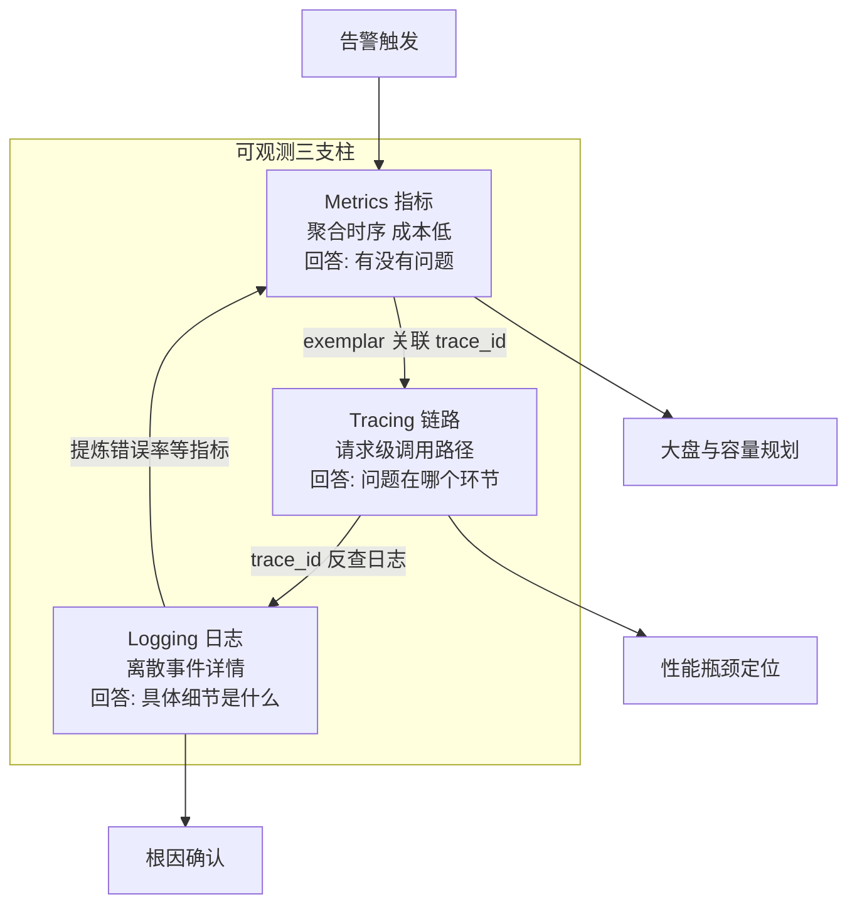
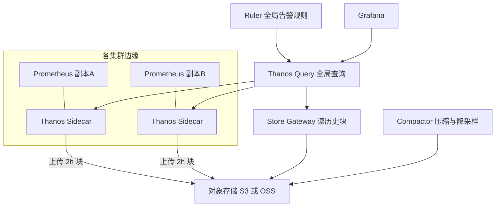
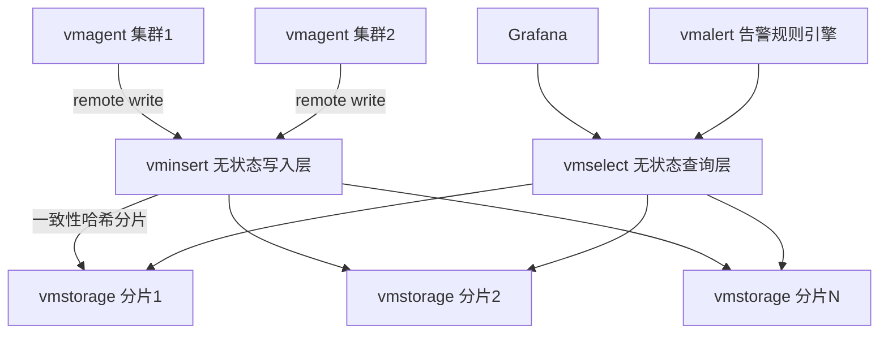
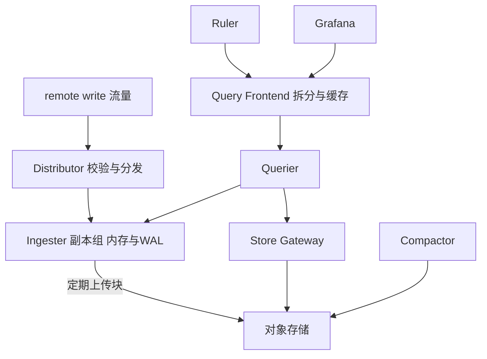
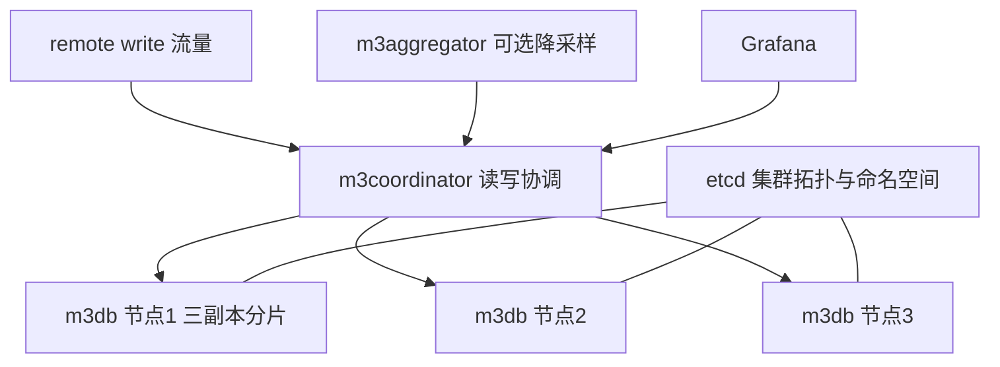
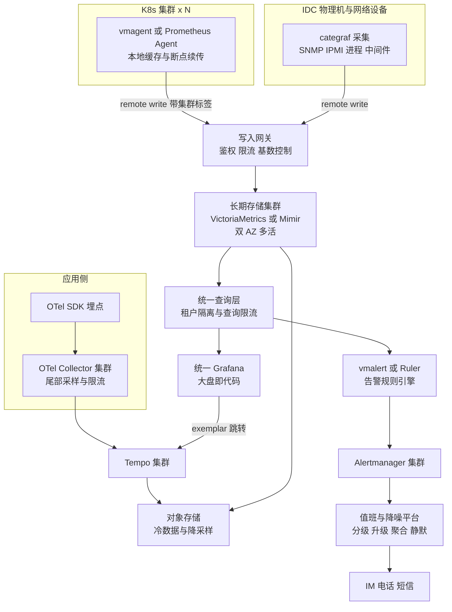

# 生产监控与可观测体系选型

> 适用范围:生产环境指标监控、链路追踪与告警体系选型,覆盖从中小规模单集群到大厂海量时序的场景。
> 日志方案不在本文展开,详见同目录[《日志方案选型》](./日志方案选型.md)。
> 目标读者:3-5 年经验的 SRE / 平台工程师。

## 目录

- [1. 结论先行:场景速查表](#1-结论先行场景速查表)
- [2. 可观测三支柱:定位与关系](#2-可观测三支柱定位与关系)
- [3. 指标体系方法论](#3-指标体系方法论)
  - [3.1 USE / RED / 四大黄金信号](#31-use--red--四大黄金信号)
  - [3.2 分层监控指标清单](#32-分层监控指标清单)
- [4. Prometheus 生态深度](#4-prometheus-生态深度)
  - [4.1 单机 Prometheus 的极限](#41-单机-prometheus-的极限)
  - [4.2 联邦机制的局限](#42-联邦机制的局限)
  - [4.3 长期存储方案对比:Thanos vs VictoriaMetrics vs Mimir vs M3DB](#43-长期存储方案对比thanos-vs-victoriametrics-vs-mimir-vs-m3db)
- [5. 传统方案:Zabbix 与夜莺](#5-传统方案zabbix-与夜莺)
- [6. 链路追踪选型](#6-链路追踪选型)
- [7. 告警体系设计](#7-告警体系设计)
- [8. 大厂典型架构](#8-大厂典型架构)
- [9. 选型决策清单](#9-选型决策清单)

---

## 1. 结论先行:场景速查表

先给结论,论证见后文对应章节。

| 场景 | 指标方案 | 链路方案 | 告警方案 | 说明 |
|---|---|---|---|---|
| 中小规模(单机房,活跃序列 < 200 万) | 单实例 Prometheus + 本地 TSDB,或单机版 VictoriaMetrics | Jaeger all-in-one 或暂缓建设 | Alertmanager 单实例 | 优先把指标覆盖率和告警治理做好,不要过早引入分布式存储 |
| K8s 云原生(1~5 个集群) | kube-prometheus-stack;数据量大时 Prometheus Agent 模式 + remote write | OpenTelemetry Collector + Tempo 或 Jaeger | Alertmanager 集群模式(2~3 副本) | 与 GitOps 结合,告警规则/仪表盘全部代码化 |
| 大规模多集群(10+ 集群,千万级活跃序列) | 每集群 vmagent/Prometheus Agent 远程写 → 中心 VictoriaMetrics 集群版或 Mimir | OTel Collector 网关层 + Tempo,尾部采样 | 中心化 Alertmanager + 值班平台(如 FlashDuty/PagerDuty) | 采集与存储分离是核心架构原则 |
| 超大规模长期存储(亿级序列,保留 1 年以上) | Mimir 或 VictoriaMetrics 集群版;已有 Cassandra 运维能力可考虑 M3DB | Tempo(对象存储,成本最优) | 告警分级 + 升级链 + 降噪平台 | 对象存储承载冷数据,成本敏感场景 VM 压缩率优势明显 |
| 传统 IDC 设备监控(网络设备/物理机/机房动环) | Zabbix 或夜莺 + categraf/snmp_exporter | 通常不需要 | Zabbix 自带触发器或夜莺告警引擎 | SNMP/IPMI 场景 Zabbix 生态最成熟;想统一到 Prometheus 生态则用夜莺 |

**一句话总结**:中小规模不要过度设计,单机 Prometheus 足够;规模上来后,"边缘采集 + 中心远程写 + 分布式长期存储"是行业收敛的形态;链路追踪统一走 OpenTelemetry 标准,后端按成本选 Tempo 或按功能选 SkyWalking。

---

## 2. 可观测三支柱:定位与关系

Metrics、Logging、Tracing 三者回答的问题不同,互相不可替代:

- **Metrics(指标)**:回答"有没有问题、问题多严重"。聚合的数值时序,成本最低、查询最快,是告警的主要数据源。
- **Tracing(链路)**:回答"问题出在哪个环节"。单次请求跨服务的调用路径与耗时分布,定位微服务瓶颈的利器。
- **Logging(日志)**:回答"问题的具体细节是什么"。离散事件的详细上下文,排障的最后一公里。详见《日志方案选型》。

三者通过统一的关联维度(trace_id、服务名、Pod 标签、exemplar)串联,形成排障闭环:

典型排障路径:**告警(Metrics)→ 圈定异常服务与时间窗 → 通过 exemplar 跳转到慢 Trace → 用 trace_id 精确检索日志 → 确认根因**。选型时务必保证三条链路能通过 trace_id 和统一标签体系互相跳转,否则三支柱各自为政,排障效率大打折扣。

本文后续重点讨论 **Metrics + Tracing + 告警**。

---

## 3. 指标体系方法论

### 3.1 USE / RED / 四大黄金信号

三套方法论针对的对象不同,实践中互补使用:

| 方法论 | 适用对象 | 核心维度 | 典型指标示例 |
|---|---|---|---|
| USE | 资源型对象(CPU/内存/磁盘/网卡/连接池) | Utilization 使用率、Saturation 饱和度、Errors 错误 | CPU 使用率、runq 长度、网卡丢包数 |
| RED | 请求型服务(API/微服务/中间件接口) | Rate 请求速率、Errors 错误率、Duration 耗时 | QPS、5xx 比例、P99 延迟 |
| 四大黄金信号 | 面向用户的服务整体(Google SRE) | 延迟、流量、错误、饱和度 | 是 USE + RED 的合集视角 |

落地建议:**资源看 USE,服务看 RED**;告警优先建立在 RED 指标上(用户可感知),USE 指标更多用于容量预警和根因辅助。

### 3.2 分层监控指标清单

按"基础设施 → 中间件 → 应用 → 业务"四层建设,每层都要有明确的 Owner 和告警接收人:

| 层级 | 采集方式 | 核心指标(清单示例) | 告警关注点 |
|---|---|---|---|
| 基础设施 | node_exporter / categraf / IPMI / SNMP | CPU 使用率与 load、内存可用量、磁盘使用率与 IO util、网卡流量与丢包、TCP 重传率、NTP 偏移、文件句柄数 | 磁盘将满(预测性告警)、单机失联、硬件故障 |
| 中间件 | mysqld_exporter、redis_exporter、kafka_exporter、JMX 等 | MySQL 慢查询数/主从延迟/连接数,Redis 内存碎片率/命中率/阻塞命令,Kafka 消费延迟 Lag/ISR 收缩,MQ 堆积量 | 主从延迟、连接池打满、消费积压 |
| 应用 | SDK 埋点 / OTel 自动注入 / 服务网格 | RED 三指标(分接口)、JVM GC 停顿/堆使用、Goroutine 数、线程池队列长度、依赖调用成功率 | 错误率突增、P99 劣化、依赖超时 |
| 业务 | 业务埋点 / 数仓回流 | 订单量、支付成功率、登录成功率、核心漏斗转化率、GMV 同比环比 | 同比/环比突降(需抗周期性算法或同比阈值) |

**K8s 环境额外必备**:kube-state-metrics(对象状态)、cAdvisor(容器资源)、apiserver/etcd/coredns/kubelet 组件指标,以及 Pod 重启次数、Pending 数量、HPA 触发情况。

---

## 4. Prometheus 生态深度

Prometheus 是云原生指标事实标准:PromQL、服务发现、exporter 生态、与 K8s 的原生集成都无可替代。选型问题从来不是"用不用 Prometheus 数据模型",而是"**规模超过单机后,存储和查询层用什么**"。

### 4.1 单机 Prometheus 的极限

单机 Prometheus 的瓶颈主要在内存与本地磁盘(以下为经验值/量级参考):

| 维度 | 量级参考(经验值) | 说明 |
|---|---|---|
| 活跃序列(active series) | 舒适区 100~300 万,极限约 500 万~1000 万 | 每活跃序列常驻内存约 2~4 KB,叠加查询开销后内存是第一瓶颈 |
| 采样吞吐 | 每秒数十万样本可稳定运行 | 15s 抓取间隔下,300 万序列约 20 万样本/秒 |
| 内存占用 | 300 万序列典型 30~64 GB | churn(序列频繁更替,如 Pod 滚动)会显著放大内存与索引压力 |
| 本地保留 | 建议 15~30 天 | 本地 TSDB 无副本、无水平扩展,不适合长期存储 |
| 高可用 | 双副本各自抓取 + 去重靠上层 | 原生无集群能力,双写会导致告警重复,需 Alertmanager 去重 |

**结论**:活跃序列稳定在 200 万以下、保留 30 天以内,单机(双副本)Prometheus 是最简方案;超过这个量级或需要全局视图/长期存储,进入下一节。

### 4.2 联邦机制的局限

Prometheus federation 曾是官方扩展答案,但生产实践中已基本被 remote write 架构取代:

- **只适合拉取聚合后的少量序列**,把明细序列全量联邦等于把瓶颈上移到全局实例;
- 全局层与边缘层**数据延迟叠加**,且全局层仍是单机,没有解决存储扩展问题;
- 标签冲突、抓取超时、序列基数控制都要人工精细维护,运维成本高。

**结论**:联邦仅适合"少量全局聚合指标上报"这一窄场景;多集群统一视图应采用 **remote write → 中心化长期存储** 架构。

### 4.3 长期存储方案对比:Thanos vs VictoriaMetrics vs Mimir vs M3DB

这是本文核心章节。四者都兼容 PromQL(或其超集/子集),核心差异在架构哲学:**Thanos 复用 Prometheus 本地 TSDB + 对象存储,VictoriaMetrics 自研一体化存储,Mimir 是多租户微服务化的对象存储架构,M3DB 是 Uber 系自研分布式 TSDB**。

#### Thanos 架构

Sidecar 模式复用现有 Prometheus,历史块上传对象存储,查询层做全局聚合:

#### VictoriaMetrics 集群版架构

自研存储引擎,组件极简,三种角色:

#### Grafana Mimir 架构

Cortex 演进而来,写入与查询路径完全微服务化,数据落对象存储:

#### M3DB 架构

Uber 开源,自研分布式 TSDB,依赖 etcd 做拓扑管理:

#### 四方案横向对比

| 维度 | Thanos | VictoriaMetrics 集群版 | Grafana Mimir | M3DB |
|---|---|---|---|---|
| 架构模式 | Sidecar/Receiver + 对象存储 | 自研引擎,shared-nothing 本地盘 | 微服务 + 对象存储,多租户原生 | 分布式 TSDB + etcd,三副本 quorum |
| 写入路径 | Sidecar 模式无中心写入压力;Receiver 模式支持 remote write | vminsert 无状态,写入吞吐业界口碑最佳(经验值:单核每秒数万至十余万样本) | Distributor + Ingester,3 副本复制,写放大较高 | coordinator + 副本 quorum 写 |
| 查询性能 | 跨 Store 聚合,历史查询依赖对象存储延迟,大查询较慢 | 单集群内查询快,重查询表现好;全局函数与 PromQL 有细微语义差异(MetricsQL) | Query Frontend 拆分/缓存成熟,重查询稳定性好 | 查询能力相对弱,复杂 PromQL 支持不完整 |
| 压缩与存储成本 | 对象存储便宜,支持降采样(5m/1h),但块冗余多 | 压缩率业界最优(经验值:每样本约 0.4~1 字节,常为其他方案的 1/3~1/7 磁盘占用),但主要用块存储/本地盘 | 对象存储 + 压缩,成本居中,冷数据便宜 | 本地盘三副本,存储成本最高 |
| 运维复杂度 | 中:组件多但各自简单,复用现有 Prometheus,渐进式引入 | 低:组件少、无外部依赖、单二进制,扩容简单(reshard 需注意) | 高:十余个微服务角色,调参多,适合有平台团队的组织 | 高:etcd 依赖 + 拓扑管理复杂,社区活跃度已下降 |
| 多租户 | 弱(需借助标签隔离) | 集群版支持租户(AccountID/ProjectID) | 原生强多租户,配额/限流完善 | 命名空间级隔离 |
| 全局去重与 HA | Query 层按 replica 标签去重,成熟 | 通过 vmagent 双写 + dedup 参数实现 | Ingester 3 副本原生 HA | 副本 quorum 原生 HA |
| 典型规模上限 | 亿级序列(经验值,需精细调优 Store Gateway) | 单集群十亿级序列案例公开可查(量级参考) | 官方宣称十亿级活跃序列(量级参考) | 亿级,Uber 内部超大规模 |
| 适合谁 | 已有大量 Prometheus 存量、想低成本获得全局视图与长期存储 | 追求性能与运维性价比的绝大多数团队,国内使用最广 | 多租户平台化、深度绑定 Grafana 生态、有专职团队 | 已有 M3 存量或重度 Cassandra/etcd 运维经验的团队,新项目不推荐 |

**选型结论**:

1. **存量 Prometheus 多、改造意愿低** → Thanos Sidecar 渐进式接入,成本最低。
2. **绝大多数国内团队的默认答案** → VictoriaMetrics:性能好、组件少、压缩率高、文档清晰;注意 MetricsQL 与 PromQL 的少量语义差异需要在告警规则迁移时回归验证。
3. **平台化多租户、SLO 体系深度绑 Grafana** → Mimir,前提是接受较高的组件复杂度。
4. **M3DB 不建议新项目引入**,社区投入已明显收缩。

---

## 5. 传统方案:Zabbix 与夜莺

并非所有场景都适合 Prometheus 拉模型。传统 IDC 的网络设备、物理机带外、动环监控,Zabbix 依然是成熟度最高的方案。

| 维度 | Zabbix | 夜莺 Nightingale | Prometheus 生态 |
|---|---|---|---|
| 数据模型 | 关系型数据库存储 item,固定 schema | 兼容 Prometheus 数据模型,存储可对接 VM/Prometheus | 多维标签时序 |
| 采集方式 | Agent 主动/被动、SNMP、IPMI、JMX,开箱即用 | categraf 一体化采集(推模式),兼容 exporter | 拉模型 + exporter,推需走 remote write/pushgateway |
| 设备监控 | 最强:SNMP 模板生态庞大,LLD 自动发现成熟 | 依赖 categraf 的 SNMP 插件,可用但生态弱于 Zabbix | snmp_exporter 配置繁琐 |
| 云原生适配 | 弱,标签模型不匹配 K8s 动态环境 | 良好,天然对接 K8s 与 Prometheus 生态 | 原生最佳 |
| 告警能力 | 触发器表达式,依赖模板 | 内置告警引擎、值班、聚合收敛,中文界面友好 | Alertmanager,能力强但需自建周边 |
| Web/权限 | 自带完整 UI 与权限体系 | 自带 UI + 权限 + 业务组模型,对国内团队友好 | 依赖 Grafana 拼装 |
| 瓶颈 | 数据库写入瓶颈明显(经验值:单库百万级 NVPS 需大量调优与 proxy 分层) | 本身无存储瓶颈,取决于后端 TSDB | 见第 4 章 |

**取舍建议**:

- **纯 IDC、大量网络设备/硬件监控、团队熟悉 Zabbix** → 继续用 Zabbix,没必要为了"云原生"强行迁移;
- **混合环境(IDC + K8s)、希望统一到一套标签模型和告警体系** → 夜莺是很好的"胶水层":categraf 统一采集,后端接 VictoriaMetrics,前端提供开箱即用的告警/值班/权限,规避了自建 Alertmanager 周边的成本;
- **纯云原生** → 直接 Prometheus 生态,无需引入夜莺也可,但告警治理平台需自建或采购。

---

## 6. 链路追踪选型

### 6.1 OpenTelemetry 的标准地位

**结论先行:埋点侧无条件选 OpenTelemetry(OTel),不要再直接使用任何后端的私有 SDK。** OTel 已完成对 OpenTracing 与 OpenCensus 的合并,是 CNCF 事实标准,Trace 信号已 GA 多年,主流语言 SDK 与自动注入(Java agent、Go 编译期/eBPF 方案)成熟。OTel Collector 作为采集网关,支持接收 OTLP/Jaeger/Zipkin 协议并导出到任意后端,**让埋点与后端解耦,后端可随时更换**。

### 6.2 后端对比

| 维度 | Jaeger | Grafana Tempo | SkyWalking | Zipkin |
|---|---|---|---|---|
| 存储后端 | 自 v2 起原生对象存储,亦支持 ES/Cassandra | 仅对象存储,成本最低 | ES 或 BanyanDB(自研) | ES/Cassandra/MySQL |
| 检索能力 | TraceID + 标签检索,较完整 | 早期仅 TraceID,现有 TraceQL 支持属性检索 | 强:拓扑、指标、Trace、Profiling 一体化 | 基础检索 |
| 与 Grafana/Prometheus 联动 | 好 | 最好:exemplar 跳转、与 Loki/Mimir 同栈 | 一般,自带完整 UI | 一般 |
| APM 能力(拓扑/服务指标/告警) | 弱,纯 Trace | 弱,依赖 Grafana 拼装 | 最强:开箱即用的 APM,含告警与拓扑 | 弱 |
| 语言探针 | 依赖 OTel SDK | 依赖 OTel SDK | 自带 Java/PHP/Python 等 agent,Java 无侵入体验极佳 | 依赖社区 SDK |
| 运维成本 | 中(v2 简化明显) | 低:组件少、对象存储 | 中高:ES 集群或 BanyanDB 需维护 | 低但功能有限 |
| 适合谁 | 通用默认选择,CNCF 毕业项目 | Grafana 全家桶用户、成本敏感的海量 Trace | Java 为主的国内团队、想要开箱即用 APM | 存量系统,新项目不推荐 |

**选型结论**:Grafana 体系 → Tempo;Java 重度 + 要 APM 大盘 → SkyWalking;通用中立 → Jaeger;Zipkin 仅维持存量。无论选谁,**埋点协议统一 OTLP,经 OTel Collector 转发**。

### 6.3 采样策略

全量存储 Trace 成本高昂,采样是必答题:

| 策略 | 原理 | 优点 | 缺点 | 适用 |
|---|---|---|---|---|
| 头部采样 Head-based | 请求入口按比例/速率决定是否采样,决策随上下文传播 | 实现简单、开销低、SDK 内置 | 采不到"事后才知道有问题"的请求,错误与慢请求大概率丢失 | 中小流量、成本优先 |
| 尾部采样 Tail-based | Collector 缓存整条 Trace,结束后按规则决策(错误必采、慢请求必采、正常请求低比例) | 保留最有排障价值的 Trace | Collector 需缓存与有状态路由(同 TraceID 路由到同实例),资源开销大 | 大流量生产环境的推荐形态 |

推荐组合:**SDK 侧头部采样兜底(如 10%~100% 视流量),OTel Collector 网关层做尾部采样(错误 100%、P99 以上慢请求 100%、正常请求 1%~5%)**,比例为经验值,按存储预算调整。

---

## 7. 告警体系设计

监控体系的价值最终通过告警兑现,而告警体系失败的第一原因是**噪音过多导致告警疲劳**。

### 7.1 Alertmanager 核心设计模式

- **路由(route)**:按 `team`/`severity` 标签树状路由到不同接收组;要求所有告警规则强制携带这两个标签(通过 CI 校验)。
- **分组(group_by)**:按 `alertname + cluster + service` 分组,`group_wait 30s` 聚合首波告警,`group_interval 5m` 控制组内新告警的追加频率,避免一次故障几百条消息刷屏。
- **抑制(inhibit_rules)**:高级别告警抑制低级别派生告警。典型规则:节点宕机抑制该节点上所有 Pod/进程告警;机房级故障抑制机房内全部告警;`critical` 抑制同标签的 `warning`。
- **静默(silence)**:变更窗口、演练、已知问题挂静默,必须带过期时间与工单号;长期静默是告警治理的坏味道,应定期审计清理。
- **高可用**:Alertmanager 以 gossip 集群模式部署 2~3 副本,Prometheus/vmalert 同时推送到所有副本,由集群去重。

### 7.2 告警分级与升级策略

| 级别 | 定义 | 通知渠道 | 响应要求(示例 SLA) | 升级策略 |
|---|---|---|---|---|
| P0 | 核心业务不可用/资损进行中 | 电话 + 短信 + IM 群 | 5 分钟内响应,15 分钟内组织作战室 | 5 分钟未认领 → 升级备份值班;10 分钟 → 升级 TL;15 分钟 → 升级总监 |
| P1 | 核心功能受损/容量临界 | 电话或短信 + IM | 15 分钟内响应 | 15 分钟未认领 → 备份值班 → TL |
| P2 | 非核心异常/冗余丢失(单副本挂) | IM 消息 | 工作时间内 2 小时处理 | 不电话升级,超时转工单 |
| P3 | 提示性/趋势性(磁盘 7 天后满) | IM 低优先级或仅工单 | 按周处理 | 仅进入周报盘点 |

配套值班体系要点:**主备双值班、按周轮换、交接必须书面化(未决告警/进行中变更/已知风险)、值班表进配置管理并与告警平台联动**,升级链自动化(依赖 FlashDuty/PagerDuty/OnCall 类平台),不要依赖"人肉盯群"。

### 7.3 告警治理:降噪三板斧

1. **聚合**:同一根因的告警合并为一条通知(Alertmanager 分组 + 告警平台二次聚合,按时间窗/标签相似度)。
2. **收敛**:抑制规则消灭派生告警;为抖动型指标加 `for` 持续时间(如 `for: 3m`)与恢复通知;对周期性业务指标用同比/环比而非固定阈值。
3. **根因**:结合拓扑(调用链、部署关系)做告警关联分析,把"50 条告警"归纳为"1 个故障 + 影响面清单"。

治理需要度量驱动,建议每周盘点:**告警总量、认领率、有效率(触发后确实需要人工处理的比例,目标 > 50%)、MTTA/MTTR、Top10 高频告警**。高频且从不处理的告警,要么修阈值,要么删规则。

---

## 8. 大厂典型架构

千万级以上活跃序列、几十个 K8s 集群 + IDC 混合场景下,行业收敛出的形态:**边缘轻量采集 → 中心化远程写(多活)→ 分布式长期存储 → 统一查询与统一告警**。

关键设计要点:

1. **边缘只做采集**:vmagent/Prometheus Agent 模式不存储不查询,内存占用小,自带磁盘缓冲对抗中心链路抖动;
2. **写入网关统一治理**:鉴权、租户配额、**序列基数熔断**(防止一个业务的高基数标签打爆全局存储,这是海量时序场景的头号事故来源);
3. **标签规范先行**:`cluster`/`env`/`team`/`app` 全局标签由采集端强制注入,是多租户路由、告警路由、成本分摊的基础;
4. **存储双活**:vmagent 双写两套存储,或 Mimir 跨 AZ 副本,查询层去重;
5. **一切即代码**:告警规则、Grafana 大盘、采集配置全部 Git 管理 + CI 校验(promtool/vmalert 语法检查、强制标签检查)+ GitOps 下发;
6. **成本可观测**:按租户统计序列数与查询量,定期清理无人查询的指标(经验上 60% 以上采集指标从未被查询,量级参考)。

---

## 9. 选型决策清单

落地前逐条确认:

- [ ] 当前与 18 个月后的活跃序列量级估算(实例数 x 每实例指标数 x 标签基数)
- [ ] 是否多集群/多机房,是否需要全局查询视图
- [ ] 数据保留要求:热数据天数、冷数据月数、是否需要降采样
- [ ] 是否有多租户/成本分摊诉求
- [ ] 存量系统:已有 Prometheus/Zabbix 存量多大,迁移成本是否可接受
- [ ] 团队能力:是否有专人维护分布式存储,还是必须选运维最简方案
- [ ] 链路追踪:埋点是否统一 OTel,采样策略与存储预算是否匹配
- [ ] 告警:分级标准、值班升级链、降噪指标(有效率/MTTA)是否定义
- [ ] 三支柱关联:trace_id 与统一标签能否贯通 Metrics/Tracing/Logging

---

## 参考资料

- Google SRE Book: Monitoring Distributed Systems
- Brendan Gregg: The USE Method
- Prometheus 官方文档:Storage / Federation / Remote Write
- Thanos、VictoriaMetrics、Grafana Mimir、M3 官方架构文档
- OpenTelemetry 官方文档:Sampling / Collector
- 夜莺 Nightingale 与 categraf 项目文档

> 数据量级、成本与性能数字均为经验值/量级参考,以实际压测为准。选型没有银弹:**先明确规模与团队能力,再选最简单够用的方案**。
