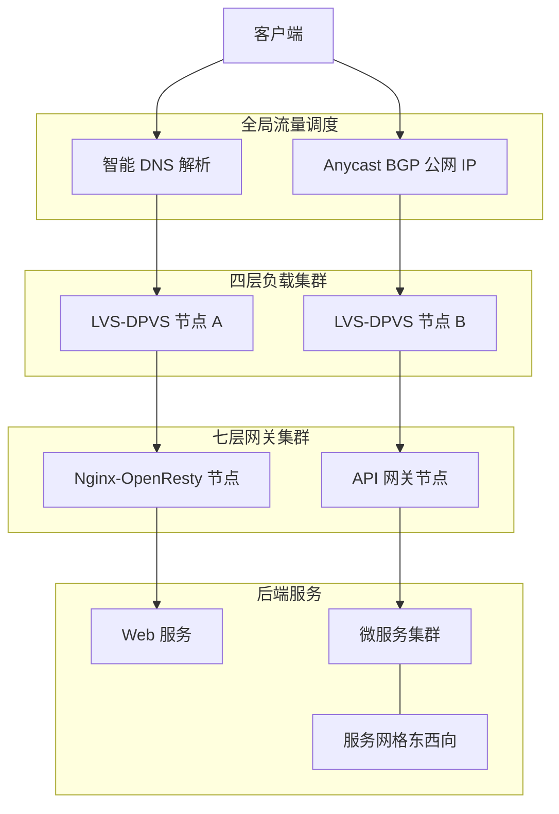
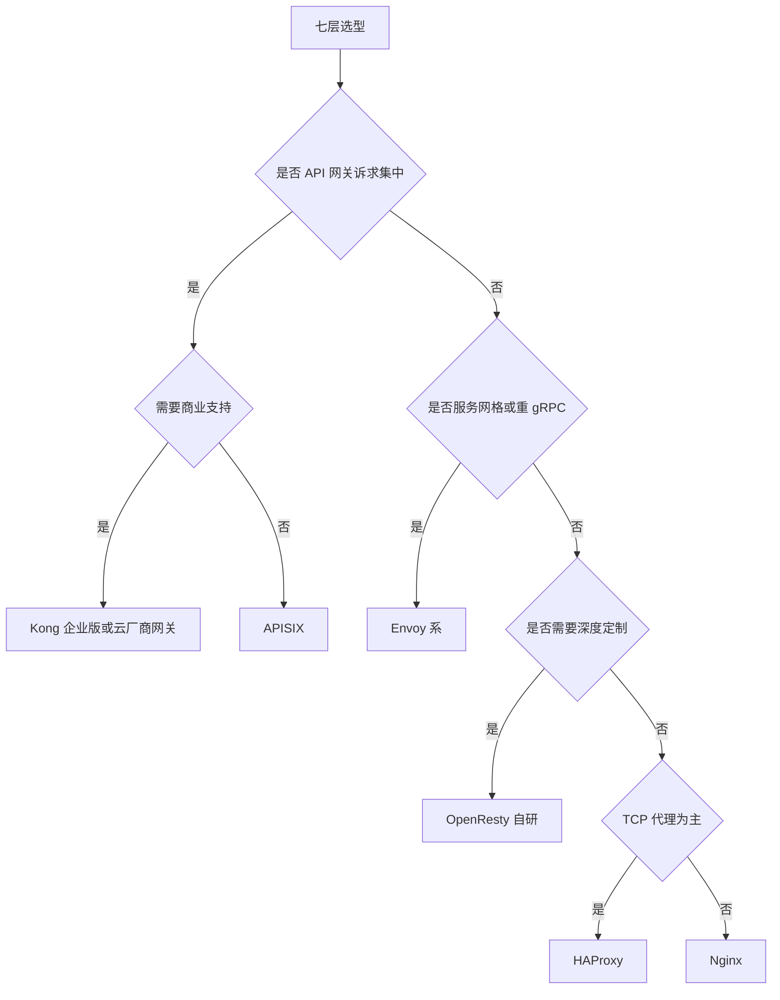
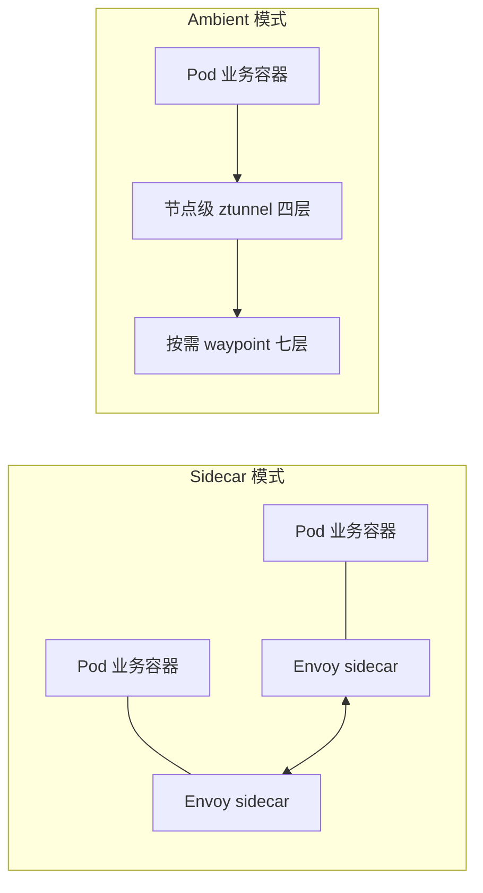

# 接入层网关与负载均衡选型

> 面向高并发大厂场景的四层/七层/API 网关/服务网格选型指南。目标读者:3-5 年经验 SRE。
> 文中性能数字均为**经验值/量级参考**,实际以自身压测为准。

## 目录

- [1. 结论先行:场景速查表](#1-结论先行场景速查表)
- [2. 接入层分层架构](#2-接入层分层架构)
- [3. 四层负载均衡](#3-四层负载均衡)
- [4. 七层选型深度对比](#4-七层选型深度对比)
- [5. API 网关职责与选型](#5-api-网关职责与选型)
- [6. K8s 场景选型](#6-k8s-场景选型)
- [7. 高可用与容灾](#7-高可用与容灾)
- [8. 性能调优要点](#8-性能调优要点)
- [9. 选型决策清单](#9-选型决策清单)

---

## 1. 结论先行:场景速查表

先给结论,细节论证见后文各章。

| 场景 | 推荐方案 | 备选 | 关键理由 |
| --- | --- | --- | --- |
| 百万级 QPS 统一入口 | DNS/Anycast + LVS-DR 或 DPVS + Nginx/OpenResty 集群 | 云厂商 SLB + 自建七层 | 四层扛量、七层做逻辑,分层扩展互不拖累 |
| 中小规模 Web 反向代理 | Nginx 单层 | HAProxy、Caddy | 单机数万 QPS 足够,运维成本最低 |
| K8s Ingress | Ingress-Nginx 存量维持,新集群评估 Gateway API + Envoy 系实现 | APISIX Ingress、Traefik | Ingress-Nginx 生态最熟,Gateway API 是社区方向 |
| 微服务 API 网关 | APISIX | Kong、基于 OpenResty 自研 | 全动态配置、插件生态、国内社区活跃 |
| gRPC 东西向流量 | Envoy(独立部署或 Istio 数据面) | APISIX、直连 + 客户端 LB | 原生 HTTP/2 多路复用与 gRPC 感知负载均衡 |
| 需要大量定制逻辑的网关 | OpenResty 自研 或 APISIX 插件 | Envoy + WASM | Lua 开发效率高,团队有存量 Nginx 经验时收益最大 |
| TCP/MySQL/Redis 等非 HTTP 代理 | HAProxy 或 LVS | Envoy TCP proxy | HAProxy 四层能力成熟,健康检查精细 |

**一句话原则**:能用一层解决就不加层;流量到十万 QPS 量级以上,再引入"四层扛量 + 七层做逻辑"的分层结构;API 网关只有在微服务治理诉求(认证/限流/灰度)集中出现时才独立建设。

---

## 2. 接入层分层架构

大厂标准接入链路是"逐层收敛、逐层卸载"的结构:



各层职责与存在理由:

| 层级 | 组件 | 核心职责 | 为什么单独一层 |
| --- | --- | --- | --- |
| 全局调度 | 智能 DNS / Anycast | 就近接入、机房级容灾切换 | 唯一能在机房整体故障时把流量调走的层 |
| 四层 | LVS / DPVS / 云 SLB | 海量连接分发、DDoS 首道防线、VIP 高可用 | 内核态/DPDK 转发,单机千万级并发连接,七层软件到不了这个量级 |
| 七层 | Nginx / OpenResty / Envoy / APISIX | TLS 卸载、路由、限流、认证、灰度、协议转换 | 业务逻辑变更频繁,与扛量层解耦后可独立发布扩容 |
| 后端 | 业务服务 / 网格 | 业务处理、东西向服务间调用 | — |

**为什么要分层**:四层转发是"每包几十纳秒"的活,七层是"每请求几十微秒"的活,两者性能差 2-3 个数量级。混在一层意味着扩容单位被最慢的逻辑绑架;分层后四层节点极少变更(稳定),七层节点频繁发布(灵活),故障域也被切开。

---

## 3. 四层负载均衡

### 3.1 LVS 三种转发模式

结论:**生产大流量场景几乎总是 DR 模式**;NAT 只适合小规模且需要改端口的场景;TUN 用于 RS 跨机房等特殊拓扑。

| 维度 | NAT | DR 直接路由 | TUN 隧道 |
| --- | --- | --- | --- |
| 转发原理 | 改写目的 IP/端口,回包也经 LVS | 改写目的 MAC,回包由 RS 直接回客户端 | IPIP 封装转发,回包 RS 直接回 |
| 回程流量 | 经过 LVS(双向瓶颈) | 不经过 LVS | 不经过 LVS |
| RS 网络要求 | 网关指向 LVS | 与 LVS 同二层,RS 绑 VIP 于 lo 并抑制 ARP | RS 支持 IPIP,可跨三层网络 |
| 性能量级(经验值) | 单机 10 万级并发 | 单机百万级并发,吞吐仅受网卡与 PPS 限制 | 略低于 DR,有封装开销 |
| 端口映射 | 支持 | 不支持,VIP 端口即 RS 端口 | 不支持 |
| 典型用途 | 小集群、内网改端口 | 主流生产入口 | RS 跨机房/跨子网 |

DR 模式 RS 侧标准配置(抑制 ARP):

```bash
# Real Server 上执行
ip addr add ${VIP}/32 dev lo
sysctl -w net.ipv4.conf.lo.arp_ignore=1
sysctl -w net.ipv4.conf.lo.arp_announce=2
sysctl -w net.ipv4.conf.all.arp_ignore=1
sysctl -w net.ipv4.conf.all.arp_announce=2
```

### 3.2 Keepalived 高可用

经典形态:两台 LVS 以 Keepalived VRRP 做主备,VIP 漂移完成秒级接管;`virtual_server` 段内配置健康检查自动摘除故障 RS。

```conf
vrrp_instance VI_1 {
    state MASTER            # 备机为 BACKUP
    interface eth0
    virtual_router_id 51
    priority 150            # 备机设 100
    advert_int 1
    authentication { auth_type PASS  auth_pass s3cret }
    virtual_ipaddress { 10.0.0.100/32 }
}
virtual_server 10.0.0.100 443 {
    delay_loop 3
    lb_algo wrr
    lb_kind DR
    protocol TCP
    real_server 10.0.1.11 443 {
        weight 100
        TCP_CHECK { connect_timeout 2  retry 2 }
    }
}
```

注意点:
- 主备模式备机闲置,利用率 50%;可做双主(两个 VIP 互为主备)提升利用率。
- `preempt_delay` 或非抢占模式避免主机抖动时 VIP 反复漂移。
- 连接同步(`ipvs sync daemon`)可在切换时保住已建连接,长连接业务必开。

### 3.3 何时需要 DPVS / 云 SLB

| 方案 | 适用信号 | 说明 |
| --- | --- | --- |
| 原生 LVS + Keepalived | 单 VIP 数十万并发以内 | 内核 IPVS,运维简单,绝大多数自建机房够用 |
| DPVS | 单点需要千万级并发/数百万 PPS 以上,或被软中断打满 | 基于 DPDK 用户态转发,绕过内核协议栈,爱奇艺开源;需要独占网卡与 CPU,运维门槛高 |
| 云 SLB/NLB | 业务在公有云 | 不要在云上自建 LVS,云厂商四层 LB 底层就是类 DPVS 集群,直接买 |

经验判断:内核 LVS 单机在 10G 网卡上达到约 **百万级并发、几十万 PPS 处理(量级参考)** 后,`ksoftirqd` 开始成为瓶颈,此时要么横向扩 ECMP 集群,要么上 DPVS。

### 3.4 ECMP + BGP 集群化

主备模式的天花板是"单机性能 x1"。大厂标准做法是 LVS 集群化:

- 每台 LVS 通过 BGP(Quagga/Bird/GoBGP)向上联交换机宣告同一个 VIP 路由;
- 交换机以 ECMP 把流量按五元组哈希分散到多台 LVS,天然横向扩展;
- 某台 LVS 故障时撤销 BGP 宣告,路由收敛秒级完成,无需 VRRP;
- 配合一致性哈希调度减少节点增减时的连接打散。

这就是"全活集群"替代"主备"的模式,VIP 容量从单机上限变为 N 台线性叠加。代价是需要网络团队配合打通 BGP,且对哈希重分布导致的连接重置要有预案(如 session 同步或七层重试兜底)。

---

## 4. 七层选型深度对比

### 4.1 总对比表

结论先行:**通用反代选 Nginx,重定制选 OpenResty,纯代理/TCP 选 HAProxy,云原生/gRPC/网格选 Envoy,API 网关选 APISIX(或 Kong),小团队快速上手选 Traefik**。

| 维度 | Nginx | OpenResty | HAProxy | Envoy | APISIX | Kong | Traefik |
| --- | --- | --- | --- | --- | --- | --- | --- |
| 内核/语言 | C | Nginx + LuaJIT | C | C++ | OpenResty + etcd | OpenResty + PG/无 DB | Go |
| 单机 HTTP 短连接 QPS(经验值/量级) | 10 万级 | 10 万级 | 10 万级 | 5-10 万级 | 5-8 万级 | 3-6 万级 | 2-4 万级 |
| 动态配置 | 弱,reload 生效 | 可自研动态能力 | Runtime API 部分动态 | 全动态 xDS | 全动态,毫秒级 | DB-less 声明式/Admin API | 自动服务发现 |
| 扩展方式 | C 模块/njs | Lua 全生命周期钩子 | Lua/SPOE | C++ filter / WASM / Lua | Lua 插件/Plugin Runner 多语言/WASM | Lua 插件/多语言 PDK | Go 中间件/插件 |
| HTTP/2 | 支持,upstream 侧 gRPC 代理 | 同 Nginx | 支持 | 原生,前后端均一等公民 | 支持 | 支持 | 支持 |
| gRPC 代理 | 支持,负载均衡按连接 | 同 Nginx | 支持 | 最佳,按流负载均衡 | 支持,含协议转换插件 | 支持 | 支持 |
| WebSocket | 支持 | 支持 | 支持 | 支持 | 支持 | 支持 | 支持 |
| 可观测性 | stub_status 简陋,依赖 exporter | 可自埋点 | 内建 stats 页/CSV,较全 | 最强,数百项指标 + 分布式追踪原生 | Prometheus/OTel 插件齐全 | 插件提供 | 内建指标/追踪 |
| 配置心智 | 静态文件,人人会写 | Nginx conf + Lua 代码 | 单文件,语义精确 | xDS/YAML 冗长,通常靠控制面 | 声明式 + 控制面 Dashboard | 声明式/Admin API | 标签/CRD 自动发现 |
| 典型定位 | 通用反代/静态资源 | 定制化网关底座 | 高可靠 LB/TCP 代理 | 网格数据面/云原生代理 | 开源 API 网关 | 商业化 API 网关 | K8s/容器友好入口 |

### 4.2 逐个简析

**Nginx**:事实标准。epoll + 多 worker 架构,单机 10 万级 QPS(经验值),配置生态与排障资料最丰富。短板是动态能力:改 upstream 要 reload(平滑但会新旧 worker 并存),商业版 Plus 才有完整动态 API。适合路由规则相对稳定的反代与静态服务。

**OpenResty**:Nginx + LuaJIT,把请求生命周期(rewrite/access/content/balancer/log)全部暴露给 Lua。动态 upstream、复杂鉴权、精细限流都可以用几百行 Lua 搞定,性能损耗通常在 10% 以内(经验值)。它不是开箱产品而是"网关开发框架",APISIX 和 Kong 都构建于其上。团队有 Nginx 功底且需要深度定制时的首选底座。

**HAProxy**:代理界的"精密仪器"。单进程多线程模型,四层/七层皆强,健康检查、连接排队、慢启动、粘性会话等 LB 语义做得比 Nginx 精细,stats 页开箱即用。短板是不能像 Nginx 一样当 Web 服务器(无静态文件/缓存能力),扩展生态弱于 Lua 系。MySQL/Redis/TCP 长连接代理场景经常比 Nginx stream 模块更省心。

**Envoy**:云原生时代的代理内核。全动态 xDS 配置(监听器/路由/集群/端点均可热更新不断连),HTTP/2 与 gRPC 前后端原生支持,可观测性(指标/日志/追踪)是设计目标而非附加。代价:裸用配置极其冗长,C++ 二次开发门槛高(WASM 可缓解但生态尚在成熟),通常配合控制面(Istio/Gloo/自研)使用。gRPC 东西向与服务网格场景基本没有对手。

**APISIX**:Apache 顶级项目,OpenResty + etcd 架构。路由/上游/插件全部存 etcd,变更毫秒级推送到数据面,无需 reload;路由匹配用基数树,性能在 API 网关里领先(经验值:同硬件下高于 Kong 约 30-50%)。插件热加载、多语言 Plugin Runner、原生 K8s Ingress 实现。国内社区活跃、文档中文友好。开源 API 网关的默认选项。

**Kong**:最早出圈的开源 API 网关,同为 OpenResty 系,传统架构依赖 PostgreSQL(现支持 DB-less 声明式)。插件生态成熟,企业版提供开发者门户、精细 RBAC 等商业能力。开源版部分高级功能受限,性能与动态性略逊 APISIX。适合需要商业支持背书、或已在 Kong 生态内的团队。

**Traefik**:Go 编写,主打"自动发现":对接 Docker/K8s 标签即自动生成路由,Let's Encrypt 证书自动签发,上手体验最好。性能量级低于 C 系代理(经验值:约为 Nginx 的 1/3-1/2),高压场景 GC 与内存表现需实测。适合中小规模容器化团队,不适合做大厂主入口。

### 4.3 快速决策



---

## 5. API 网关职责与选型

API 网关 = 七层代理 + **集中式微服务治理**。判断是否需要独立网关:当以下能力开始在多个服务里重复实现时,就该收口到网关。

| 职责 | 说明 | 典型实现 |
| --- | --- | --- |
| 认证鉴权 | JWT/OAuth2/HMAC 签名校验、内部服务 token | key-auth/jwt 插件,或对接统一认证中心 |
| 限流熔断 | 按 App/用户/IP 维度限流,后端异常熔断降级 | 令牌桶/漏桶插件 + Redis 集群级计数 |
| 灰度发布 | 按 header/用户尾号/权重分流到新版本 | traffic-split、金丝雀路由规则 |
| 协议转换 | HTTP 转 gRPC/Dubbo,聚合编排 | grpc-transcode 等插件 |
| 安全防护 | WAF 规则、IP 黑白名单、防重放 | 插件或前置 WAF 层 |
| 审计计费 | 全量访问日志、调用量计费 | 日志插件 + Kafka 落地 |

### APISIX vs Kong vs 自研(OpenResty)取舍

| 维度 | APISIX | Kong | OpenResty 自研 |
| --- | --- | --- | --- |
| 上线速度 | 快,开箱插件 80+ | 快,生态成熟 | 慢,人力月为单位 |
| 深度定制 | Lua 插件,能力已够 90% 场景 | Lua 插件,部分能力锁企业版 | 无上限,完全贴合内部体系 |
| 与内部系统集成 | 需写插件对接 | 需写插件对接 | 原生按内部规范设计 |
| 长期维护成本 | 社区演进,跟版本即可 | 依赖厂商节奏 | 全部自担,人员流失是最大风险 |
| 适用团队 | 绝大多数团队 | 要商业 SLA 的团队 | 网关本身是核心竞争力的大厂 |

**结论**:默认 APISIX;只有当网关承载了大量与内部基础设施(自研注册中心、自研认证、专有协议)强耦合的逻辑,且团队能长期投入 2 人以上专职维护时,自研才划算。很多"自研网关"实际是 APISIX/Kong 魔改,注意与上游版本脱节的代价。

---

## 6. K8s 场景选型

### 6.1 Ingress 实现对比

| 维度 | Ingress-Nginx | APISIX Ingress | Traefik | Gateway API 实现 |
| --- | --- | --- | --- | --- |
| 数据面 | Nginx | APISIX | Traefik | Envoy 居多,如 Envoy Gateway/Cilium |
| 配置生效 | 部分变更需 reload | 全动态无 reload | 动态 | 动态 |
| 表达能力 | annotation 膨胀,非标准 | CRD 丰富,含插件全集 | CRD/中间件 | 标准 API,角色分离,表达力强 |
| 灰度/限流 | annotation 有限支持 | 插件原生支持 | 中间件支持 | HTTPRoute 原生权重分流 |
| 社区趋势 | 存量最大;注意其 v1 已宣布进入维护模式,社区力量转向 Gateway API 的 InGate 方向 | 活跃 | 活跃 | 上升,K8s 官方方向 |

**建议**:存量集群 Ingress-Nginx 继续用但冻结复杂 annotation 玩法;新建平台直接按 **Gateway API** 建模(GatewayClass/Gateway/HTTPRoute 的角色分离更符合平台工程),数据面选 Envoy 系或 APISIX 的 Gateway API 实现,避免未来二次迁移。

### 6.2 服务网格:何时需要



- **需要网格的信号**:数百个微服务、多语言技术栈无法统一 SDK、需要全链路 mTLS/细粒度东西向授权、灰度和故障注入要下沉到平台层。
- **不需要的信号**:服务数量两位数以内、单一语言可用框架(如 Spring Cloud/Dubbo/gRPC 客户端 LB)解决、团队没有专职网格运维。网格是"每 Pod 一个代理"的成本(sidecar 模式下内存/延迟/升级复杂度都翻倍)。
- **Sidecar vs Ambient**:sidecar 成熟、隔离性好但资源开销大、升级要重启业务 Pod;Istio ambient 把四层能力下沉到节点级 ztunnel、七层按需部署 waypoint,资源省、升级与业务解耦,已 GA 并适合新上网格的集群从它开始;重 L7 策略且求稳的存量场景仍可用 sidecar。

---

## 7. 高可用与容灾

### 7.1 接入层多活

| 手段 | 生效粒度 | 切换速度 | 局限 |
| --- | --- | --- | --- |
| 智能 DNS(GSLB) | 机房级,按地域/运营商解析 | 分钟级,受 TTL 与运营商缓存拖累 | LocalDNS 不遵守 TTL 是常态,必须配合客户端重试/HTTPDNS |
| Anycast + BGP | 机房级,路由收敛 | 秒级 | 需要自有 AS 与公网 BGP 能力,长连接跨路由漂移会断 |
| HTTPDNS / 客户端调度 | 端级精确调度 | 近实时 | 仅覆盖自有 App,Web 端不适用 |

大厂实践是三者叠加:DNS 做粗调度,Anycast 扛 DDoS 与就近接入,App 端 HTTPDNS 精确容灾。**多活演练必须常态化**——DNS 切换的真实收敛时间只有演练才知道。

### 7.2 连接保持与优雅摘流

摘除一台七层节点的标准动序:

1. 先摘流量:从上游 LVS/注册中心摘除权重(置 0),而不是直接杀进程;
2. 等存量排空:等待现有请求完成、长连接自然回收(设置 drain 超时,如 30-60s);
3. Nginx 用 `SIGQUIT` 优雅退出,Envoy 用 `/drain_listeners?graceful`,K8s 用 preStop sleep + `terminationGracePeriodSeconds` 覆盖排空窗口;
4. 长连接客户端要配合:服务端发送 `Connection: close` 或 HTTP/2 GOAWAY 主动引导重连。

四层侧配合 Keepalived 的 `ipvs` 连接同步或 ECMP 一致性哈希,避免摘除动作放大成连接风暴。

### 7.3 TLS 卸载位置

| 卸载位置 | 优点 | 缺点 | 适用 |
| --- | --- | --- | --- |
| 七层网关卸载(主流) | 集中管证书,后端明文省 CPU | 内网明文需受控网络 | 绝大多数场景 |
| 网关卸载后端重新加密 | 满足内网加密合规 | 双倍 TLS 开销 | 金融/合规场景 |
| 端到端透传 SNI 分流 | 网关不解密,私密性最好 | 七层能力全部失效,只能按 SNI 路由 | 特殊安全要求 |
| 网格 mTLS | 东西向零信任 | 由网格自动管理,复杂度在控制面 | 已上网格的集群 |

实践要点:TLS 1.3 + session resumption + OCSP stapling 是标配;证书统一由自动化体系(内部 CA/ACME)签发轮换,禁止手工散落;RSA 换 ECDSA 证书可显著降低握手 CPU(经验值:握手性能约 2-3 倍提升)。

---

## 8. 性能调优要点

### 8.1 内核参数(接入层机器基线)

```bash
# /etc/sysctl.d/99-lb.conf —— 生产级基线,按压测微调
net.core.somaxconn = 65535               # accept 队列上限,需与应用 backlog 同步调大
net.core.netdev_max_backlog = 262144     # 网卡收包队列
net.ipv4.tcp_max_syn_backlog = 262144    # SYN 半连接队列
net.ipv4.tcp_tw_reuse = 1                # 出向连接复用 TIME_WAIT,代理连后端必开
net.ipv4.tcp_fin_timeout = 15
net.ipv4.ip_local_port_range = 1024 65000  # 出向端口范围,决定到单个后端的连接上限
net.ipv4.tcp_slow_start_after_idle = 0   # 长连接空闲后不重回慢启动
net.ipv4.tcp_congestion_control = bbr
fs.file-max = 4194304
fs.nr_open = 4194304
```

```bash
# 文件句柄:systemd 服务单元中设置,优先于 limits.conf
# /etc/systemd/system/nginx.service.d/limits.conf
[Service]
LimitNOFILE=1048576
```

注意:`tcp_tw_recycle` 在新内核已移除,历史文档里出现一律忽略;NAT 环境下它曾是著名故障源。

### 8.2 Nginx worker 与 CPU 亲和

```nginx
worker_processes auto;              # 等于 CPU 核数
worker_cpu_affinity auto;           # 每 worker 绑核,减少缓存失效与调度抖动
worker_rlimit_nofile 1048576;

events {
    worker_connections 262144;      # 单 worker 连接数,代理场景每请求占 2 个连接
    multi_accept on;
}
```

要点:
- `reuseport`(listen 指令参数)让内核按 socket 哈希分发新连接到各 worker,消除 accept 惊群与负载不均,高并发短连接场景收益明显;
- 网卡多队列中断也要绑核(irqbalance 或手工 `smp_affinity`),与 worker 绑核配合,避免所有软中断挤在 CPU0;
- NUMA 机器上让网卡中断、worker、网卡所在 NUMA 节点对齐。

### 8.3 长连接复用

代理机最常见的隐性瓶颈是**对后端使用短连接**,导致本机端口耗尽与握手开销。

```nginx
upstream backend {
    server 10.0.2.11:8080;
    server 10.0.2.12:8080;
    keepalive 512;                  # 每 worker 缓存的空闲后端连接数
    keepalive_requests 10000;       # 单连接最大请求数后轮换,配合后端优雅回收
    keepalive_timeout 60s;
}
server {
    location / {
        proxy_pass http://backend;
        proxy_http_version 1.1;    # keepalive 必须 1.1
        proxy_set_header Connection "";   # 清掉 close 头
    }
    keepalive_timeout 75s;          # 客户端侧长连接
    keepalive_requests 1000;
}
```

- 排查口径:后端连接是否复用,看代理机 `ss -s` 的 timewait 数量与 `ss -tan sport = :随机高位口` 的规模;TIME_WAIT 上十万基本就是短连接问题。
- gRPC/HTTP2 场景注意:HTTP/2 单连接多路复用,少量连接即可打满后端,但要防止负载不均——Envoy 的 `max_requests_per_connection` 或定期 GOAWAY 强制重建连接可以重新打散。
- 压测时务必区分"新建连接 CPS"与"复用连接 QPS"两个指标,二者瓶颈完全不同(前者卡在握手 CPU 与队列,后者卡在转发路径)。

---

## 9. 选型决策清单

落地前逐条过一遍:

1. 当前峰值 QPS 与 3 年预期?十万级以下不要提前建四层集群。
2. 路由/策略变更频率?每天多次变更 → 必须全动态配置(APISIX/Envoy),reload 型方案会成为发布瓶颈。
3. 团队技术栈?有 Lua/Nginx 经验偏 OpenResty 系,有 Go 经验偏 Traefik/自研控制面,网格经验偏 Envoy 系。
4. 协议构成?gRPC 占比高直接倾向 Envoy 系。
5. 合规要求?内网加密、审计日志会影响 TLS 卸载位置与网关选型。
6. 是否已在公有云?优先用云 LB 替代自建四层,把人力留给七层与治理。
7. 每引入一层,同时给出:健康检查方式、摘流动序、容量水位告警、演练计划——缺一项就先不要上线。

---

## 参考

- LVS 官方文档与 IPVS 内核文档
- DPVS 项目(iqiyi/dpvs)
- Nginx/OpenResty/HAProxy/Envoy/APISIX/Kong/Traefik 官方文档
- Kubernetes Gateway API 规范(gateway-api.sigs.k8s.io)
- Istio Ambient Mesh 文档
