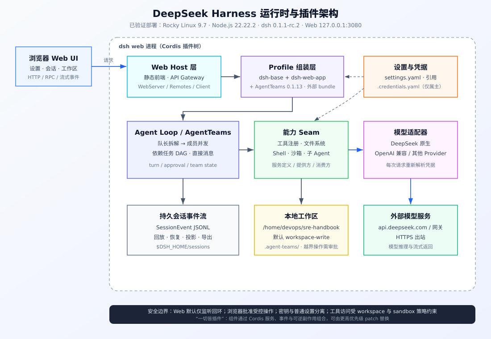
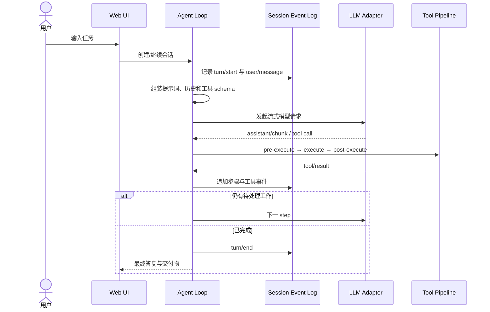
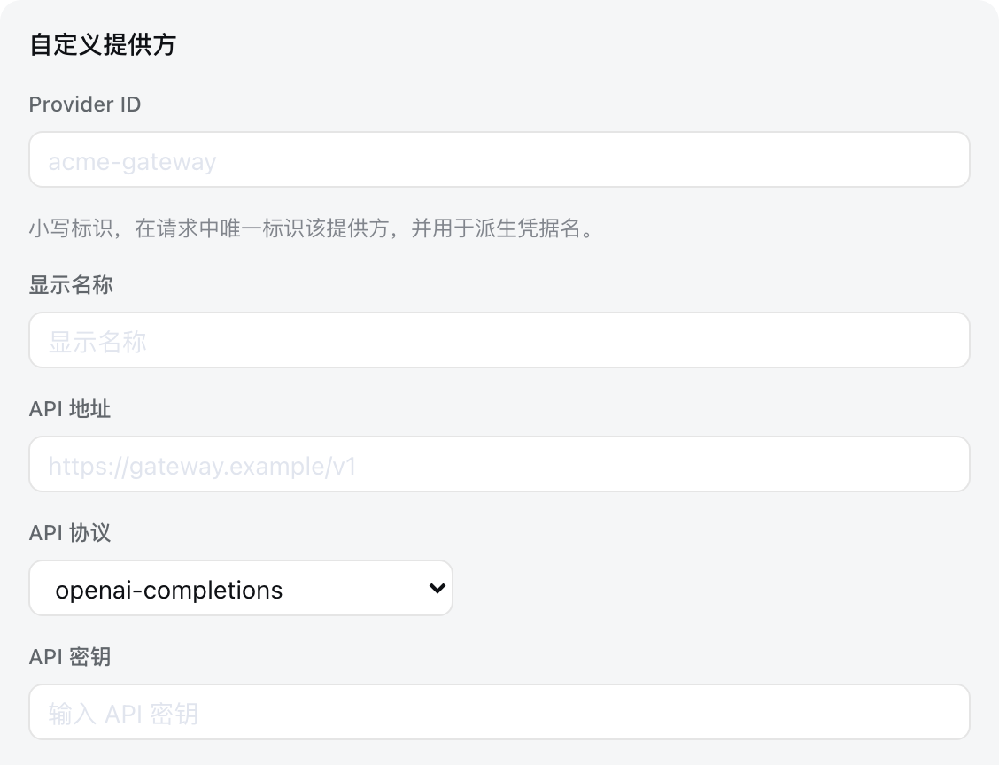

# DeepSeek Harness 部署与使用指南

> **一句话**：DeepSeek Harness（命令 `dsh`）是 DeepSeek AI 开源的智能体运行框架，
> 以 Cordis 为底座，采用“一切皆插件”的架构，提供 Web UI、无头任务、模型适配、
> 工具、工作区、审批、会话持久化和插件扩展能力。
>
> **实测环境**：Rocky Linux 9.7 · Node.js 22.22.2 · npm 10.9.7 ·
> `@deepseek-ai/dsh` 0.1.1-rc.2
> **部署日期**：2026-08-14 · **升级验证**：2026-08-25 · **状态**：✅ CLI 安装成功，✅ systemd 用户服务运行，
> ✅ `127.0.0.1:3080` 返回 HTTP 200

**⚠️ 开发者预览警告：** 上游明确提示后续会有破坏兼容性的变更。升级前务必备份
`~/.dsh`，并固定、记录当前版本。

---

## 目录

1. [它是什么](#1-它是什么)
2. [架构与请求链路](#2-架构与请求链路)
3. [安装方式对比](#3-安装方式对比)
4. [Rocky Linux 9 完整安装](#4-rocky-linux-9-完整安装)
5. [systemd 持久化运行](#5-systemd-持久化运行)
6. [首次使用 Web UI](#6-首次使用-web-ui)
7. [模型与凭据配置](#7-模型与凭据配置)
8. [Profile、插件与配置覆盖](#8-profile插件与配置覆盖)
9. [CLI 常用命令](#9-cli-常用命令)
10. [安全设计与远程访问](#10-安全设计与远程访问)
11. [日常运维](#11-日常运维)
12. [故障排查](#12-故障排查)
13. [验证记录](#13-验证记录)
14. [文件与端口清单](#14-文件与端口清单)
15. [参考资料与图片来源](#15-参考资料与图片来源)

---

## 1. 它是什么

DeepSeek Harness 不是一个单独的聊天页面，而是一个可组合的 Agent Harness：
它负责把模型、提示词、工具、权限、工作区、会话和 UI 装配为可运行的智能体。

| 能力 | 作用 |
| --- | --- |
| Web UI | 配置模型、选择工作区、创建会话、观察工具调用和交付物 |
| Agent Loop | 管理 turn/step、模型请求、流式输出、工具执行和续跑 |
| 模型适配 | 内置 DeepSeek，并可接入 OpenAI 兼容端点等 Provider |
| 工具与能力 seam | 以插件提供文件系统、Shell、搜索、子 Agent、工作流等能力 |
| 权限与审批 | 默认 `workspace-write`，越出策略范围的动作进入人工审批 |
| 会话持久化 | 以追加事件流记录会话，支持恢复、回放、投影与导出 |
| Profile | 用可排序的 bundle 与 patch 组合不同运行形态 |
| 插件管理 | 给指定 profile 安装、更新和移除树外插件 |

当前发行版自带两个主要 profile：

- `web`：启动浏览器 UI，默认监听 `127.0.0.1:3080`。
- `headless`：执行一个任务，输出最终答复后退出，不启动 HTTP 服务。

## 2. 架构与请求链路



可编辑矢量源文件见 [`architecture.svg`](./architecture.svg)。

### 2.1 核心设计

DeepSeek Harness 的底层是 Cordis。模型适配器、会话、工具注册表、Agent Loop、
Web Server 等都是插件；插件通过共享上下文贡献服务、类型化事件和可逆副作用。
因此，扩展功能通常是挂载新插件或应用 patch，而不是修改一个特权“内核”。

`web` profile 的配置大致按以下顺序叠加，越靠后优先级越高：

```text
空配置树
  └─ @deepseek-ai/dsh-base
      └─ @deepseek-ai/dsh-web-app
          └─ ~/.dsh/profiles/web/cordis.patch.yml
              └─ ~/.dsh/cordis.patch.yml
                  └─ dsh --patch ./extra.yml
```

注意：patch 对命中条目的 `config` 是**整体替换**，不是对象深度合并。变更前先用 `--dump-config` 检查最终组合结果。

### 2.2 一次任务如何执行



会话日志是模型历史的事实来源；对模型可见的信息必须能够从日志重建。这也是恢复、回放和审计能够基于同一事件流工作的原因。

## 3. 安装方式对比

| 方式 | 命令/入口 | 适用场景 | 特点 |
| --- | --- | --- | --- |
| npx 临时运行 | `npx @deepseek-ai/dsh web` | 快速体验 | 官方 README 的最短路径；首次运行下载包 |
| 用户级安装 | `npm i -g --prefix ~/.local ...` | 长期部署 | 无需 root，版本固定 |
| 从源码运行 | clone + `pnpm install` + build | 开发、调试、贡献 | 依赖多、构建时间长，不适合只想使用 UI 的场景 |

本文没有把 DeepSeek Harness 源码复制到 SRE Handbook 仓库中；运行程序来自 npm
官方包，当前仓库只保存经过验证的部署文档、架构图和 systemd 模板。

## 4. Rocky Linux 9 完整安装

### 4.1 环境预检

```bash
cat /etc/os-release
node --version
npm --version
python3 --version
df -h .
```

本文验证组合：

| 项目 | 本机值 | 说明 |
| --- | ---: | --- |
| Rocky Linux | 9.7 | RHEL 9 / AlmaLinux 9 同类环境可参考 |
| Node.js | 22.22.2 | 上游包当前未声明 `engines`；这是实测版本，不代表唯一支持版本 |
| npm | 10.9.7 | 随 Node.js 安装 |
| Python | 3.9.25 | 仅供 `node-gyp` 使用；`dsh` 本身是 Node.js 程序 |
| 磁盘 | 137 GiB 可用 | npm 包及依赖约数百 MB，另预留会话和工作区空间 |

若没有 Node.js，可从 Rocky AppStream 或组织批准的 Node.js 软件源安装。安装后再次确认 `node` 与 `npm` 都可用。

```bash
sudo dnf module reset -y nodejs
sudo dnf module enable -y nodejs:22
sudo dnf install -y nodejs
node --version && npm --version
```

### 4.2 安装原生模块构建链

当前 Linux x64 / Node 22 组合安装 `node-pty` 时没有命中预编译产物，会回退到
`node-gyp rebuild`。Rocky Linux 最小化安装通常缺少 `make` 和编译器，因此先安装：

```bash
sudo dnf install -y make gcc gcc-c++
```

### 4.3 安装固定版本 CLI

系统级 npm 前缀通常是 `/usr/local`，普通用户不可写。使用用户级前缀可避免 `sudo npm install -g`：

```bash
npm install --global --prefix "$HOME/.local" @deepseek-ai/dsh@0.1.1-rc.2
```

确保 `~/.local/bin` 位于 PATH。Rocky Linux 的普通用户环境通常已包含该目录；若没有，在 `~/.bashrc` 中加入：

```bash
export PATH="$HOME/.local/bin:$PATH"
```

重新登录或执行 `source ~/.bashrc`，然后验证：

```bash
command -v dsh
dsh --version
dsh --help
npm list --global --prefix "$HOME/.local" --depth=0
```

预期关键输出：

```text
/home/devops/.local/bin/dsh
0.1.1-rc.2
└── @deepseek-ai/dsh@0.1.1-rc.2
```

### 4.4 首次启动与健康检查

从需要作为默认工作区的目录启动。本文使用 SRE Handbook 根目录：

```bash
cd /home/devops/sre-handbook
dsh web --no-open --host 127.0.0.1 --port 3080
```

首次启动会在 `~/.dsh/profiles/` 初始化 `web` 和 `headless` profile。看到下面这行说明监听成功：

```text
dsh web: http://127.0.0.1:3080
```

另开终端验证：

```bash
curl --fail --silent --show-error \
  --output /dev/null \
  --write-out 'HTTP %{http_code}\n' \
  http://127.0.0.1:3080/

ss -ltnp '( sport = :3080 )'
```

预期返回 `HTTP 200`，且只监听 `127.0.0.1:3080`。

## 5. systemd 持久化运行

仓库内已提供经过本机验证的用户级 unit：
[deepseek-harness.service](./deepseek-harness.service)。它把工作目录固定为
`%h/sre-handbook`，把状态目录固定为 `%h/.dsh`，并只监听回环地址。

### 5.1 安装服务

```bash
cd /home/devops/sre-handbook
install -Dm0644 \
  automation/deepseek-harness/deepseek-harness.service \
  "$HOME/.config/systemd/user/deepseek-harness.service"

systemctl --user daemon-reload
systemctl --user enable --now deepseek-harness.service
```

若仓库不在 `/home/devops/sre-handbook`，先把 unit 中的 `WorkingDirectory` 改成实际目录；
该目录会成为 Agent 的默认工作区根目录。

如果服务器需要在用户退出登录后继续运行，启用 linger：

```bash
sudo loginctl enable-linger "$USER"
```

### 5.2 验证服务

```bash
systemctl --user is-enabled deepseek-harness.service
systemctl --user is-active deepseek-harness.service
systemctl --user status deepseek-harness.service --no-pager
curl -I http://127.0.0.1:3080/
```

### 5.3 日志与启停

```bash
tail -f "$HOME/.dsh/web.log"
systemctl --user restart deepseek-harness.service
systemctl --user stop deepseek-harness.service
systemctl --user start deepseek-harness.service
```

## 6. 首次使用 Web UI

本机浏览器打开 `http://127.0.0.1:3080`。服务器无桌面环境时，优先使用 [SSH 隧道](#102-ssh-隧道推荐)。

首次使用顺序：

1. 打开**设置 → 模型**，配置 DeepSeek 或其他模型 Provider。
2. 点击**选择工作区**，添加并选择 `/home/devops/sre-handbook`。
3. 创建新会话并选择模型。
4. 输入任务，例如“概括这个仓库，并列出主要文档分类”。
5. 工具操作需要审批时，在 UI 中核对目标、参数和影响后再批准。

未选择工作区前，输入框会保持不可用，这是预期行为。

## 7. 模型与凭据配置

### 7.1 配置 DeepSeek

进入**设置 → 模型**，在 DeepSeek 卡片填写 API Key 并保存。设置立即生效，不需要重启服务。


密钥是只写的：浏览器保存后只会收到脱敏描述，不会再次得到明文。普通模型设置保存在
`$DSH_HOME/settings.yaml`，凭据由 `$DSH_HOME/.credentials.yaml` 管理。

凭据解析优先级为：

```text
进程环境变量
  > $DSH_HOME/.credentials.yaml
  > 启动工作目录/.env
  > $DSH_HOME/.env
```

不要把 `.env`、`.credentials.yaml`、会话日志或含真实密钥的截图提交到 Git。

### 7.2 自定义 OpenAI 兼容 Provider

企业网关、自建模型服务或目录中不存在的 Provider，可通过**添加自定义提供方**配置：



至少填写：

- 小写且稳定的 Provider ID；会话和凭据引用会使用它，后续不要随意改名。
- 显示名称。
- Base URL，例如 `https://gateway.example/v1`。
- API 协议。
- 凭据和至少一个模型 ID。

模型发现会请求 OpenAI 兼容的 `GET /models`。如果网关没有实现该接口，可手动填写模型。

### 7.3 常见配置错误

| 错误 | 原因 | 处理 |
| --- | --- | --- |
| `MISSING_CREDENTIAL` | Provider 引用的密钥不存在 | 在模型设置中保存密钥，或提供对应环境变量 |
| `UNKNOWN_MODEL` | 默认模型已被删除或未配置 | 重新选择模型，或补回 Provider 的模型 ID |
| 获取模型返回 401 | API Key、Base URL 或协议不匹配 | 用 curl 单独验证网关，再检查 Provider 表单 |
| 图片发送前被拒绝 | 手工模型未声明图片输入 | 在 `settings.yaml` 为该模型声明 `input: [text, image]` |

## 8. Profile、插件与配置覆盖

### 8.1 Profile 目录

```text
~/.dsh/
├── profiles/
│   ├── web/
│   │   ├── package.json          # profile manifest 与树外插件依赖
│   │   ├── cordis.yml            # 生成的组合配置
│   │   └── cordis.patch.yml      # web profile 用户覆盖层
│   └── headless/
├── cordis.patch.yml              # 可选：所有 profile 共享的机器级覆盖
├── settings.yaml                 # UI/模型等普通设置，首次保存后创建
├── .credentials.yaml             # 受管凭据，首次保存密钥后创建
├── sessions/                     # 会话 JSONL
└── storages/                     # Web UI 本地存储
```

### 8.2 检查最终配置

```bash
# 仅查看发行版 bundle 的默认组合
dsh --profile web --dump-default-config

# 包含 profile、home 和命令行 patch 后的最终组合
dsh --profile web --dump-config

# 临时增加一个最高优先级覆盖层
dsh --profile web --patch ./extra.yml
```

这两个 dump 命令不会真正启动应用，输出中的 `!!js` 表达式也不会求值。

### 8.3 管理树外插件

`dsh plugin` 会把其余参数转发给 profile 目录内的 pnpm：

```bash
dsh plugin --profile web add <插件包名>
dsh plugin --profile web remove <插件包名>
dsh plugin --profile web list
```

只安装来源可信、版本明确的插件。插件可能获得与 Agent 相同的工作区、网络或进程能力；安装前应审计包内容和依赖链。

### 8.4 AgentTeams 多 Agent 协作插件

本机 Web profile 已固定安装 `@nanmicoder/dsh-agent-teams@0.1.13`。它让当前会话成为队长，
可创建持久化成员、拆分带依赖的任务、在成员间发送消息，并在 Web UI 显示活动面板。

`dsh plugin` 需要 `pnpm`；在用户级 npm 前缀安装后，通过 Harness 插件管理命令安装：

```bash
npm install --global --prefix "$HOME/.local" pnpm@11.23.0
dsh plugin --profile web add @nanmicoder/dsh-agent-teams@0.1.13
dsh --profile web --dump-config
systemctl --user restart deepseek-harness.service
```

刷新 Web UI 后，可在输入框直接使用：

```text
/agent-teams 从安全、性能和产品角度并行审查当前工作区，输出一份汇总报告
```

团队状态默认保存在当前 workspace 的 `.agent-teams/`。该目录包含成员、任务和消息状态，
是否提交到 Git 应按项目数据保留规则决定。卸载命令：

```bash
dsh plugin --profile web remove @nanmicoder/dsh-agent-teams
systemctl --user restart deepseek-harness.service
```

> **兼容性记录：** AgentTeams 0.1.13 上游发布说明实测到 Harness 0.1.0-rc.8，
> 尚未声明 0.1.1-rc.2 的 peer 范围。本机已在 Harness 0.1.1-rc.2 完成配置合成、
> 冷启动、Host/Client 注册、公网脚本和设置 API 验收，但尚未执行真实模型的完整团队任务。

## 9. CLI 常用命令

| 命令 | 用途 |
| --- | --- |
| `dsh --version` | 查看版本 |
| `dsh --help` | 查看启动器帮助 |
| `dsh web --help` | 查看 Web profile 参数 |
| `dsh web` | 默认在 `127.0.0.1:3080` 启动 Web UI 并尝试打开浏览器 |
| `dsh web --no-open` | 启动 Web UI 但不打开浏览器，适用于 systemd/服务器 |
| `dsh web --port 8080` | 使用其他端口 |
| `dsh web --port 0` | 让操作系统分配空闲端口 |
| `dsh --profile headless "任务"` | 无头执行一次任务后退出 |
| `dsh --profile web --dump-config` | 查看实际配置树 |
| `dsh plugin --profile web list` | 列出 Web profile 插件依赖 |

启动命令所在目录会成为默认 workspace 根目录。systemd 模板因此显式设置了 `WorkingDirectory`。

## 10. 安全设计与远程访问

### 10.1 不要直接暴露 3080

上游文档明确说明：当前 Web Server **没有 TLS、认证或 Origin 策略**。
`--host 0.0.0.0` 会把 UI 暴露给所在网络；而 Agent UI 可以操作工作区、执行命令并
保存模型凭据，所以不能把 3080 直接开放到公网。

本文部署坚持以下边界：

- `dsh` 只监听 `127.0.0.1:3080`。
- firewalld 和云安全组不开放 3080。
- 凭据文件权限保持仅属主可读写，备份也要加密。
- 审批前核对命令、路径、网络目标和数据范围。
- 服务使用普通用户运行，不使用 root。

### 10.2 SSH 隧道（推荐）

在自己的电脑执行：

```bash
ssh -N -L 3080:127.0.0.1:3080 devops@<服务器地址>
```

然后本地浏览器访问 `http://127.0.0.1:3080`。流量经 SSH 加密，服务仍只监听服务器回环地址。

### 10.3 团队访问

多人访问时应在前面增加具备以下能力的反向代理或零信任网关：

- TLS；
- 强认证与最小授权；
- WebSocket/流式响应代理；
- 访问日志、速率限制和会话超时；
- 正确传递并限制 Host，必要时配合 `--trusted-host <authority>`。

在完成端到端鉴权测试前，不要改为 `--host 0.0.0.0`。

### 10.4 本机公网入口（Nginx + HTTPS + Basic Auth）

本机已经部署独立入口：

```text
https://139.162.62.212:8443
  → Nginx TLS + Basic Auth
  → http://127.0.0.1:3080
  → DeepSeek Harness
```

配置模板见 [`nginx-public.conf`](./nginx-public.conf)。后端继续只监听回环地址，
firewalld 仅对外开放 Nginx 的 `8443/tcp`。用户名为 `dshadmin`，初始随机密码保存在
`~/.dsh/nginx-initial-password`（权限 `0600`），不会写入 Git。取得密码后应立即轮换并
删除该明文初始密码文件：

```bash
cat "$HOME/.dsh/nginx-initial-password"
sudo htpasswd -B /etc/nginx/deepseek-harness.htpasswd dshadmin
```

当前证书为带公网 IP SAN 的自签名证书，因此浏览器会显示证书不受信任。核对证书指纹
后可临时接受，正式多人使用应替换为组织 CA 或受信任 CA 签发的证书。

Harness 会把 `settings.describe`、`credentials.describe` 和配置写入等特权接口固定在
回环同源，`--trusted-host` 不会放开它们。Nginx 因此先执行 TLS 与 Basic Auth，再拒绝
不属于本站的浏览器 Origin，最后把已认证请求的 `Host`/`Origin` 规范化为
`127.0.0.1:3080`。若只转发公网 Host，普通 API 会成功，但模型设置页会返回 HTTP 403。

## 11. 日常运维

### 11.1 状态与日志

```bash
systemctl --user status deepseek-harness.service --no-pager
tail -n 200 "$HOME/.dsh/web.log"
curl --fail http://127.0.0.1:3080/ --output /dev/null
dsh --version
```

### 11.2 备份

升级或修改 profile 前停止写入并备份整个 Harness home：

```bash
systemctl --user stop deepseek-harness.service
tar --create --gzip \
  --file "$HOME/dsh-backup-$(date +%Y%m%d-%H%M%S).tar.gz" \
  --directory "$HOME" .dsh
systemctl --user start deepseek-harness.service
```

备份中可能含 API Key、会话内容和工作区元数据，必须加密保存并限制访问。

### 11.3 升级

先查看将要安装的版本，不要在预览阶段无审查追随 `latest`：

```bash
npm view @deepseek-ai/dsh version
npm view @deepseek-ai/dsh versions --json
```

确认版本并完成备份后：

```bash
systemctl --user stop deepseek-harness.service
npm install --global --prefix "$HOME/.local" @deepseek-ai/dsh@<目标版本>
dsh --version
systemctl --user start deepseek-harness.service
curl --fail http://127.0.0.1:3080/ --output /dev/null
```

### 11.4 回滚

程序回滚到本文验证版：

```bash
npm install --global --prefix "$HOME/.local" @deepseek-ai/dsh@0.1.1-rc.2
systemctl --user restart deepseek-harness.service
```

若新版本迁移过状态格式，应先停止服务，再从升级前备份恢复 `~/.dsh`；不要让旧程序直接写入未经确认兼容的新状态。

### 11.5 卸载

```bash
systemctl --user disable --now deepseek-harness.service
npm uninstall --global --prefix "$HOME/.local" @deepseek-ai/dsh
systemctl --user daemon-reload
```

`~/.dsh` 中仍有设置、凭据和会话。确认备份与保留要求后再单独处理，不要在卸载程序时顺手删除。

## 12. 故障排查

### 12.1 `EACCES: permission denied, mkdir '/usr/local/lib/node_modules'`

**原因**：普通用户无权写系统 npm 全局目录。

**处理**：使用用户前缀，不要用 `sudo npm`：

```bash
npm install --global --prefix "$HOME/.local" @deepseek-ai/dsh@0.1.1-rc.2
```

### 12.2 `node-gyp` 报 `not found: make`

**原因**：`node-pty` 没有命中当前平台的预编译包，回退源码构建，但系统缺少编译链。

**处理**：

```bash
sudo dnf install -y make gcc gcc-c++
npm install --global --prefix "$HOME/.local" @deepseek-ai/dsh@0.1.1-rc.2
```

### 12.3 `dsh: command not found`

```bash
ls -l "$HOME/.local/bin/dsh"
export PATH="$HOME/.local/bin:$PATH"
hash -r
dsh --version
```

systemd 不依赖交互式 PATH；模板使用 `%h/.local/bin/dsh` 绝对路径。

### 12.4 `EADDRINUSE` / 3080 已占用

```bash
ss -ltnp '( sport = :3080 )'
systemctl --user status deepseek-harness.service --no-pager
```

不要同时运行手工 `dsh web` 和 systemd 服务。可停止重复进程，或明确选择其他端口并同步修改健康检查和访问地址。

### 12.5 页面可打开但不能输入

通常是还没选择工作区。点击**选择工作区**，添加并选中目标目录；同时确认已配置可用模型。

### 12.6 systemd 服务反复重启

```bash
tail -n 200 "$HOME/.dsh/web.log"
systemctl --user cat deepseek-harness.service
/home/devops/.local/bin/dsh web --no-open --host 127.0.0.1 --port 3080
```

重点检查：端口冲突、可执行文件是否存在、`WorkingDirectory` 是否正确、profile YAML 是否损坏，以及升级后的配置兼容性。

### 12.7 远程访问返回 Host/信任错误

保持回环监听并优先用 SSH 隧道。使用反向代理时，把浏览器实际访问的 authority 加入
`--trusted-host`，同时只允许代理访问后端端口。不要通过放开所有 Host 或直接公网监听
来绕过检查。

## 13. 验证记录

以下结果来自 2026-08-25 的实际升级验证：

| 检查项 | 命令 | 结果 |
| --- | --- | --- |
| CLI 路径 | `command -v dsh` | `/home/devops/.local/bin/dsh` |
| CLI 版本 | `dsh --version` | `0.1.1-rc.2` |
| npm 包 | `npm ls -g --prefix ~/.local` | `@deepseek-ai/dsh@0.1.1-rc.2` |
| Web 启动 | `dsh web --no-open --host 127.0.0.1 --port 3080` | 输出访问地址，无启动错误 |
| HTTP | `curl http://127.0.0.1:3080/` | `HTTP/1.1 200 OK` |
| 页面标题 | 检查返回 HTML | `DeepSeek Harness` |
| 监听范围 | `ss -ltnp '( sport = :3080 )'` | 仅 `127.0.0.1:3080` |
| systemd | `systemctl --user is-active ...` | `active` |

健康检查只证明 UI 与本地运行时可用；真正执行 Agent 任务还需要用户自己的模型凭据。本文没有创建、记录或提交任何 API Key。

## 14. 文件与端口清单

| 路径/端口 | 权限建议 | 用途 |
| --- | --- | --- |
| `~/.local/bin/dsh` | 普通可执行 | CLI 入口 |
| `~/.local/lib/node_modules/@deepseek-ai/dsh` | 属主写、其他只读 | npm 程序与依赖 |
| `~/.dsh/` | `0700` | Harness home |
| `~/.dsh/settings.yaml` | `0600` | 普通设置，首次保存后创建 |
| `~/.dsh/.credentials.yaml` | `0600` | 受管凭据 |
| `~/.dsh/profiles/<name>/` | 属主写 | Profile manifest、配置与插件依赖 |
| `~/.dsh/sessions/` | `0700` | 会话事件日志 |
| `~/.dsh/web.log` | `0600` | Web 服务标准输出与错误日志 |
| `~/.config/systemd/user/deepseek-harness.service` | `0644` | 用户服务 unit |
| `127.0.0.1:3080` | 不对公网开放 | Web UI 与 API |

## 15. 参考资料与图片来源

- [DeepSeek Harness 中文 README](https://github.com/deepseek-ai/deepseek-harness/blob/47f943859bef60e4160492346772ded9b24f765a/README.zh.md)
- [Web UI 使用指南](https://github.com/deepseek-ai/deepseek-harness/blob/47f943859bef60e4160492346772ded9b24f765a/docs/user/guide/index.zh.md)
- [模型 Provider 配置](https://github.com/deepseek-ai/deepseek-harness/blob/47f943859bef60e4160492346772ded9b24f765a/docs/user/guide/providers.zh.md)
- [架构文档](https://github.com/deepseek-ai/deepseek-harness/blob/47f943859bef60e4160492346772ded9b24f765a/docs/architecture.zh.md)
- [CLI 参考](https://github.com/deepseek-ai/deepseek-harness/blob/47f943859bef60e4160492346772ded9b24f765a/apps/cli/reference/README.zh.md)
- [HTTP Server 安全说明](https://github.com/deepseek-ai/deepseek-harness/blob/47f943859bef60e4160492346772ded9b24f765a/docs/subsystems/web-server.zh.md)

本页两张 UI 截图取自上述上游仓库的中文 Provider 指南，版本固定到提交
`47f9438`；上游项目采用 MIT License，许可证副本见
[`assets/LICENSE.deepseek-harness.txt`](./assets/LICENSE.deepseek-harness.txt)。`architecture.svg`、渲染后的
`architecture.png` 与本文内容为本仓库根据实际部署和上游架构文档重新绘制、整理。
