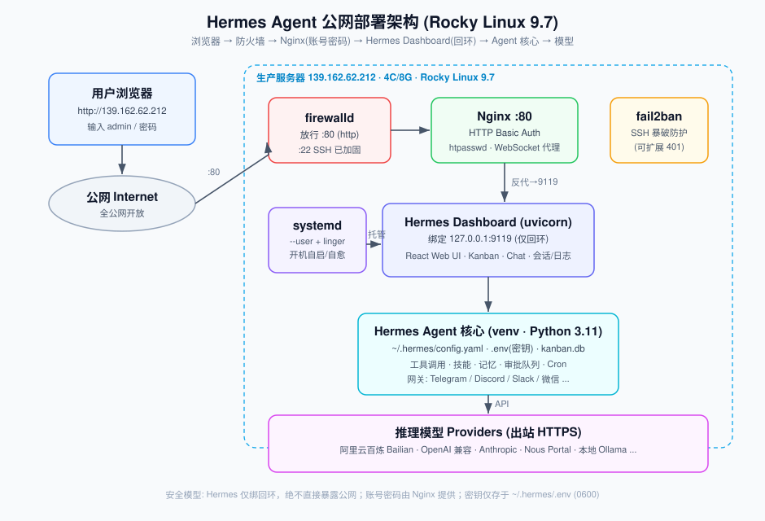

# Hermes Agent 部署与使用指南（公网访问 + 账号密码）

> **一句话**：Hermes Agent 是 Nous Research 开源的 AI Agent 网关，自带多 Agent 看板（Kanban）、Web Dashboard、消息网关（Telegram/Discord/微信…）、工具调用、Cron、技能与记忆系统。本文记录在 **Rocky Linux 9.7 生产服务器**上，将其 Dashboard 通过 **Nginx 反向代理 + HTTP Basic Auth** 暴露到公网 IP 直接访问的**完整、已验证**部署流程。
>
> **环境**：Rocky Linux 9.7 · 4C / 8G · 公网 IP `139.162.62.212` · Hermes Agent **v0.19.0 (2026.7.20)**
> **部署日期**：2026-07-28 ｜ **状态**：✅ 已部署并端到端验证通过

---

## 目录

1. [Hermes 是什么 / 功能作用](#1-hermes-是什么--功能作用)
2. [部署架构](#2-部署架构)
3. [环境要求](#3-环境要求)
4. [有几种部署方式](#4-有几种部署方式)
5. [完整部署步骤（本文实操，已验证）](#5-完整部署步骤本文实操已验证)
6. [如何配置模型（重点）](#6-如何配置模型重点)
7. [完整命令参考（hermes CLI）](#7-完整命令参考hermes-cli)
8. [如何使用 Dashboard 与看板](#8-如何使用-dashboard-与看板)
9. [验证结果](#9-验证结果)
10. [安全加固建议](#10-安全加固建议)
11. [日常运维（启停 / 日志 / 升级 / 卸载）](#11-日常运维启停--日志--升级--卸载)
12. [故障排查（部署中实际踩的坑）](#12-故障排查部署中实际踩的坑)
13. [附录：关键文件与端口清单](#13-附录关键文件与端口清单)

---

## 1. Hermes 是什么 / 功能作用

**Hermes Agent** 是 [Nous Research](https://nousresearch.com) 开源的自托管 AI 助理 / Agent 运行时。核心能力：

| 能力 | 说明 |
|------|------|
| **Web Dashboard** | 浏览器管理界面：管理配置、API Key、会话、模型、技能、MCP、定时任务、日志 |
| **多 Agent 看板 Kanban** | SQLite 持久化的任务板（`~/.hermes/kanban.db`），任务原子领取、可设依赖、由具名 profile 在隔离工作区执行；支持 **Swarm**（并行 worker → 校验 → 汇总） |
| **消息网关 Gateway** | 通过 Telegram / Discord / Slack / WhatsApp / Signal / 微信 / Email 收发消息、远程驱动 Agent |
| **工具调用 / 技能 / 记忆** | 文件、终端、浏览器（Playwright）、MCP、可插拔 skills、长期记忆 |
| **审批队列 Approvals** | Agent 想执行 shell / 改文件 / 联网时可要求人工审批 |
| **Cron 定时任务** | 定时驱动 Agent 执行任务 |
| **MoA / Fallback** | Mixture-of-Agents 多模型编排、主模型失败自动回退 |

> **这就是用户想要的"看所有 agent 在做什么"的页面**——Dashboard + Kanban 正是它的可视化控制台。

---

## 2. 部署架构



**请求链路**：
```
用户浏览器  →  公网:80  →  firewalld(放行 80)  →  Nginx(Basic Auth 账号密码)
           →  反向代理到 127.0.0.1:9119  →  Hermes Dashboard(uvicorn, 仅回环)
           →  Hermes Agent 核心(venv/py3.11, config.yaml, .env, kanban.db)
           →  出站 HTTPS 调用模型 Provider(百炼/OpenAI/Anthropic/Nous/Ollama…)
```

**安全设计要点**：
- Hermes Dashboard **只绑 `127.0.0.1`**，绝不直接对公网监听（官方明确警告 `--host 0.0.0.0` 不要用于共享/公网主机）。
- 公网入口由 **Nginx** 承担，**HTTP Basic Auth** 提供账号密码。
- API 密钥仅存于 `~/.hermes/.env`（权限 `0600`），不进入 Nginx、不进入日志、不进入 Git。
- Dashboard 由 **systemd 用户级服务 + linger** 托管，开机自启、崩溃自愈。

---

## 3. 环境要求

| 项 | 要求 | 本机实际 |
|----|------|----------|
| 操作系统 | Linux / macOS / WSL2 | Rocky Linux 9.7 ✅ |
| Python | 3.11（安装器用 `uv` 自动装，**无需系统预装**） | 系统 3.9，venv 内 3.11.15 ✅ |
| Node.js | 构建 Web UI 需要 | v22.22.2 ✅ |
| 内存 | ≥ 2G（建议 4G+） | 8G ✅ |
| 磁盘 | ≥ 3G（含浏览器引擎） | 141G 可用 ✅ |
| 反向代理 | Nginx | 1.20.1 ✅ |
| 认证工具 | httpd-tools（`htpasswd`） | ✅ |

> 安装器会自动装：`uv`（Python 包管理）、Python 3.11、Node 依赖、Playwright Chromium、ripgrep/ffmpeg（尽力而为）。

---

## 4. 有几种部署方式

Hermes 本身与"公网暴露"是两个维度，组合起来常见有 **4 种**：

### 部署方式对比

| # | 方式 | 说明 | 适用场景 | 安全性 |
|---|------|------|----------|--------|
| **A** | **官方一键安装脚本**（本文采用） | `curl … install.sh \| bash`，自动装 uv/py3.11/依赖 | 绝大多数 Linux/macOS 服务器 | 取决于暴露方式 |
| **B** | **手动 Git 部署** | clone 仓库 + `uv sync` 自建 venv | 需离线/定制/审计源码 | 同上 |
| **C** | **Docker/容器** | 打包为镜像运行（社区/自建 Dockerfile） | 需隔离、可移植、K8s | 容器隔离较好 |
| **D** | **托管/Railway 等 PaaS** | 一键部署到云平台 | 不想自维护服务器 | 平台托管 |

### 公网暴露方式对比（认证层）

| 方式 | 账号密码 | HTTPS | 复杂度 | 说明 |
|------|:---:|:---:|:---:|------|
| **Nginx + Basic Auth（本文）** | ✅ | ❌(纯 HTTP) | 低 | 本次用户选择：纯 IP + HTTP + 账号密码 |
| Nginx + Basic Auth + 自签证书 | ✅ | ✅(自签) | 中 | 无域名也能加密，浏览器有告警 |
| Nginx + Let's Encrypt | ✅ | ✅(受信) | 中 | **推荐**，需域名 |
| Hermes 原生密码认证 | ✅ | ❌ | 低 | v0.19 起公网绑定强制认证；仍建议放 Nginx 后 |
| SSH 隧道 / Tailscale | 免公网 | ✅ | 中 | 最安全，但非"公网直接访问" |

> 本文档采用 **方式 A（官方安装）+ Nginx Basic Auth（纯 HTTP）+ 全公网开放**，即用户选定的方案。

---

## 5. 完整部署步骤（本文实操，已验证）

> 以下命令均以普通用户 `devops`（uid 1000，具备 passwordless sudo）执行。

### 5.1 环境预检

```bash
cat /etc/os-release | head -3         # 确认系统
curl -s ifconfig.me                   # 确认公网 IP → 139.162.62.212
node --version                        # v22.x（构建 Web UI 用）
free -h && df -h /                     # 内存/磁盘
sudo firewall-cmd --state             # firewalld 是否 running
```

### 5.2 安装 Hermes Agent（方式 A：官方脚本）

```bash
# 下载安装器（先下后跑，便于审计）
curl -fsSL https://hermes-agent.nousresearch.com/install.sh -o /tmp/hermes-install.sh

# 非交互安装：跳过需要填 API Key 的向导（之后单独配）
bash /tmp/hermes-install.sh --skip-setup --non-interactive
```

安装完成后：
- 命令：`~/.local/bin/hermes`（软链到 venv 内的 Python 启动器）
- 安装目录：`~/.hermes/hermes-agent/`（含 `venv/`）
- 配置目录：`~/.hermes/`（`config.yaml`、`.env`、`kanban.db`…）

```bash
export PATH="$HOME/.local/bin:$PATH"     # 建议写入 ~/.bashrc
hermes version                           # 确认 v0.19.0
```

### 5.3 启动 Dashboard（先临时验证，绑回环）

```bash
hermes dashboard --host 127.0.0.1 --port 9119 --no-open
# 首次会自动构建 React Web UI（web_dist），日志出现 HERMES_DASHBOARD_READY port=9119 即成功
```

本地验证：
```bash
curl -s -o /dev/null -w "%{http_code}\n" http://127.0.0.1:9119/     # 期望 200
```

### 5.4 用 systemd 用户级服务托管（持久化 / 开机自启）

> **为什么用"用户级"而非系统级**：SELinux（enforcing）禁止系统级 systemd（`init_t`）执行用户家目录 `/home/devops` 下的可执行文件，直接建系统服务会报 `203/EXEC Permission denied`。用户级服务运行在用户域，规避该限制。详见[第 12 节](#12-故障排查部署中实际踩的坑)。

```bash
# 1) 开启 linger：让用户服务在无登录会话时也随机器启动
sudo loginctl enable-linger devops

# 2) 创建用户级 unit
mkdir -p ~/.config/systemd/user
cat > ~/.config/systemd/user/hermes-dashboard.service <<'EOF'
[Unit]
Description=Hermes Agent Dashboard (web UI, loopback only; fronted by nginx)
After=default.target

[Service]
Type=simple
ExecStart=%h/.hermes/hermes-agent/venv/bin/python %h/.hermes/hermes-agent/hermes dashboard --host 127.0.0.1 --port 9119 --no-open --skip-build
Restart=always
RestartSec=5

[Install]
WantedBy=default.target
EOF

# 3) 启用并启动
export XDG_RUNTIME_DIR=/run/user/1000
systemctl --user daemon-reload
systemctl --user enable --now hermes-dashboard
systemctl --user is-active hermes-dashboard         # active
ss -tlnp | grep 9119                                # 127.0.0.1:9119 LISTEN
```

> `--skip-build` 复用已构建的 `web_dist`，启动更快、不依赖 npm。

### 5.5 安装并配置 Nginx 反向代理 + Basic Auth

```bash
sudo dnf install -y nginx httpd-tools
```

**创建账号密码**（用户名 `admin`，密码请自行设定强口令）：
```bash
sudo htpasswd -bc /etc/nginx/hermes.htpasswd admin '<你的强密码>'
# 追加更多用户： sudo htpasswd -b /etc/nginx/hermes.htpasswd <user> '<pass>'
```

**禁用默认 server 块**（避免与我们的 80 端口冲突）：编辑 `/etc/nginx/nginx.conf`，注释掉自带的 `server { listen 80; … }` 整段（先 `cp` 备份）。

**创建反代配置** `/etc/nginx/conf.d/hermes.conf`：
```nginx
map $http_upgrade $connection_upgrade { default upgrade; '' close; }

server {
    listen       80 default_server;
    listen       [::]:80 default_server;
    server_name  _;

    auth_basic           "Hermes Agent - Restricted";
    auth_basic_user_file /etc/nginx/hermes.htpasswd;

    client_max_body_size 100m;
    access_log /var/log/nginx/hermes.access.log;
    error_log  /var/log/nginx/hermes.error.log;

    location / {
        proxy_pass         http://127.0.0.1:9119;
        proxy_http_version 1.1;

        # WebSocket（Dashboard 终端 / 实时流）
        proxy_set_header   Upgrade    $http_upgrade;
        proxy_set_header   Connection $connection_upgrade;

        # 关键：Host 固定为后端信任值，绕过 Hermes 的 allowed-hosts 校验（否则 400）
        proxy_set_header   Host              127.0.0.1:9119;
        proxy_set_header   X-Real-IP         $remote_addr;
        proxy_set_header   X-Forwarded-For   $proxy_add_x_forwarded_for;
        proxy_set_header   X-Forwarded-Proto $scheme;

        proxy_read_timeout 3600s;
        proxy_send_timeout 3600s;
        proxy_buffering    off;
    }
}
```

**SELinux 放行 + 启动**：
```bash
# enforcing 下 nginx 默认不允许连后端端口，必须打开此布尔值
sudo setsebool -P httpd_can_network_connect 1

sudo nginx -t                          # 语法检查
sudo systemctl enable --now nginx
```

本地验证认证：
```bash
curl -s -o /dev/null -w "%{http_code}\n" http://127.0.0.1/                 # 401（无认证被拦）
curl -s -o /dev/null -w "%{http_code}\n" -u admin:'<密码>' http://127.0.0.1/ # 200
```

### 5.6 开放防火墙

```bash
sudo firewall-cmd --permanent --add-service=http
sudo firewall-cmd --reload
sudo firewall-cmd --list-services       # 应含 http
```

> 云厂商（如 Linode/阿里云）若有**安全组**，还需在控制台放行 80 端口入方向。

### 5.7 公网访问

浏览器打开 **`http://139.162.62.212`** → 弹出登录框 → 输入 `admin` / 你的密码 → 进入 Dashboard。

---

## 6. 如何配置模型（重点）

Hermes 支持多种 Provider。密钥统一存 `~/.hermes/.env`，选择存 `~/.hermes/config.yaml`。**三种配置途径**：

### 途径 1：Web Dashboard（最简单，推荐）
登录后进入 **Models / Env** 页 → 选择 Provider → 填入 API Key / Base URL → 选默认模型 → 保存。密钥自动写入 `.env`。

### 途径 2：交互式向导（CLI）
```bash
hermes setup model        # 只配模型这一节
# 或
hermes model              # 交互选择 Provider + 默认模型
```

### 途径 3：直接改配置 / 环境变量
```bash
# 查看/设置配置
hermes config show
hermes config set <key> <value>
hermes config path        # → ~/.hermes/config.yaml
hermes config env-path    # → ~/.hermes/.env
```

### 常见 Provider 示例

**阿里云百炼 Bailian（OpenAI 兼容端点）**——在 `~/.hermes/.env` 写入：
```bash
OPENAI_API_KEY=sk-<你的百炼Key>
OPENAI_BASE_URL=https://dashscope.aliyuncs.com/compatible-mode/v1
```
然后 `hermes model` 选择该 Provider 下的模型（如 `qwen-max`、`qwen3` 等）。

**其他内置 Provider**：Anthropic（`claude-*`）、OpenAI、Nous Portal（`hermes portal`，OAuth 登录 + Tool Gateway）、本地 Ollama 等。

**高级**：
```bash
hermes moa        # 配置 Mixture-of-Agents 多模型槽位
hermes fallback   # 配置主模型失败时的回退 Provider
```

验证模型可用：
```bash
hermes status --deep                       # 深度检查各组件
hermes chat -q "你好，报下你用的模型" -Q     # 单次问答（非交互）
```

---

## 7. 完整命令参考（hermes CLI）

`hermes <命令>`。顶层命令 60+ 个，下面分组列出，**常用命令附子命令详解**。

### 7.1 核心 / 交互

| 命令 | 作用 |
|------|------|
| `hermes` | 无参数 = 启动交互式聊天 |
| `chat` | 交互式对话（`-q` 单次、`-m` 指定模型、`-t` 工具集、`-s` 技能、`--yolo` 免审批） |
| `status` | 各组件状态（`--all` 全量脱敏、`--deep` 深检） |
| `doctor` | 配置与依赖体检 |
| `setup` | 交互式安装向导（可指定小节：`model/tts/terminal/gateway/tools/agent`） |
| `version` / `update` / `uninstall` | 版本 / 升级 / 卸载 |

### 7.2 模型 / 推理

| 命令 | 作用 |
|------|------|
| `model` | 交互选择 Provider 与默认模型（`--refresh` 刷新模型缓存） |
| `moa` | 配置 Mixture-of-Agents 槽位 |
| `fallback` | 管理回退 Provider |
| `proxy` | 本地 OpenAI 兼容代理（对接 OAuth Provider） |
| `portal` | Nous Portal 登录 / 选模型 / Tool Gateway |
| `auth` / `login` / `logout` | Provider 凭据管理 |
| `secrets` | 外部密钥源（Bitwarden / 1Password） |
| `egress` | iron-proxy 出站凭据注入防火墙 |

### 7.3 Dashboard / 服务

| 命令 | 作用 |
|------|------|
| `dashboard` | **Web 控制台**。`--host`(默认 127.0.0.1) `--port`(默认 9119) `--skip-build` `--stop` `--status` `--no-open` |
| `serve` / `desktop` / `gui` | 其它前端形态 |
| `logs` | 查看日志 |

`hermes dashboard` 关键子项：
- `hermes dashboard --status`：列出运行中的 Web 进程
- `hermes dashboard --stop`：停止所有 Web 进程
- `hermes dashboard register`：把自托管 Dashboard 注册到 Nous Portal（OAuth）

### 7.4 消息网关 Gateway

`hermes gateway <子命令>` — 管理 Telegram/Discord/WhatsApp/微信 等：

| 子命令 | 作用 |
|--------|------|
| `run` | 前台运行（WSL/Docker/Termux 推荐） |
| `start` / `stop` / `restart` | 管理已安装的 systemd/launchd 后台服务 |
| `install` / `uninstall` | 安装/卸载为后台服务 |
| `status` / `list` | 状态 / 列出所有 profile 网关状态 |
| `setup` | 配置消息平台 |
| `enroll` | 与 relay 连接器对接 |

平台快捷配置：`hermes whatsapp` / `whatsapp-cloud` / `slack` / `pairing`。
一次性推送：`hermes send -t telegram "消息"`（复用网关凭据，无需跑 Agent）。

### 7.5 看板 Kanban（多 Agent 协作）

`hermes kanban <子命令>` — SQLite 持久化任务板：

| 子命令 | 作用 |
|--------|------|
| `init` | 创建 `kanban.db`（幂等） |
| `boards` | 管理看板（一个项目/工作流一块板） |
| `create` | 新建任务 |
| `swarm` | 创建 Swarm 图（并行 worker → 校验 → 汇总） |
| `list`/`ls` `show` | 列出 / 查看任务（含评论与事件） |
| `assign` `reassign` `reclaim` | 指派 / 重指派 / 释放认领 |
| `set-model` | 为任务设定模型/Provider 覆盖 |
| `link` `unlink` | 增/删父子依赖 |
| `claim` `complete` `block` `unblock` | 领取 / 完成 / 阻塞 / 解阻塞 |
| `dispatch` `daemon` `watch` `tail` | 调度 / 守护进程 / 观察 / 跟踪 |
| `stats` `runs` `log` `heartbeat` | 统计 / 执行记录 / 日志 / 心跳 |
| `decompose` `specify` `context` | 任务拆解 / 规格化 / 上下文 |
| `gc` `repair` `archive` | 垃圾回收 / 修复 / 归档 |

> 看板默认由 Gateway 内嵌 dispatcher 调度（`kanban.dispatch_in_gateway: true`，默认 60s 一轮）。

### 7.6 定时 / 自动化 / 项目

| 命令 | 作用 |
|------|------|
| `cron` | 定时任务：`list/create/edit/pause/resume/run/remove/status/runs/tick` |
| `webhook` | 动态 webhook 订阅 |
| `project` | 命名的多目录工作区 |
| `hooks` | shell 脚本钩子 |
| `approvals` | 审批历史挖掘为允许清单 |

### 7.7 能力 / 扩展

| 命令 | 作用 |
|------|------|
| `skills` / `bundles` / `plugins` / `curator` | 技能 / 技能包 / 插件 / 策展 |
| `mcp` | MCP Server 管理 |
| `tools` / `computer-use` | 工具集 / 电脑操作 |
| `memory` / `memory-graph` / `learning` / `insights` | 记忆 / 记忆图谱 / 学习 / 洞察 |
| `lsp` | Language Server 管理 |

### 7.8 配置 / 数据 / 运维

| 命令 | 作用 |
|------|------|
| `config` | `show/edit/get/set/unset/path/env-path/check/migrate` |
| `secrets` | 外部密钥源 |
| `backup` / `checkpoints` / `import` | 备份 / 检查点 / 导入 |
| `sessions` / `dump` / `debug` | 会话 / 调试转储 / 调试 |
| `security` | 供应链审计（OSV.dev，扫 venv/插件/MCP） |
| `migrate` | 迁移退役模型/废弃配置 |
| `profile` / `skin` / `console` / `pets` / `journey` | 画像 / 皮肤 / 控制台 / 其它 |
| `completion` | Shell 自动补全 |

> 查看任意命令详情：`hermes <命令> --help`。

---

## 8. 如何使用 Dashboard 与看板

### Dashboard 主要页面
| 页面 | 用途 |
|------|------|
| **Chat** | 直接与 Agent 对话 |
| **Kanban** | 看所有任务/Agent 状态（New→In Progress→Done→Failed 拖拽） |
| **Sessions** | 历史会话与回放 |
| **Models / Env** | 配置模型 Provider 与 API Key |
| **Channels** | 消息平台（Telegram/微信…）连接状态 |
| **Cron / Webhooks** | 定时任务与 webhook |
| **Skills / Plugins / MCP** | 能力扩展管理 |
| **System / Analytics** | 系统资源、Token/成本统计 |
| **Approvals** | 审批 Agent 的敏感操作 |

### 看板典型用法（CLI 等价）
```bash
hermes kanban init                              # 初始化
hermes kanban create "抓取并汇总今日行情" --board ops
hermes kanban list --board ops                  # 查看任务
hermes kanban show <task-id>                    # 详情+评论+事件
hermes kanban swarm ...                         # 并行 worker→校验→汇总
hermes kanban watch                             # 实时观察调度
```

---

## 9. 验证结果

> 部署当天（2026-07-28）实测，全部通过。

| # | 验证项 | 命令 | 期望 | 实测 |
|---|--------|------|:---:|:---:|
| 1 | 本地 Dashboard | `curl 127.0.0.1:9119/` | 200 | ✅ 200 |
| 2 | 公网无认证被拦 | `curl http://139.162.62.212/` | 401 | ✅ 401 |
| 3 | 公网错误密码被拦 | `curl -u admin:wrong …` | 401 | ✅ 401 |
| 4 | 公网正确账密可进 | `curl -u admin:*** …` | 200 | ✅ 200（返回 Dashboard） |
| 5 | API 健康 | `… /api/health` | 200 | ✅ 200 |
| 6 | 静态资源 | `… /assets/*.js` | 200 | ✅ 200 |
| 7 | Dashboard 服务自启 | `systemctl --user is-enabled` | enabled | ✅ enabled |
| 8 | linger 常驻 | `loginctl show-user devops -p Linger` | yes | ✅ yes |
| 9 | Nginx 自启+运行 | `systemctl is-enabled/active nginx` | enabled/active | ✅ |

---

## 10. 安全加固建议

> 本次为满足需求采用 **纯 HTTP + 全公网开放**，安全性较弱，强烈建议后续加固：

1. **上 HTTPS**：有域名走 Let's Encrypt（`certbot`）；无域名至少自签证书，避免密码明文传输。
2. **IP 白名单**：`firewall-cmd` 用 rich rule 只放行可信 IP，比全公网开放安全一个量级。
3. **fail2ban 加 nginx-http-auth jail**：本机已装 fail2ban（防 SSH 暴破），可扩展一条针对 Nginx 401 的规则，自动封禁暴力猜密码的 IP。
4. **强口令 + 定期轮换**：`htpasswd` 用 16+ 位随机密码，定期更换。
5. **开启 Hermes 审批队列**：让 Agent 的 shell/联网操作需人工确认，避免被越权利用。
6. **密钥最小化**：`~/.hermes/.env` 权限保持 `0600`，切勿提交到 Git。
7. **限制来源 Host**：保留 Hermes 的 allowed-hosts 校验（本文用固定 Host 头满足）。

---

## 11. 日常运维（启停 / 日志 / 升级 / 卸载）

```bash
# —— Dashboard（用户级 systemd）——
export XDG_RUNTIME_DIR=/run/user/1000
systemctl --user status  hermes-dashboard
systemctl --user restart hermes-dashboard
systemctl --user stop    hermes-dashboard
journalctl --user -u hermes-dashboard -f          # 实时日志

# —— Nginx ——
sudo systemctl reload nginx                        # 改配置后热加载
sudo tail -f /var/log/nginx/hermes.access.log      # 访问日志
sudo tail -f /var/log/nginx/hermes.error.log       # 错误日志

# —— 改账号密码 ——
sudo htpasswd /etc/nginx/hermes.htpasswd admin     # 改 admin 密码
sudo htpasswd    /etc/nginx/hermes.htpasswd bob    # 加用户 bob
sudo htpasswd -D /etc/nginx/hermes.htpasswd bob    # 删用户 bob
# 改完无需 reload（Nginx 每次请求读文件）

# —— Hermes 升级 / 卸载 ——
hermes update
hermes uninstall

# —— Hermes 数据备份 ——
hermes backup                                      # 或直接备份 ~/.hermes/
tar czf hermes-backup-$(date +%F).tgz -C ~ .hermes/config.yaml .hermes/.env .hermes/kanban.db
```

---

## 12. 故障排查（部署中实际踩的坑）

### 坑 1：systemd 系统服务报 `203/EXEC Permission denied`
**现象**：`/etc/systemd/system/hermes-dashboard.service` 启动失败，日志 `Failed to locate executable …/venv/bin/python: Permission denied`。
**根因**：SELinux（enforcing）禁止系统级 systemd（`init_t`）执行**用户家目录**下的文件。
**解决**：改用**用户级服务** `systemctl --user` + `loginctl enable-linger devops`（见 5.4）。

### 坑 2：公网带正确账密仍返回 `400 Bad Request`
**现象**：本地 `127.0.0.1` 访问 200，但经公网 IP 访问带认证却 400。
**根因**：Hermes Dashboard 有 **allowed-hosts（Host 头）校验**，Nginx 默认透传的 `Host: 139.162.62.212` 不被后端信任。
**解决**：Nginx 中 `proxy_set_header Host 127.0.0.1:9119;` 固定为后端信任值（见 5.5）。

### 坑 3：Nginx 502 / 无法连接后端
**根因**：SELinux 未放行 httpd 出站连接。
**解决**：`sudo setsebool -P httpd_can_network_connect 1`。

### 坑 4：Nginx `-t` 报 duplicate default server / 端口冲突
**根因**：`nginx.conf` 自带的 `server{listen 80;}` 与本文的 80 端口 server 冲突。
**解决**：注释掉 `nginx.conf` 里自带的那段 server 块（见 5.5）。

### 坑 5：`hermes` 命令找不到
**解决**：`export PATH="$HOME/.local/bin:$PATH"`，并写入 `~/.bashrc`。

### 坑 6：首次 `hermes dashboard` 卡在构建
**说明**：首次需 `npm build` 构建 Web UI（`web_dist`），属正常；服务用 `--skip-build` 复用已构建产物。

---

## 13. 附录：关键文件与端口清单

### 端口
| 端口 | 监听地址 | 用途 |
|------|----------|------|
| 80 | `0.0.0.0` | Nginx 公网入口（Basic Auth） |
| 9119 | `127.0.0.1` | Hermes Dashboard（仅回环，不对外） |
| 22 | `0.0.0.0` | SSH（已 fail2ban 加固） |

### 关键文件
| 路径 | 说明 |
|------|------|
| `~/.local/bin/hermes` | CLI 启动器 |
| `~/.hermes/hermes-agent/` | 安装目录（含 `venv/`、`web_dist/`） |
| `~/.hermes/config.yaml` | 主配置 |
| `~/.hermes/.env` | 密钥（`0600`，勿入库） |
| `~/.hermes/kanban.db` | 看板数据库 |
| `~/.config/systemd/user/hermes-dashboard.service` | Dashboard 用户级服务 |
| `/etc/nginx/conf.d/hermes.conf` | 反向代理配置 |
| `/etc/nginx/hermes.htpasswd` | 账号密码文件 |
| `/etc/nginx/nginx.conf.bak.*` | 原始 nginx.conf 备份 |

### 版本信息
- Hermes Agent **v0.19.0 (2026.7.20)** · Python 3.11.15（venv）
- Nginx 1.20.1 · Rocky Linux 9.7 · Node v22.22.2

---

> **文档维护**：`automation/hermes-agent/` ｜ 架构图：`architecture.svg` ｜ 最后更新：2026-07-28
> **凭据说明**：真实账号密码**未写入本仓库**（公开仓库安全考虑），由部署者单独交付并妥善保管。
