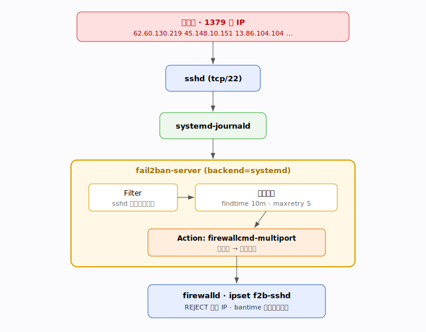

# Fail2ban 生产部署文档

> 主机:Rocky Linux 9.7 (Blue Onyx) · 内核 5.14.0-611 · x86_64
> 部署时间:2026-07-14
> 防火墙后端:firewalld (active) · SELinux:Enforcing
> Fail2ban 版本:**1.1.0** (来自 EPEL 9)

本文档记录本机 fail2ban 的**完整部署过程、原理、配置详解与日常使用**,从零基础到能独立运维。

---

## 目录

1. [为什么要装 fail2ban(背景)](#1-为什么要装-fail2ban背景)
2. [它是什么 / 工作原理](#2-它是什么--工作原理)
3. [架构图](#3-架构图)
4. [安装全过程(逐条命令)](#4-安装全过程逐条命令)
5. [配置文件详解](#5-配置文件详解)
6. [本机实际配置(jail.local)](#6-本机实际配置jaillocal)
7. [启动与验证](#7-启动与验证)
8. [日常使用命令手册](#8-日常使用命令手册)
9. [常见问题排查](#9-常见问题排查)
10. [进阶与优化](#10-进阶与优化)

---

## 1. 为什么要装 fail2ban(背景)

部署前对本机做安全扫描时发现:

| 指标 | 数值 |
|------|------|
| 过去 24 小时 SSH 失败登录 | **23,498 次** |
| 发起攻击的不同 IP | **1,379 个** |
| 攻击目标 | 大量爆破 `root`、`titus`、`bot` 等账户 |
| 原有暴力破解防护 | ❌ 无(未装 fail2ban/sshguard) |

也就是说,机器正暴露在**持续的 SSH 暴力破解**下,只差一个弱密码就会失守。fail2ban 的作用就是:**自动识别这类反复失败的登录,并用防火墙把攻击源 IP 封掉。**

---

## 2. 它是什么 / 工作原理

**Fail2ban** 是一个用 Python 写的入侵防御守护进程(IPS)。核心逻辑一句话概括:

> 扫描日志 → 匹配"失败特征" → 同一 IP 在时间窗口内失败超过阈值 → 调用防火墙封禁该 IP → 到期自动解封。

它由四个核心概念组成:

| 概念 | 说明 |
|------|------|
| **Jail(牢笼)** | 一套完整规则单元 = 监控哪个日志 + 用哪个过滤器 + 触发后执行什么动作。每个服务(sshd、nginx…)一个 jail。 |
| **Filter(过滤器)** | 一组正则,用来从日志里识别"这是一次失败"。位于 `/etc/fail2ban/filter.d/`。 |
| **Action(动作)** | 触发后干什么。通常是"调用 firewalld/iptables/nftables 封 IP",也可发邮件。位于 `/etc/fail2ban/action.d/`。 |
| **Backend(后端)** | 从哪里读日志。本机用 `systemd`(直接读 journald),而非传统的读 `/var/log/secure` 文件。 |

三个关键阈值参数(下面配置详解会再讲):

- `findtime`:时间窗口(比如 10 分钟)。
- `maxretry`:窗口内允许的最大失败次数(比如 5 次)。
- `bantime`:超阈值后封禁多久(比如 1 小时)。

**判定公式**:`在 findtime 内,同一 IP 失败次数 ≥ maxretry → 封禁 bantime`。

---

## 3. 架构图

```
              ┌──────────────────── 攻击者(1379 个 IP)────────────────────┐
              │   62.60.130.219   45.148.10.151   13.86.104.104  ...        │
              └────────────────────────────┬────────────────────────────────┘
                                           │ SSH 爆破 (tcp/22)
                                           ▼
                                   ┌───────────────┐
                                   │   sshd 服务    │  每次失败写一条日志
                                   └───────┬───────┘
                                           │
                                           ▼
                                 ┌──────────────────┐
                                 │  systemd-journald │  (backend = systemd)
                                 └─────────┬────────┘
                                           │ 实时读取
                     ┌─────────────────────▼──────────────────────┐
                     │             fail2ban-server                 │
                     │  ┌────────────┐   ┌─────────────────────┐   │
                     │  │ Filter     │──▶│ 计数器:findtime/    │   │
                     │  │ (sshd 正则)│   │ maxretry 判定         │   │
                     │  └────────────┘   └──────────┬──────────┘   │
                     │                              │ 超阈值        │
                     │                   ┌──────────▼──────────┐   │
                     │                   │ Action:              │   │
                     │                   │ firewallcmd-multiport│   │
                     │                   └──────────┬──────────┘   │
                     └──────────────────────────────┼──────────────┘
                                                    │ firewall-cmd 下发
                                                    ▼
                                        ┌──────────────────────┐
                                        │      firewalld        │
                                        │  ipset: f2b-sshd      │──▶ REJECT 该 IP
                                        └──────────────────────┘
                                                    │ bantime 到期
                                                    ▼
                                              自动解封,移出 ipset
```

下面是同一架构的 **SVG 矢量图**:



---

## 4. 安装全过程(逐条命令)

本机基于 Rocky Linux 9,fail2ban 不在官方基础仓库,需要先启用 **EPEL**。以下是本次部署**实际执行的每一步**。

### 4.1 启用 EPEL 仓库

```bash
sudo dnf install -y epel-release
# 结果:epel-release-9-10.el9.noarch 安装完成
```

> EPEL(Extra Packages for Enterprise Linux)是 Fedora 官方维护的 RHEL 系附加仓库,fail2ban 就在这里。

### 4.2 安装 fail2ban 及配套组件

```bash
sudo dnf install -y fail2ban fail2ban-firewalld
```

实际装上的关键包:

| 包名 | 作用 |
|------|------|
| `fail2ban-1.1.0-6.el9` | 主元包 |
| `fail2ban-server-1.1.0-6.el9` | 核心守护进程(真正干活的) |
| `fail2ban-firewalld-1.1.0-6.el9` | 让 fail2ban 走 firewalld 封禁(本机防火墙是 firewalld) |
| `fail2ban-selinux-1.1.0-6.el9` | SELinux 策略模块(本机 SELinux 为 Enforcing,必需) |
| `fail2ban-sendmail`, `libesmtp` 等 | 邮件通知依赖(可选) |

> ⚠️ **为什么要装 `fail2ban-firewalld`**:本机防火墙是 firewalld(active),默认封禁动作需要它提供的 firewalld 集成才能正确下发规则。若机器用 nftables/iptables 则装法不同。

---

## 5. 配置文件详解

### 5.1 目录结构

```
/etc/fail2ban/
├── fail2ban.conf        # 守护进程本身的配置(日志级别、socket 等)— 一般不动
├── jail.conf            # 官方默认 jail 定义 — 【不要直接改】,升级会被覆盖
├── jail.d/              # jail 片段目录
├── jail.local           # 【我们的配置】覆盖 jail.conf,升级不受影响 ★
├── filter.d/            # 所有过滤器正则(sshd.conf 等)
└── action.d/            # 所有封禁动作(firewallcmd-multiport.conf 等)
```

**黄金法则**:永远不要改 `jail.conf` / `*.conf`,而是新建 `jail.local` 或 `jail.d/*.local` 来覆盖。`.local` 的优先级高于 `.conf`,且系统升级不会覆盖它。

### 5.2 核心参数逐个讲

| 参数 | 含义 | 本机取值 |
|------|------|---------|
| `bantime` | 封禁时长。支持 `600`(秒)、`1h`、`1d`、`1w`。设 `-1` 为永久封禁。 | `1h` |
| `findtime` | 统计窗口。在这段时间内累计失败次数。 | `10m` |
| `maxretry` | 窗口内允许的最大失败次数,超过即封。 | `5` |
| `banaction` | 用什么执行封禁。本机 firewalld → `firewallcmd-multiport`。 | `firewallcmd-multiport` |
| `backend` | 日志来源。`systemd` = 直接读 journald(推荐,本机 journald 是 volatile 内存日志,读文件方式会失效)。 | `systemd` |
| `ignoreip` | 白名单,永不封禁。务必包含回环和自己的管理 IP。 | `127.0.0.1/8 ::1` |
| `enabled` | 该 jail 是否启用。 | `true` |
| `port` | 监控/封禁的端口。`ssh` 会解析为 22。 | `ssh` |

> ⚠️ **踩坑记录(真实发生)**:第一次配置误写成 `banaction = firewalld-multiport`,导致 sshd jail 启动失败,日志报 `Unable to read action 'firewalld-multiport'`。正确名称是 **`firewallcmd-multiport`**。可用动作名可通过 `ls /etc/fail2ban/action.d/ | grep firewall` 查看。

---

## 6. 本机实际配置(jail.local)

文件路径:`/etc/fail2ban/jail.local`

```ini
[DEFAULT]
# 封禁时长:1 小时
bantime  = 1h
# 在 findtime 窗口内达到 maxretry 次失败即封禁
findtime = 10m
maxretry = 5
# 使用 firewalld 作为封禁后端(本机 firewalld 已 active)
banaction = firewallcmd-multiport
# 从 systemd journal 读取日志(本机 journald 为 volatile,仍可用)
backend = systemd
# 不封禁本机回环
ignoreip = 127.0.0.1/8 ::1

[sshd]
enabled  = true
port     = ssh
maxretry = 5
bantime  = 1h

# 累犯惩罚:对反复被封的 IP 施加超长封禁
[recidive]
enabled  = true
bantime  = 1w      # 累犯封 1 周
findtime = 1d      # 统计窗口 1 天
maxretry = 5       # 1 天内被封 5 次 → 进入累犯名单
```

**两个 jail 的分工**:
- `[sshd]`:一线防御,处理常规 SSH 爆破,封 1 小时。
- `[recidive]`:二线防御,监控 fail2ban 自己的封禁日志。同一个 IP 一天内被 sshd jail 封 5 次以上,说明是"惯犯",直接封 **1 周**。

> 💡 **修改配置后如何生效**:改完 `jail.local` 执行 `sudo systemctl reload fail2ban`(热重载)或 `sudo systemctl restart fail2ban`(重启)。

---

## 7. 启动与验证

### 7.1 设为开机自启并立即启动

```bash
sudo systemctl enable --now fail2ban
```

### 7.2 验证服务状态

```bash
systemctl is-enabled fail2ban   # → enabled
systemctl is-active  fail2ban   # → active
```

### 7.3 验证 jail 已加载

```bash
sudo fail2ban-client status
```
本机实际输出:
```
Status
|- Number of jail:	2
`- Jail list:	recidive, sshd
```

### 7.4 验证已在实际封禁(部署几秒后)

```bash
sudo fail2ban-client status sshd
```
本机实际输出:
```
Status for the jail: sshd
|- Filter
|  |- Currently failed:	1
|  |- Total failed:	19
|  `- Journal matches:	_SYSTEMD_UNIT=sshd.service + _COMM=sshd + _COMM=sshd-session
`- Actions
   |- Currently banned:	3
   |- Total banned:	3
   `- Banned IP list:	13.86.104.104 45.227.254.170 45.148.10.152
```

### 7.5 验证防火墙已下发封禁规则

```bash
sudo firewall-cmd --direct --get-all-rules
```
可看到 `f2b-sshd` 链对被封 IP 执行 `REJECT`:
```
ipv4 filter f2b-sshd 0 -s 13.86.104.104 -j REJECT --reject-with icmp-port-unreachable
```

✅ **部署成功**:fail2ban 已在几秒内自动封禁了 3 个正在爆破的攻击 IP。

---

## 8. 日常使用命令手册

> 注意:`fail2ban-client` 需要访问 `/var/run/fail2ban/fail2ban.sock`,必须用 **root/sudo** 执行。

### 8.1 查看状态

```bash
# 总览:有哪些 jail
sudo fail2ban-client status

# 某个 jail 的详情(失败数、封禁数、被封 IP 列表)
sudo fail2ban-client status sshd

# 版本
sudo fail2ban-client version
```

### 8.2 手动封禁 / 解封

```bash
# 手动解封某个 IP(比如误封了自己)
sudo fail2ban-client set sshd unbanip 1.2.3.4

# 手动封禁某个 IP
sudo fail2ban-client set sshd banip 1.2.3.4

# 解封 sshd jail 里所有 IP
sudo fail2ban-client unban --all
```

### 8.3 白名单(避免误封自己)

**强烈建议**把你的办公/家庭固定公网 IP 加入白名单,防止手滑被自己锁在外面:

```bash
# 编辑 /etc/fail2ban/jail.local,在 [DEFAULT] 的 ignoreip 后追加你的 IP:
# ignoreip = 127.0.0.1/8 ::1 203.0.113.10
sudo systemctl reload fail2ban
```

### 8.4 服务管理

```bash
sudo systemctl status  fail2ban    # 查看服务状态
sudo systemctl reload  fail2ban    # 热重载配置(改完 jail.local 用这个)
sudo systemctl restart fail2ban    # 重启
sudo systemctl stop    fail2ban    # 停止(会解除所有封禁)
```

### 8.5 查看日志

```bash
# fail2ban 自身日志(封了谁、什么时候)
sudo tail -f /var/log/fail2ban.log

# 只看封禁动作
sudo grep "Ban" /var/log/fail2ban.log | tail -20
```

### 8.6 测试过滤器(调试正则)

```bash
# 用真实日志测试 sshd 过滤器能匹配多少次失败
sudo fail2ban-regex systemd-journal /etc/fail2ban/filter.d/sshd.conf
```

---

## 9. 常见问题排查

| 现象 | 原因 | 解决 |
|------|------|------|
| `status sshd` 报 `jail 'sshd' does not exist` | jail 启动失败(通常是 action/filter 名字写错) | 看 `/var/log/fail2ban.log` 的 ERROR 行,修正后 `restart` |
| `Unable to read action 'xxx'` | banaction 名字错 | `ls /etc/fail2ban/action.d/` 查正确名,firewalld 用 `firewallcmd-multiport` |
| `Permission denied to socket` | 没用 root | 所有 `fail2ban-client` 命令加 `sudo` |
| 封禁数一直是 0 | backend 读不到日志 | 确认 `backend = systemd`;本机 journald 是 volatile,不能用文件后端 |
| SELinux 拦截 | 缺策略 | 装 `fail2ban-selinux`(本机已装),必要时 `sudo restorecon -v /etc/fail2ban/*` |
| 把自己封了 | 未设白名单 | 从其他 IP 登录后 `unbanip`,并把自己 IP 加 `ignoreip` |

---

## 10. 进阶与优化

### 10.1 更狠的封禁策略(可选)

```ini
[sshd]
enabled  = true
maxretry = 3         # 更严:3 次就封
bantime  = 24h       # 封 1 天
# bantime.increment = true   # 递增封禁:每次累犯自动翻倍
# bantime.factor = 2
# bantime.maxtime = 4w
```

### 10.2 配合 SSH 加固(治本)

fail2ban 是"减速带",真正的根治是**关闭密码登录、禁用 root 直登**。本机扫描发现 `PermitRootLogin yes` 且 `PasswordAuthentication yes`,建议改 `/etc/ssh/sshd_config`:

```
PermitRootLogin no
PasswordAuthentication no    # 确认密钥可用后再关,避免锁死
```
```bash
sudo systemctl reload sshd
```
> 关闭密码登录后,那 23000+ 次爆破会**瞬间全部失效**——因为根本没有密码可猜。fail2ban 则继续拦截密钥探测和其他噪音。

### 10.3 邮件告警(可选)

在 `[DEFAULT]` 设 `destemail` / `sender` 并把 `action` 改为带通知的动作(如 `%(action_mwl)s`),被封时会收到含日志的邮件。

### 10.4 监控集成

- fail2ban 有 `fail2ban-client status <jail>` 可被脚本/Prometheus exporter 采集。
- 社区有 `fail2ban_exporter` 可把封禁数暴露成 Prometheus 指标,接入 Grafana 看板。

---

## 附录:本次部署速查

```bash
# —— 一键复现本次部署 ——
sudo dnf install -y epel-release
sudo dnf install -y fail2ban fail2ban-firewalld

# 写入 /etc/fail2ban/jail.local(内容见第 6 节)

sudo systemctl enable --now fail2ban
sudo fail2ban-client status
sudo fail2ban-client status sshd
```

| 项目 | 值 |
|------|-----|
| 系统 | Rocky Linux 9.7 |
| fail2ban 版本 | 1.1.0 (EPEL) |
| 启用的 jail | sshd, recidive |
| 封禁后端 | firewalld (firewallcmd-multiport) |
| 日志后端 | systemd (journald) |
| 默认策略 | 10 分钟内失败 5 次 → 封 1 小时;累犯封 1 周 |
| 开机自启 | 是 |
| 部署验证 | 部署即封禁 3 个活跃攻击 IP ✅ |

---
*文档生成于 2026-07-14,记录本机 fail2ban 真实部署过程。*
